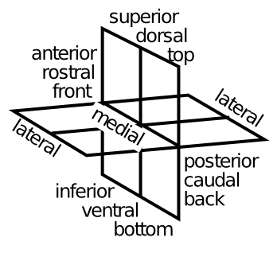
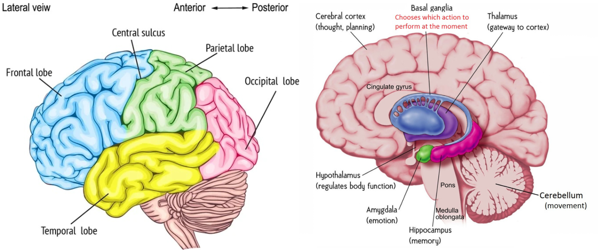

+++
Categories = ["Neuroscience"]
+++

This page provides a big-picture overview of brain anatomy and terminology.

{id="figure_locations" style="height:20em"}

[[#figure_locations]] shows the various terms used to refer to different locations in the brain. We also often use the following letters in the names of areas:
* **v** = ventral
* **d** = dorsal
* **m** = medial
* **l** = lateral
* **a** = anterior
* **p** = posterior

So, the dlPFC is the dorsal+lateral (_dorsolateral_) [[prefrontal cortex]], for example.

Interestingly, as a very broad generalization, dorsal and lateral areas tend to be more about sensory and motor function, while ventral and medial areas tend to be more about [[emotion]], motivation, goals, etc (e.g., many areas of the [[limbic system]] are v, m).

{id="figure_brain" style="height:30em"}

[[#figure_brain]] gives a big-picture overview of the major areas of the brain and lobes of the [[neocortex]]. Other areas included in the [[Axon]] models are:

* [[Basal ganglia]] for [[reinforcement learning]] of actions and a key element of the [[Rubicon]] goal-directed behavior system.

* [[Thalamus]] plays multiple essential roles in relation to the neocortex, including [[predictive learning]] in posterior neocortex, and modulatory control over the frontal and [[prefrontal cortex]], driven in part by the basal ganglia.

* [[Amygdala]] is a key element of the Rubicon model and is critical for [[emotion]], captured in the [[PVLV]] model of phasic [[dopamine]] firing for example. The hypothalamus, medulla oblongata, and other brainstem nuclei are also included in these systems.

* [[Hippocampus]] is critical for episodic memory: rapid learning of detailed events and places.

