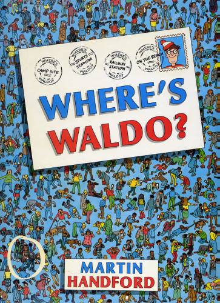
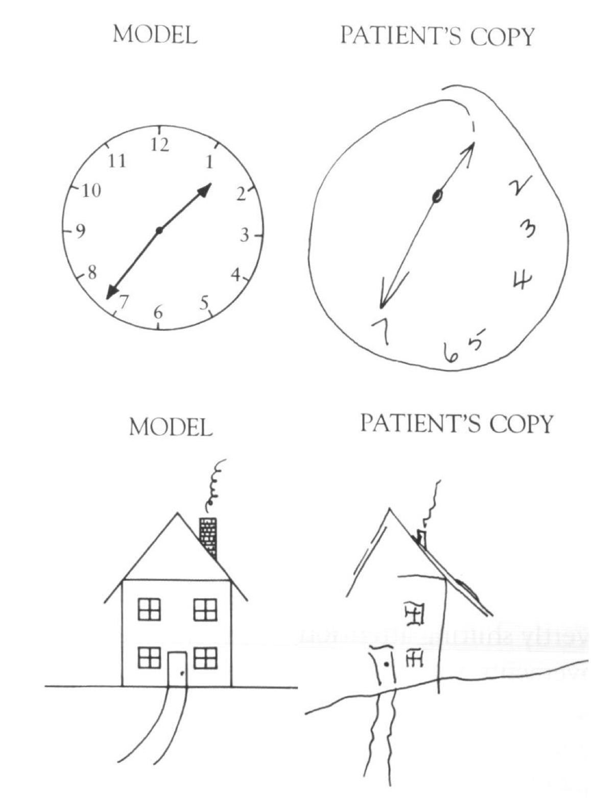
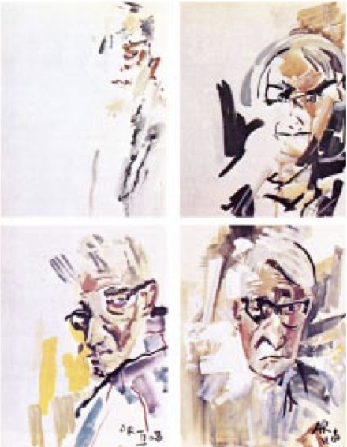
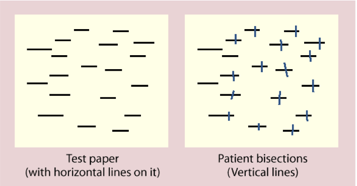
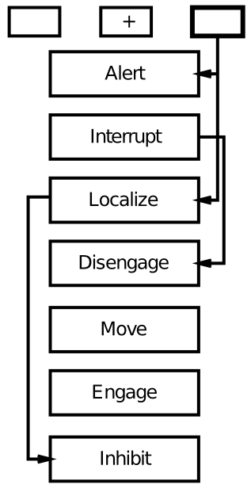
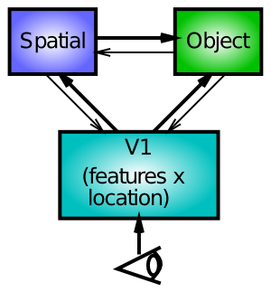

+++
Categories = ["Activation", "Inhibition", "Bidirectional connectivity", "Axon"]
bibfile = "ccnlab.json"
+++

The dorsal visual pathway that goes into the parietal cortex is more heterogeneous in its functionality relative to the object recognition processing taking place in the ventral *what* pathway, which appears to be the primary function of that pathway. Originally, the dorsal pathway was described as a *where* pathway, in contrast to the ventral *what* pathway ([[@UngerleiderMishkin82]]). However, [[@^GoodaleMilner92]] provide a compelling broader interpretation of this pathway as performing a *how* function --- mapping from perception to action. One aspect of this *how* functionality involves spatial location information, in that this information is highly relevant for controlling motor actions in 3D space, but spatial information is too narrow of a definition for the wide range of functions supported by the parietal lobe.

Parietal areas are important for numerical and mathematical processing, and representation of abstract relationship information, for example. Areas of the parietal cortex also appear to be important for modulating episodic memory function in the medial temporal lobe, and various other functions. This later example may represent a broader set of functions associated with prefrontal cortical cognitive control --- areas of the parietal cortex are almost always active in combination with the prefrontal cortex in demanding cognitive control tasks, although there is typically little understanding of what precise role they might be playing.

Here we focus on the established _where_ aspect of parietal function. Even within the domain of spatial processing, there are many cognitive functions that can be performed using parietal spatial representations, but we focus here on their role in focusing attention to spatial locations. In relation to the previous section, one crucial function of spatial attention is to enable object recognition to function in visual scenes that have multiple different objects present.

{id="figure_waldo"}

For example, consider one of those "where's Waldo" puzzles ([[#figure_waldo]]) that is packed with rich visual detail. Is it possible to perceive such a scene all in one take? No. You have to scan over the image using a "spotlight" of visual attention to focus on small areas of the image, which can then be processed effectively by the object recognition pathway. The ability to direct this spotlight of attention depends on spatial representations in the dorsal pathway, which then interact with lower levels of the object recognition pathway (V1, V2, V4) to constrain the inputs to reflect only those visual features that come from within this spotlight of attention.

## Hemispatial Neglect

{id="figure_neglect" style="height:30em"}

{id="figure_neglect-portraits"}

{id="figure_neglect-bisect"}

Some of the most striking evidence that the parietal cortex is important for spatial attention comes from patients with hemispatial neglect, who tend to ignore or neglect one side of space ([[#figure_neglect]], [[#figure_neglect-portraits]], [[#figure_neglect-bisect]]). This condition typically arises from a stroke or other form of brain injury affecting the right parietal cortex, which then gives rise to a neglect of the left half of space (due to the crossing over of visual information shown in the biology section). 

Interestingly, the neglect applies to multiple different spatial reference frames, as shown in [[#figure_neglect-bisect]], where lines on the left side of the image tend to be neglected, and also each individual line is bisected more toward the right, indicating a neglect of the left portion of each line.

## The Posner Spatial Cueing Task

{id="figure_posner-task"}
![The Posner spatial cueing task, widely used to explore spatial attention effects. The participant is shown a display with two boxes and a central fixation cross --- on some trials, one of the boxes is cued (e.g., the lines get transiently thicker), and then a target appears in one of the boxes (or not at all on catch trials). The participant just presses a key when they first detect the target. Reaction time is quicker for valid cues vs. invalid ones, suggesting that spatial attention was drawn to that side of space. Patients with hemispatial neglect exhibit slowing for targets that appear in the neglected side of space, particularly when invalidly cued.](media/fig_posner_task.png)

One of the most widely used tasks to study the spotlight of spatial attention is the Posner spatial cueing task, developed by Michael Posner ([[@Posner80]]; [[#figure_posner-task]]). One side of visual space is cued, and the effects of this cue on subsequent target detection are measured. If the cue and target show up in the same side of space (*valid* cue condition), then reaction times are faster compared to when they show up on different sides of space (*invalid* cue condition). This difference in reaction time (RT) suggests that spatial attention is drawn to the cued side of space, and thus facilitates target detection. The invalid case is actually worse than a neutral condition with no cue at all, indicating that the process of reallocating spatial attention to the correct side of space takes some amount of time. Interestingly, this task is typically run with the time interval between cue and target sufficiently brief as to prevent eye movements to the cue --- thus, these attentional effects are described as *covert attention*.

{id="figure_posner-data" style="height:20em"}

As shown in [[#figure_posner-data]], patients with hemispatial neglect show a disproportionate increase in reaction times for the invalid cue case, specifically when the cue is presented to the good visual field (typically the right), while the target appears in the left. Posner took this data to suggest that these patients have difficulty disengaging attention, according to his box-and-arrow model of the spatial cueing task ([[#figure_posner-disengage]]).

{id="figure_posner-disengage" style="height:30em"}

{id="figure_attn-model"}

We explore an alternative account here, based on bidirectional interactions between spatial and object processing pathways ([[#figure_attn-model]]). In this account, damage to one half of the spatial processing pathway leads to an inability of that side to compete against the intact side of the network. Thus, when there is something to compete against (e.g., the cue in the cueing paradigm), the effects of the damage are most pronounced.

Importantly, these models make distinct predictions regarding the effects of *bilateral* parietal damage. Patients with this condition are known to suffer from Balint's syndrome, which is characterized by a profound inability to recognize objects when more than one is present in the visual field ([[@CoslettSaffran91]]). This is suggestive of the important role that spatial attention plays in facilitating object recognition in crowded visual scenes.

According to Posner's disengage model, bilateral damage should result in difficulty disengaging from *both* sides of space, producing slowing in invalid trials for both sides of space. In contrast, the competition-based model makes the opposite prediction: the lesions serve to reduce competition on *both* sides of space, such that there should be reduced attentional effects on both sides. That is, the effect of the invalid cue actually decreases in magnitude. The data are consistent with the competition model, and not Posner's model [[@VerfaellieRapcsakHeilman90]].

## Spatial attention simulation

See the [[attention simulation]] to explore a model with spatial and object pathways interacting in the context of multiple spatial attention tasks, including perceiving multiple objects, and the Posner spatial cueing task. It reproduces the behavioral data shown above, and correctly demonstrates the observed pattern of reduced attentional effects for Balint's patients.

