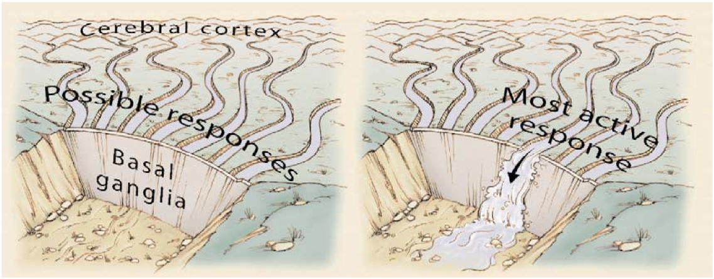
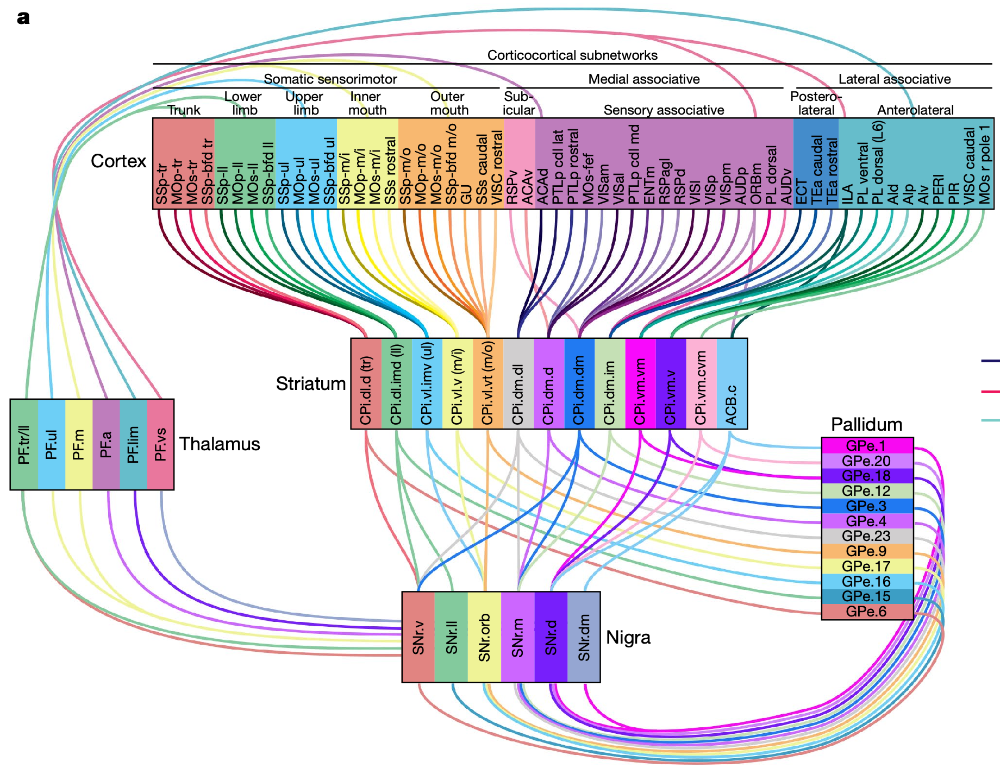

+++
Categories = ["Rubicon", "Neuroscience"]
bibfile = "ccnlab.json"
+++

The **basal ganglia** (BG) are a collection of nuclei located at the central "core" of the brain ([[#figure_bg-anatomy]]), forming the functional bridge between the highest levels of processing in the [[neocortex]], and the motor control networks in the brainstem (midbrain and hindbrain, progressing down to the spinal cord). The primary outputs of the BG are downward to these motor networks, and, via extensive connections into the thalamus, back up to the frontal areas of the neocortex and [[prefrontal cortex]]. The **striatum** is the input nucleus of the BG, anatomically composed of the _caudate_ and _putamen_, which receive extensive projections from the neocortex and other brain areas.

{id="figure_bg-anatomy" style="height:25em"}
![Major areas of the basal ganglia (BG) and associated brain areas. The striatum is the input layer to the BG, composed of the caudate and putamen as large-scale anatomical features. The striatum receives a wide range of inputs from all over the brain, especially the neocortex, with the right panel showing a functional interpretation of this connectivity for the 3D volume of the striatum, reflected so that anterior is to left (Pauli et al., 2016). The ventral striatum (including the nucleus accumbens, NAc), is the input area for goal-driven, affective circuits ("value"), with adjacent more dorsal areas encoding motor-related value signals. The putamen is largely interconnected with motor areas and associated somatosensory cortex, corresponding to dorsolateral striatum in rodents. The globus pallidus externus (GPe) is the next stage of processing, providing the central "core" integration for the BG, with the GP internus (GPi) sending BG outputs subcortically and, via extensive connections into the thalamus, back up to the frontal neocortex. The substantia nigra pars reticulata (SNr) is also a major output pathway, while the pars compacta (SNc) provides dopamine innervation into the entire BG. The subthalamic nucleus (STN) also receives extensive cortical input from frontal areas, and interacts bidirectionally with the GPe. The amygdala, which is a primary affective / emotion area, is not a part of the BG but interacts extensively with it and is located at the extreme end of the tail of the caudate, and the lateral habenula (LHb) plays an essential role in driving dips in dopamine, based on extensive inputs from the ventral striatum among many other areas.](media/fig_bg_anatomy_human.png)

{id="figure_bg-rat-nhp" style="height:25em"}
![Coronal slices through the right hemisphere of rat and NHP (non-human primate, i.e., macaque monkey) striatum, showing the projections from major frontal areas, with functional interpretations based on the Rubicon framework, consistent with the previous figure. The most ventral and medial area receives most strongly from the infralimbic (IL) frontal cortex in rat, which is homologous to Brodman area 25 in primates. This encodes the more abstract (pure) value of goal outcomes in Rubicon. Going lateral from there are more lateral OFC (orbitofrontal) areas (VOLO = ventrolateral OFC) that encode more concrete, sensory aspects of goal outcomes. Dorsal from there are areas receiving from dorsal ACC (anterior cingulate cortex, Brodmann 24; Cg = cingulum in rats), encoding affective values associated with different actions (mainly costs like effort, uncertainty, etc). Moving medial to that receives from the prelimbic (PL) cortex in rats (Brodmann 32, pregenual ACC in primates), which integrates IL and ACC inputs to compute overall utility (outcome value minus costs). PL/32 projects across most of the medial and ventral region. From Heilbronner et al., 2016.](media/fig_bg_areas_heilbronner_etal_2016_labels.png)

[[#figure_bg-rat-nhp]] and the right panel of [[#figure_bg-anatomy]] show how different regions of the striatum interconnect with different frontal cortical areas, with associated functional interpretations consistent with the [[Rubicon]] framework (data from [[@PauliOReillyYarkoniEtAl16]] and [[@HeilbronnerRodriguez-RomagueraQuirkEtAl16]]). These goal-oriented areas are located in the ventral and medial areas of the striatum, while the progressively dorsal and lateral areas (which comprise roughly 2/3 of the total striatum) are more strongly interconnected with motor cortical areas, and dorsolateral prefrontal cortex in primates. These different parts of the BG share a common canonical circuit but also have differences, consistent with the idea that they likewise share a common overall function with differences associated with their different specialized contributions.

There is extensive evidence showing that the dorsolateral BG encodes detailed motor control signals, with recent studies able to decode complex naturalistic motor behaviors in freely-behaving rats ([[@MarkowitzGillisBeronEtAl18]]; [[@KlausMartinsPaixaoEtAl17]]; [[@MengZhouPapaneriEtAl18]]), in addition to simpler conditioned learning tasks ([[@YttriDudman18]]). Furthermore, studies of animals with complete lesions of the neocortex demonstrate that the BG can drive remarkably intact fine-grained motor control through its descending motor pathway projections ([[@GrillnerRobertsonKotaleski20]]; [[@ParkCoddingtonDudman20]]; [[@ArberCosta22]]). In evolutionarily more ancient vertebrates without much cortex, such as the lamprey (which has essentially the same BG structures as the rodent and primate; [[@GrillnerRobertson16]]), the BG is the primary driver of learning and behavior.

At a neural level, the SPNs (spiny projection neurons; also called medium spiny neurons, MSNs) in the striatum receive the strongest [[dopamine]] inputs of any area in the brain, and likewise have the greatest ability to rapidly clear dopamine from the synapse after it has been released. This allows these neurons to learn from rapid _phasic_ changes in dopamine, i.e., _bursts_ and _dips_ relative to the baseline _tonic_ firing level, in a manner consistent with the core principles of [[reinforcement learning]] (RL; [[@MarkowitzGillisJayEtAl23]]; [[@HowardLiGeddesEtAl17]]; [[@NairGutierrez-ArenasErikssonEtAl15]]; [[@ShenFlajoletGreengardEtAl08]]; [[@Frank05]]; [[@HoukAdamsBarto95]]; [[@Barto95]]).

Thus, the dorsolateral striatum is widely believed to be the neural substrate for the _actor_ component of the brain's reinforcement learning system, where reward prediction error (RPE) signals from the dopamine _critic_ system train the BG actor to improve motor actions to increase overall reward (see [[reinforcement learning#figure_actor-critic]] in the RL page). 

However, in animals with more neocortex, especially in primates and humans, the BG also works intimately in concert with the cortex to organize behavior, by way of its extensive connections into the thalamus. These thalamic projections can provide two functions: direct modulation of cortical activity, which occurs in a very broad manner (which we term **gating**), and more fine-grained training of cortical learning through the same type of thalamic-driven [[predictive learning]] signals used in the [[Axon]] [[error-driven learning]] model.

Thalamic gating is a central mechanism in the [[Rubicon]] framework, for locking in the active maintenance of distributed goal representations across various regions of the prefrontal cortex, driven by the more medial and ventral areas shown in [[#figure_bg-rat-nhp]].

Thus, these two roles of the BG make it one of the most central brain structures for understanding both basic motor control and more advanced goal-driven planning and higher-level cognition. The circuits that enable it to play these critical roles are explored first in the case of basic motor control below, and then elaborated in terms of the relationships with the [[prefrontal cortex]] in that page.

One overarching way of understanding the role of the BG across all these levels is in terms of a _bidirectional_ and _modulatory_ control system, that uses learning across two _opponent pathways_ ([[@CollinsFrank14]]) to _disinhibit_ output targets, in order to selectively control the flow of activity through these other circuits. Thus, it is a kind of "puppet master" pulling the strings of the brain, to get it to "do the right thing" in order to optimize overall reward, and accomplish desired goals.

In the following sections, the opponent pathway organization of the BG is examined, in relation to its higher-level functional contributions. Then we describe a new model of the BG that incorporates new patterns of connectivity that have recently been discovered. This _PCore_ model shows how two different types of neurons within the GPe, and projections from GPe back to the striatum, support the ability to integrate information over time during the decision-making process, which was not possible in the purely feedforward, classical model of BG function. Then we review a range of data that provide a coherent overall understanding of what the BG does, in the context of the PCore model.

## Opponent pathways: D1 vs D2 / Go vs No

{id="figure_bg-rat" style="height:25em"}

One of the most salient features of the BG circuitry, illustrated in the context of the anatomy of the BG within the rodent brain in [[#figure_bg-rat]], is that it has two distinct pathways from the striatum to the output areas of the _substantia nigra pars reticulata_ (SNr) and globus pallidus internus segment (GPi) (these two output areas are functionally identical for the present purposes). Because all of the major neurons in the BG are inhibitory (unlike the cortex, where the principal neurons are excitatory), these two pathways end up having opposing effects, a fact which has driven much of the theorizing about BG function.

{id="figure_bg-gating" style="height:20em"}
![Classical model of BG direct and indirect pathway function, where the direct pathway inhibits the BG output nuclei (GPi, SNr), thus disinhibiting its downstream targets such as the thalamus (i.e., a net "Go" permissive effect). The indirect pathway adds one more step, into the otherwise tonically active GPe neurons, so that when it is activated, it inhibits this GPe inhibition, and thus makes the output nuclei more active, increasing or maintaining inhibition on the downstream targets (i.e., a net "No" or inhibitory effect). The plots adjacent to each step of the pathway illustrate the activity of neurons over time, for the Go case, where the direct pathway neurons are strongly activated and the indirect pathways are not so much. Dopamine drives consistent learning and modulation of the direct and indirect pathways via D1 (Go) vs. D2 (No) receptors, such that bursts of dopamine facilitate the Go pathway and inhibit No, while the opposite holds for dips in dopamine.](media/fig_bg_gating_circuit.png)

Specifically, distinct subsets of SPN neurons in the striatum project either _direct_ to the GPi/SNr (_dSPN_), or go through the _indirect_ pathway (_iSPN_) via _globus pallidus externus_ (GPe). Because the GPi/SNr output neurons are themselves inhibitory, the net effect of the direct pathway is to _disinhibit_ the areas that the BG projects to.

Therefore, the direct pathway can be thought of as a "Go" pathway: it allows behavior to proceed, like a green traffic light ([[#figure_bg-gating]]). This analogy also captures the permissive (_modulatory_) nature of disinhibition: it doesn't force anything to happen on its own: it just allows any "traffic" that might otherwise be there to proceed.

By contrast, the indirect pathway adds an additional minus sign in the chain, making it net _inhibitory_ on BG outputs, and thus a "No" pathway (red light) that tends to prevent behavior from proceeding. You can compute these effects by adding up the number of minus signs in the pathway: if it is even, then the net effect is positive / disinhibitory (two negatives cancel each other out), and if it is odd, then the net effect is negative / inhibitory:

* Direct: dSPN -o SNr -o Thalamus = 2 (even, excitatory)
* Indirect: iSPN -o GPe -o SNr -o Thalamus = 3 (odd, inhibitory)

The opposing effects of dSPN vs iSPN neurons align with the effects of [[dopamine]] neuromodulation via the D1 vs. D2 dopamine receptor types, which are differentially expressed on these neuron subtypes ([[@ShenFlajoletGreengardEtAl08]]; [[@Frank05]]). The D1 dopamine receptor on dSPNs is excitatory and promotes LTP (long-term potentiation; [[synaptic plasticity]]) when stimulated with bursts of dopamine. The D2 receptor on iSPNs is inhibitory and promotes LTD from dopamine bursts. Furthermore, the opposite pattern holds for dopamine dips, directly implementing both sides of Thorndike's _law of effect_ for instrumental conditioning: do more of things that give you dopamine bursts, and less of things that give you dips in dopamine.

## Action selection

The simple _Go_ vs. _No_ logic of these two BG pathways aligns with impairments in people with Parkinson's disease and related basal ganglia disorders known as _catatonia_, which can be characterized as a specific problem in _initiating_ motor actions. This was compellingly demonstrated in the 1990 movie _Awakenings_, where a patient (Robert De Niro) could keep walking once he got started, but otherwise could be stuck for hours unable to start. This convergence of circuitry and initiation deficits led several authors to suggest that the primary function of the BG is in _action selection_: the decision of what action to perform ([[@AlbinYoungPenney89]]; [[@ChevalierDeniau90]]; [[@AlexanderCrutcher90a]]; [[@Mink96]]; [[@RedgravePrescottGurney99]]; [[@GurneyPrescottRedgrave01]]; [[@FrankLoughryOReilly01]]; [[@BrownBullockGrossberg04]]; [[@Nambu04]]; [[@BogaczGurney07]]).

Once a selection has been made, the action can proceed without further input from the BG, explaining the selective initiation deficits in Parkinson's patients: they cannot select any action. Furthermore, this account has the advantage of distinguishing the contribution of the BG from that of the cerebellum, which is widely thought to be important for rapid online adjustments to motor control signals ([[@Albus75]]; [[@Ito98]]; [[@BuonomanoMauk94]]), and not for selection or initiation.

{id="figure_bg-act-sel" style="height:20em"}

The simplest form of the action selection model posits that the selected action gets a _Go_ disinhibitory signal from the BG, while all the other unselected actions get a _No_ inhibitory signal, as illustrated in [[#figure_bg-act-sel]].

However, this is not the only way in which action selection can operate, especially at the level of the striatum. For example, one can think of the Go and No pathways in the striatum as contributing _graded_ weighting signals that are effectively voting in favor or against a given action, with _downstream_ processes being responsible for integrating those votes. Critically, even a selected action can get a number of No votes, as long as it also gets sufficient Go votes. Furthermore, his ability to separately represent the Go vs. No votes has important computational advantages over an alternative that immediately collapses these votes into a single signal ([[@CollinsFrank14]]). 

This opponent-process dynamic of push vs. pull, ying vs. yang, with lots of both going on in most cases, is more consistent with considerable data showing that the direct and indirect pathway neurons associated with a given action are both activated, instead of having fully opposite patterns of activity ([[@CuiJunJinEtAl13]]; [[@MarkowitzGillisBeronEtAl18]]; [[@KlausMartinsPaixaoEtAl17]]; [[@MengZhouPapaneriEtAl18]]). This graded balancing of opponent forces is also consistent with optogenetic studies that clearly show that activation of the direct pathway facilitates action, while activation of the indirect pathway inhibits it ([[@KravitzFreezeParkerEtAl10]]; [[@YttriDudman16]]), and evidence of the opposing effects of these pathways is evident in the identifiable and decorrelated behavior of dSPNs vs iSPNs in the above studies.

In summary, an opponent, competitive dynamic between Go and No pathways does _not_ mean that these neurons are fully anticorrelated: as in any good sports game, lots of good moves are made on both sides, and each team can play with strong vigor, even though one or the other ends up winning in the end. Indeed, at the level of muscle forces, there is always a lot of co-contraction taking place among opposing muscles, which is necessary to maintain overall muscle tension and postural stability.

## Parallel action selection and online motor control

The action selection framework is often construed in terms of a strongly serial, discrete conception of motor action, where a single discrete action is performed at a given time. However, at the level of the muscles that actually drive motor action, it is actually a highly parallel "symphony" of activity that is in constant motion. Thus, to the extent that the dorsolateral BG is involved in motor control at the level of muscles, it makes more sense to think of the BG as a conductor of this symphony, providing dynamic, bidirectional modulation of each of the different muscles in order to better coordinate their activity, to accomplish desired motor outcomes.

Under this more dynamic, parallel scenario, the Go vs. No pathways are not discretely and sequentially picking one out of many possible actions, but rather the dynamic balance between Go and No determines the extent to which each muscle or muscle group is selectively disinhibited at any given point in time, in parallel. If there is more Go than No, that pathway will be disinhibited and allowed to act more strongly, while a greater No than Go balance with tend to inhibit the pathway and prevent it from interfering with other muscle activity that should proceed. To return to the puppet-master analogy used above, the strings by which a puppet is controlled need to have bidirectional control: you can't operate a puppet in zero gravity! In the neural domain, the dynamic Go vs. No competition gives you this bidirectional control.

This conception of motor control converges with the conclusions of numerous studies on the descending pathways from the BG to motor output areas in the midbrain and spinal cord, as summarized in recent reviews ([[@GrillnerRobertsonKotaleski20]]; [[@ParkCoddingtonDudman20]]; [[@ArberCosta22]]). For example, [[@^ParkCoddingtonDudman20]] use the analogy of the function of a graphical equalizer in a stereo system, which modulates the strength of different frequency bands, and also note that many of these motor control studies specifically find that BG lesions affect dynamic online motor control but _not_ action initiation. Indeed, it is likely that the catatonia-like initiation deficits arise from active imbalances in Go vs. No pathways (more No than Go), whereas full lesions just remove the BG modulation entirely.

In addition, one of the considerations that has led to the more serial, discrete conception of BG function is the extreme funnel-like compression of the neural signal as it flows through the network, with only roughly 30k neurons in each hemisphere in the output nuclei (SNr and GPi), versus about 2.8 million in the striatal inputs ([[@Oorschot96]]). However, 30k is still a large number compared with the number of distinct muscles (roughly 600 in the human and a similar order of magnitude in the rat), although this 30k number includes all of the different pathways through the BG, so the motor control portion may be more like 10k or so. It is clear from anatomical studies that different pathways from the BG output project to different motor control centers in the midbrain, consistent with a parallel modulation of the descending motor system ([[@ArberCosta22]]).

<!--- TODO: add link, burb -->

As we review in detail below, recordings of the activity of neurons in the BG output pathways would seem to provide a more definitive understanding of what it is contributing to motor control, relative to the strong focus in the field on properties of the striatal input neurons. The relatively few such studies of SNr and GPi neurons clearly support the parallel, bidirectional modulation model ([[@BarterLiSukharnikovaEtAl15]]; [[@FreezeKravitzHammackEtAl13]]; [[@GulleyKuwajimaMayhillEtAl99]]).  Brief blurb.

Computationally, this parallel, graded modulation of action is much more efficient from a learning and [[search]] perspective than a serial, discrete selection process: incremental graded changes in modulation can be explored in parallel to optimize overall behavior, whereas a strictly discrete, serial process suffers from the [[curse of dimensionality]] as the space of actions and situations grows.

While the relatively low-dimensional, parallel, graded BG output signals make sense from the descending motor control perspective, how does this kind of signal work in the context of ascending projections through the thalamus and back up to the neocortex, where there are many more millions of neurons? And how does the BG output coordinate with the direct descending projections from cortical motor areas into the same midbrain and spinal motor areas?

If we retain the parallel, muscle-based conception of motor control in the cortex, then the BG ascending projections can be playing a similar puppet-master / conductor / traffic light role in modulating these muscle-based pathways as they go through the thalamus: even if there are many more traffic lanes, the same low-dimensional Go vs. No control can still provide useful control over the flow of signals through these lanes. Furthermore, this modulation can drive error-driven learning in cortex, in much the same way that thalamic projections through the pulvinar nucleus drive [[predictive learning]] in posterior cortex.

After we explore our updated, detailed model of the BG circuitry in the next section, we return to these big-picture questions of overall BG function, across the multiple different pathways and domains in which it operates. The available evidence strongly suggests that these different pathways have different functional properties, with neurons in the ventral and medial areas having more coherent, discrete behavior, while the dorsolateral motor control areas are more parallel, graded and modulatory. How do these different modes of behavior emerge from the same type of circuitry? Are there other strong commonalities among these apparent differences? These are some of the questions we revisit in light of the detailed model.

## The Pallidal-core (PCore) model

Although there were earlier indications of inaccuracies and omissions in the classical direct vs. indirect pathway model ([[#figure_bg-gating]]), relatively recent molecular labeling techniques have now provided definitive evidence for a new anatomical model, which puts the GPe in a more central role in shaping the dynamics of the BG ([[@CourtneyPamukcuChan23]] (review); [[@MalletMicklemHennyEtAl12]]; [[@SaundersMacoskoWysokerEtAl18]]; [[@CuiDuChangEtAl21]]; [[@DodsonLarvinDuffellEtAl15]]; [[@AbdiMalletMohamedEtAl15]]; [[@GuilhemsangMallet24]]; [[@NambuChiken24]]). [[@^SuryanarayanaHellgrenKotaleskiGrillnerEtAl19]] developed a version of the earlier action-selection model of [[@^GurneyPrescottRedgrave01]] incorporating the new GPe anatomy, which informed the PCore model described below.

{id="figure_pcore-bio" style="height:25em"}
![PCore model of the basal ganglia, which is centered around the multiple projections into and out of the GPe neurons that affect every other part of the BG circuitry, putting the GPe Pallidum at the core of its function. The GPeAk (arkypallidal) neurons receive from the direct pathway striatal neurons (dSPN), while the prototypical (GPePr) neurons receive from the indirect pathway, as in the classical model (hence the name). Because GPeAk projects inhibition back up to the striatum, it must be inhibited in order to disinhibit the SPN neurons, which is accomplished by the direct pathway inputs. The iSPN neurons can also get some relief by inhibiting the GPeAk in cases where they are more active, and are directly inhibiting the dSPNs (but not the other way around). The hyperdirect pathway into the STN drives initial "brakes" on the system preventing premature responding. The numbers below each nucleus indicate the rough number of neurons in each hemisphere in a rat (Oorschot, 1996).](media/fig_pcore_v2_pr_ak.png)

Our implementation of this new circuitry is summarized in [[#figure_pcore-bio]], showing two of the main subtypes of GPe neurons: _GPeAk_ are the _arkypallidal_ GPe neurons, which express the molecular markers NPAS1 and FOXP2, while the GPePr are the _prototypical_ GPe neurons that have a connectivity pattern similar to the GPe in the classical model, and express PV (parvalbumin, as discussed in [[inhibition]]) and KCNG4. As shown in the figure, roughly 45% of the GPe neurons are prototypical, while 18% are arkypallidal, with another 12% projecting to the SNc dopamine area (similar to [[#striosome]] neurons in the striatum, which we discuss below). The remaining neurons constitute a more heterogenous group, which we ignore for the time being.

The striatum remains largely as in the classical model, with the one new wrinkle that the lateral inhibition among the SPN neurons is strongly asymmetric, with iSPNs inhibiting dSPNs but not the other way around ([[@TavernaIlijicSurmeier08]]), which is compatible with the remainder of the dynamics from the GPe.

Unlike the classical model, the GPe receives significant input from the direct pathway dSPN neurons, which strongly favors the GPeAk arkypallidal neurons. Meanwhile, the prototypical GPe neurons are so-named because they almost exclusively receive input from the iSPN neurons, as in the classical model. The GPeAk neurons also diverge from the classical model by projecting back up to the striatum, which provides a key insight into their function. Meanwhile, the prototypical GPe neurons inhibit themselves and the GPeAk neurons, while also sending the classically-described inhibitory projection to the output nuclei (SNr and GPi).

This circuit converging on the GPeAk neurons effectively replicates the classical direct vs. indirect dynamic ([[#figure_bg-gating]]), but with the GPeAk as the target of direct inhibition and indirect disinhibition instead of the GPi / SNr output neurons. This allows the GPeAk neurons to compute an integrated balance of the Go vs. No forces, which then feeds back up into the striatum, which enables this internal circuit to drive dynamic integration processing that is otherwise not possible in the strictly feedforward classical model. This is the "core" of the PCore model.

Finally, the [[STN]] (subthalamic nucleus) plays a critical role in the BG circuit (and is a major target of therapeutic treatments in Parkinson's disease), supporting the _hyperdirect_ projection from the cortex and uniquely sending excitatory glutamatergic projections to the GPe and SNr / GPi neurons. This set of connections has long been recognized as important for providing an initial "brake" on any disinhibitory effects of the BG, by driving an initial burst of excitation to the SNr and GPi outputs that are inhibiting the downstream targets of the BG ([[@Frank06]]). An alternative role for the STN is as a normalizing factor to retain the sensitivity of the system under different strengths and numbers of inputs ([[@GurneyPrescottRedgrave01]]; [[@GurneyPrescottRedgrave01a]]; [[@GurneyHumphriesRedgrave15]]; [[@BogaczGurney07]]), which may characterize a different subset of STN neurons.

In the PCore model, the STN projections into the GPePr are critical for driving a reciprocal inhibitory reflection back from GPePr to STN, which opens up a window where the SNr / GPi outputs can actually become net inhibited, because a subset of the STN neurons go into an extended pause in firing after their initial burst of activity ([[@FujimotoKita93]]; [[@MagillSharottBevanEtAl04]]). This excitatory-inhibitory relationship between STN and GPePr is widely implicated in the tremor associated with Parkinson's disease ([[@BevanMagillTermanEtAl02]]; [[@Nevado-HolgadoMalletMagillEtAl14]]; [[@LindahlKotaleski16]]).

The STN also projects excitation to the GPeAk, which causes it to more strongly inhibit the striatum. This provides a mechanism for the notably transient, phasic nature of SPN firing (as shown in neural recording data shown below). The tonic activity of GPeAk keeps the SPNs inhibited, and the increased excitation from the STN associated with an increased in cortical activity compensates for the increased activity that the SPNs also receive. Then, after their activity pause, the recovery in STN firing activates the GPeAk again, terminating the transient SPN activity (and putting the brakes back on in the BG output nuclei). See [[STN]] for more details and discussion of the neural basis for these dynamics -- there are multiple cell types in the STN and it is likely doing multiple things.

{id="figure_pcore-dyn" style="height:30em"}
![Dynamics of the PCore model for a Go > No case (left panel) vs a No > Go case (right panel), illustrating the central role of the GPeAk neurons. Each layer shows a raster plot of spikes across the 25 neurons per layer, with time going back in depth for each layer. Thus, you can see the initial burst of activity in the STN driven by the hyperdirect pathway inputs, which puts on the "brake" at the start, allowing the rest of the dynamics to unfold, as the brake is released by GPePr inhbiting the STN. See text for further explanation of each of the steps highlighted. The striatum neurons are labeled as Mtx, representing the matrix (vs. striosome) subset, with dSPN = Go and iSPN = No.](media/fig_pcore_v2_vs_sim_go_no.png)

[[#figure_pcore-dyn]] shows the PCore model in action (see the [[BG ventral simulation]]) in cases where it ends up being net disinhibitory ("Go") and net inhibitory ("No"). For the Go case, the key steps are:

0. The STN hyperdirect activity provides a burst of activation to the SNr, GPePr, and GPeAk neurons, effectively preventing the SNr output from being inhibited. This is the initial "brake" on the system, which is released when the GPePr inhibits the STN in turn, and the [[neuron channels#SKCa]] calcium-gated K channels produce a longer-lasting inhibitory pause, providing a window for the BG to control the output pathways (i.e., a _gating window_).

1. Stronger learned weights from the "ACC" inputs (which are just clamped input layers in this model) to the dSPN cause these neurons to respond more vigorously than the opponent iSPN neurons.

2. This dSPN activity directly inhibits the GPeAk, initiating a "positive" disinhibitory feedback loop that facilitates further overall "Go" mode activity. This is effectively a kind of amplifier circuit, which is important for enabling the Go vs. No distinction to be made across a wide range of different input strengths.

3. The reduced GPeAk activity disinhibits the striatum neurons (both dSPN and iSPN), which allows the dSPN pathway to ramp up further, although this is also tempered by increased iSPN pathway firing which directly inhibits the dSPN cells.

4. The increased striatal dSPN activity inhibits the SNr neurons...

5. Thereby accomplishing the classical Go pathway dynamic of disinhibiting the downstream targets of the BG, in this case the thalamus.

6. This phasic output disinhibition is terminated when the STN neurons recover from their activity pause, thus exciting the GPeAk, which in turn inhibits the SPNs. The brakes also go back on in the output nuclei (SNr, GPi).

The case illustrated on the right shows what happens when the iSPN _No_ pathway gets more excited by the inputs.

1. Now the iSPN neurons are more active initially.

2. Which inhibits the GPePr, thereby disinhibiting the GPeAk.

3. Thus the continued GPeAk activity inhibits the striatum, preventing the dSPN Go pathway from getting more active.

4. Therefore, the SNr remains active...

5. And the thalamus remains inhibited by the SNr.

In summary, the GPeAk neurons integrate the direct dSPN pathway inputs relative to the iSPN inputs via GPePr, providing an internal integration of this balance that then feeds back to modulate the activity of the striatal input pathways. When GPeAk is net inhibited, it is more likely to amplify the dSPN pathway and drive overall disinhibition ("Go"), whereas the opposite holds when GPeAk is disinhibited via iSPN inhibition on GPePr. There are also direct excitatory cortical projections into the GPeAk that are functionally consistent with the STN hyperdirect inputs, providing a baseline against which these differential dynamics operate (.

This ability for the direct and indirect pathways to interact through their convergence in the GPe resolves one of the main problems with the classical theory: there is only sparse, weak inhibitory connectivity among SPN neurons in the striatum, which seems unlikely to support a robust inhibitory competition and selection dynamic ([[@TunstallOorschotKeanEtAl02]]). Because the GPe is much more compact in size than the entire striatum (i.e., roughly 46,000 neurons in the GPe in a rat, compared to roughly 2.8 million in the striatum, as shown in [[#figure_pcore-dyn]]; [[@Oorschot96]]), it is therefore much easier for these pathways to interact competitively with each other, relative to neurons having to directly compete in the much larger space of the striatum.

{id="figure_ketzef-etal" style="height:30em"}

These dynamics are consistent with various recorded patterns of neural activity, for example in a recent optogenetic stimulation experiment ([[@KetzefSilberberg21]]) that selectively activated iSPN neurons or STN neurons ([[#figure_ketzef-etal]]). A number of other studies report consistent data on the effects of GPeAk activation and inhibition of motor action ([[@MalletSchmidtLeventhalEtAl16]]; [[@GlajchKelverHegemanEtAl16]]; [[@PamukcuCuiXeniasEtAl20]]; [[@GuSchmidtBerke20]]; [[@TachibanaKitaChikenEtAl08]]; [[@DodsonLarvinDuffellEtAl15]]).

### Functional benefits of PCore

At a broad-brushstroke level of analysis, the PCore model exhibits similar behavior to the classical BG model, with a strong opponent dynamic between a net Go vs. a net No pathway. However, the internal integration of the Go vs. No balance within the GPeAk neurons, along with similar other balancing interactions (e.g.,iSPN inhibition of dSPNs, and self-inhibtion of the GPePr neurons) makes it considerably more robust than the classical model, and allows it to exhibit important temporal dynamics reflecting the relative balance of these pathways.

{id="figure_bgventral-test" style="height:20em"}
![Testing results from the ventral BG model, trained with dopamine based on reward prediction error to do Go gating when the input signals indicate more positive reward versus negative costs are available, and No when the opposite is true. The testing sweeps through increments of negative costs in an inner loop, and positive rewards in the outer looop, as shown on the lower portion of the plot. The Gated line the proportion of times that the model did Go gating, which is strongly determined by the ratio of positive to negative, across the full range of these values. This demonstrates the balanced nature of the interactions between pathways. The RT line shows the normalized number of cycles taken when a Go gating outcome occurred, showing that the model was significantly slower in processing the cases with greatest conflict, where positive is very close to negative. Furthermore, the overall trend is that with stronger positive values, RT is overall faster. These patterns are widely observed in decision-making studies, and predicted by normative drift-diffusion models. This demostrates that the model naturally exhibits an information-integration dynamic to accumulate more input over time when the decision is more ambiguous.](media/fig_bgventral_test.png)

The [[BG ventral simulation]] explores these dynamics in a simple decision-making context, which demonstrates that the system can apply a ratio-based decision threshold across a wide range of raw input activation strengths, consistently exhibiting disinhibitory Go dynamics when the relative strength of initial Go vs. No pathway activation favors Go ([[#figure_bgventral-test]]). In addition, as the Go vs. No balance gets closer, the system takes longer to make a decision, allowing more time for additional input signals to be integrated and improve the overall quality of the resulting decision.

This temporal dynamic is consistent with the normative [[drift-diffusion]] model of decision making, which has been identified with the function of the basal ganglia empirically ([[@YartsevHanksYoonEtAl18]]; [[@DunovanLynchMolesworthEtAl15]]; [[@DoiFanGoldEtAl20]]; [[@DingGold13]]) and theoretically ([[@BogaczGurney07]]; [[@BogaczMoraudAbdiEtAl16]]).

In the "hold-your-horses" model of STN function ([[@Frank06]]), this ability to modulate the BG decision making speed as a function of ambiguity was attributed to the sustained activity of the STN in response to ambiguous activity patterns in the cortical inputs to the STN. By contrast, this dynamic arises in the PCore model from the GPeAk integration and feedback loop mechanism, which has the important advantage of being based directly on the striatal dSPN vs. iSPN responses to the cortical inputs, rather than the cortical representations themselves.

The STN's primary function in the PCore model is to provide the burst-then-pause firing pattern that opens a phasic window for the BG to successfully inhibit the output nuclei and disinhibit downstream targets. This ensures that the BG only drives transient, phasic effects, consistent with the data reviewed below.

The action selection model of [[@^GurneyPrescottRedgrave01]] ([[@GurneyPrescottRedgrave01a]]; [[@GurneyHumphriesRedgrave15]]; [[@BogaczGurney07]]; [[@HumphriesGurney21]]) instead requires a sustained, proportional activity from the STN, so it is clear that these different models make distinctive predictions about STN activity, making this an important topic for further empirical tests. It is also possible that phasic and sustained modes of STN activity are supported by different subtypes of STN neurons.

Finally, the GPeAk disinhibition of striatum strongly predicts that there will be some correlation in dSPN and iSPN firing, even though they are in an overall oppositional relationship, consistent with observed data ([[@CuiJunJinEtAl13]]). However, the oppositional relationship is still evident overall, consistent with the properties of dSPN and iSPN firing in naturalistic behavioral contexts ([[@MarkowitzGillisBeronEtAl18]]; [[@KlausMartinsPaixaoEtAl17]]).

Overall, several features of the PCore circuit produce behavior consistent with an an action-initiation role, including the brake-then-release dynamics in the STN, and the progressive positive feedback loops between dSPN and GPeAk. Nevertheless, the balanced dynamics should also support generating more graded, balanced combinations of net disinhibitory tone, consistent with an ability to provide ongoing modulatory control over motor actions as they unfold.

## Functional contributions of the BG

<!--- TODO: explain, fix interpretive functional labels: -->

{id="figure_bg-all" style="height:25em"}
![Circuits involving the BG, from the frontal cortex to descending motor areas, arranged schematically according to the rat anatomy (as in earlier Figures 2 and 3). The ventral and medial circuits are as described in Figure 2 (V = ventral, M = medial, D = dorsal, L = lateral, S = striatum, aIC = anterior insula). Primary and secondary motor areas target dorsal and lateral striatum, and anterior motor areas (a weak analogue of the much larger dlPFC in primates) target dorsal medial striatum. The SNr output also has a topographic map as shown. The thalamic nuclei targeted by DLS outputs are ventral medial and ventral lateral, which also interconnect with the cerebellum. Brainstem motor targets include the superior colliclulus (SC; orienting and approach), medullary reticular formation (MRF; locomotion), and pontine reticular formation (PRF; limbs, digits).](media/fig_motor_systems.png)

Moving back out from the circuit dynamics level, we return to the big picture question of what the BG contributes to overall brain function, across the different domains in which it is involved. [[#figure_bg-all]] provides a summary of some of the major patterns of connectivity between the BG and the rest of the brain, in the rat. The ventral and medial portions of the striatum were already discussed more in [[#figure_bg-rat-nhp]], and [[#figure_bg-all]] fills in some of the circuits involving the dorsal and lateral motor areas, continuing through the nuclei in the thalamus (VM = ventromedial, VL = ventrolateral) and some of the brainstem motor areas that the BG output disinhibits.

The big picture here is that the BG is positioned with its "fingers on the buttons" of every major pathway of brain function, from motor to motivation. [[#figure_bg-all]] does not show the extensive sensory projections into the BG from posterior areas of the [[neocortex]], which provide abstracted environmental state information according to the standard [[reinforcement learning]] (RL) paradigm. The simple story is clearly that the BG is where RL happens in the brain, with phasic dopamine signals driving learning to optimize behavior.

To understand in more detail what each area is contributing, we examine task-related neural activity in the ventromedial (VM) and dorsolateral (DL) BG areas in the following sections. This data shows that VMS striatum neurons are active at the start and end of a chunk of behavior, but _not_ at critical decision points along the way. This is consistent with the [[Rubicon]] framework, reflecting a single goal-engaged step. Thus, the BG is not just a simple model-free form of RL, but rather supports a proactive, goal-driven form of model-based RL that organizes behavior over time to accomplish goals selected at the start of a goal-engaged window.

Meanwhile, in DLS striatum, we look at what the motor encoding of actions looks like, and also trace that back to the relatively rare recordings from the output pathways.

### Goal-related activity in VS

{id="figure_vs-maze" style="height:30em"}
![Activity of neurons in the ventromedial striatum (VMS) of the rat, recorded in a simple cued T-maze task, over the full course of acquisition and re-acquisition with a different cue modality (AA1 = initial auditory cue acquisition, with AA2 and AO showing further training, followed by TA = tactile cue). VMS neurons consistently fire right at the start, and at the end, but not at the critical decision point where the rat senses the cue and decides to go into the right or left arm. This is consistent with the gating of an overarching goal / plan at the start, which is then updated with the actual outcome at the end. The top figures show z-scored data over the population of neurons, while lower panels show actual firing rates and raster plots of individual trials, recording individual neural spiking for the click-responsive neurons and the reward responsive neurons. Activity is generally very sparse, and clearly strongly driven by the warning cue and reward onset, respectively. Figure adapted from Atallah et al., 2014.](media/fig_bg_vs_gating_atallah_etal_2014.png)

[[#figure_vs-maze]] shows the activity of neurons in the ventromedial striatum (VMS) of a rat as it learns to navigate a T maze, which is one of the most widely-studied behavioral paradigms ([[@AtallahMcCoolHoweEtAl14]]). The rats are placed at the start location, and a auditory warning click (WC) signals that the trial is about to start, at which point a gate opens. As they run down the first arm, the rats then hear another auditory cue that indicates whether they should turn left or right at the T junction, to get a food reward. The data clearly shows that one subset of VMS neurons respond strongly and phasically to the warning click, consistently throughout the different phases of training. Then two other subsets of neurons respond in anticipation of the reward at the goal, or after reward receipt.

What is _not_ observed are neurons responding to the discriminative cue that actually tells the rats which way they should turn to get the reward. This striking lack of responding, present from the start, is consistent with the idea that the VMS neurons are playing a phasic role at the initial goal-selection phase, triggered by the warning click, where they activate a plan that encompasses the behavioral strategy of using the cue to determine which way to turn. Thus, there is no further updating of that plan when the cue occurs. At the end, there is activity tracking the expectation of a reward, and after receiving the reward, which presumably are important for updating and clearing the goal representations based on what actually happened.

The [[arm maze simulation]] shows how the [[Rubicon]] model exhibits this same pattern of behavior in making similar kinds of behavioral choices. It is also important to note that this activity pattern is inconsistent with a simpler kind of [[reinforcement learning#model-free]] RL learning that would be predicted by the TD algorithm. This algorithm would predict that over the course of learning, activity would transition from the discriminative cue back to the initial warning click (i.e., a "backup"), as the chaining-like dynamic of temporal difference error signals moves progressively backward in time to find the earliest reliable predictor of reward.

### Motor activity in DL

{id="figure_ds-actions" style="height:30em"}
![Averaged traces of neural activity (yellow colors) and inactivity (blue) of dSPNs and iSPNs in the DLS of freely behaving mice, associated with different actions as labeled. Each line represents the behaviorally-synchronized average for an individual neuron. There is bidirectional modulation of neural activity in both pathways specific to each action, straddling the onset of these actions. Any given neuron has a relatively brief phasic window of activity, which reliably occurs at about the same relative point in time across instances of the behavior. From Markowitz et al., 2018.](media/fig_bg_dorsal_activity_markowitz_etal_18.png)

[[#figure_ds_actions]] shows neural activity in the dorsolateral striatum (DLS) of freely-behaving mice associated with different actions that they naturally exhibited ([[@MarkowitzGillisBeronEtAl18]]). The most evident properties of these responses are:

* Individual SPN neurons exhibit reliable, precisely-timed, and brief windows of activity and inhibition in relationship to distinct motor actions, spanning the time window from slightly anticipating the action onset (by roughly 50-70 ms) to roughly 1 s post-action. This is very different from the VS neurons shown above.

    This means that the SPN activity is clearly not exclusively or even predominantly involved in action initiation, thereby raising significant questions about the action selection model. However, further experiments reported in [[@MarkowitzGillisBeronEtAl18]] showed that DLS inactivation resulted in nearly identical performance of individual actions, but the overall pattern of actions was impacted, and the ability to shape action to avoid a noxious smell was impaired. Other analyses showed that neural activity was conditional on the sequential context in which an action is performed. Thus, this BG activity is likely important for a more graded, parallel, ongoing shaping of motor actions that ends up determining which actions are performed, as discussed earlier.
	
	The brief windows of activity (which were present in individual trials, not just the averaged data) are consistent with the STN gating window dynamic of the PCore model, as discussed in more detail in [[STN]]. Given that each neuron recorded has a slightly different such peak, this suggests that there are strongly parallel microcircuits through the BG system, 

* The activity profiles of dSPN and iSPN neurons are essentially identical in terms of the average traces shown in the figure. However, statistically, the individual firing behavior of iSPN and dSPN neurons is decorrelated, consistent with the basic connectivity and overwhelming evidence supporting the fundamental Go vs. No distinction between these neurons.

* The participation of an individual SPN across different action types is consistent with a sparse [[distributed representations]], with representational overlap matching action similarity.

{id="figure_ds-snr" style="height:30em"}

[[#figure_ds-snr]] provides a complementary picture of the activity of neurons in the BG output pathway of the SNr, in the dorsolateral motor area, from [[@^BarterLiSukharnikovaEtAl15]]. It clearly demonstrates that some of these neurons provide a graded firing rate signal that closely tracks continuous motor outcome variables such as head position, consistent with the idea that these neurons provide relatively direct mappings onto muscle groups that control different parts of the body.

Furthermore, at the level of these outputs, for these neurons, the brief phasic activity that is present in the striatal neurons is not evident, and instead there is a seemingly continuous modulation of neural activity. This could reflect the integration of many overlapping striatal neuron contributions across time, producing a continuous overall effect. Also see [[@^BassoWurtz02]] for recordings of SNr neurons with eye movement correlates, which do not fire in advance of the corresponding motor areas in the colliculus, but do have a continuous activity modulation.

Taken together, this data is overall strongly consistent with a graded, distributed, parallel representation of the motor action space, which thus supports a much more efficient gradient-based parallel [[search]] process through the space of such actions over the course of learning. The [[BG dorsal simulation]] explores how this learning can efficiently search through relatively high-dimensional action sequence space to learn arbitrary action sequences.

### Thalamic modulation back to cortex

The strong version of the cortically-focused model of action selection holds that the BG is critical for disinhibiting thalamocortical loops and thereby controlling action selection in the cortex ([[@AlbinYoungPenney89]]; [[@ChevalierDeniau90]]; [[@FrankLoughryOReilly01]]; [[@GurneyPrescottRedgrave01]]; [[@Frank05]]; [[@OReillyFrank06]]). However, recent simultaneous recordings from the GPi output nucleus and connected areas in the VLa nucleus of the thalamus showed little evidence of such a dynamic ([[@SchwabKaseZimnikEtAl20]]), consistent with earlier lesion studies showing minimal effects of BG lesions on thalamic motor-related activity ([[@InaseBufordAnderson96]]). Instead, GPi and thalamic activity typically moved in the same direction, and movement-related changes in GPi firing typically trailed those seen in the VLa itself. Various other measures showed little direct impact of GPi an thalamic activity.

In contrast to this apparent lack of influence of the BG on the thalamus, direct stimulation studies have shown robust inhibition of thalamus by stimulating the BG output nuclei, consistent with the monosynaptic inhibitory relationship between these neurons ([[@KimKimNakajimaEtAl17]]; [[@CataneseJaeger21]]). The most obvious reconciliation of these findings is that the motor task in the [[@^SchwabKaseZimnikEtAl20]] study involved a simple overtrained reaching action, whereas we would expect the BG influence to occur during the initial learning of novel motor tasks, if indeed the main function of the BG is to support [[reinforcement learning]] driven by phasic dopamine changes.

There are a number of studies showing that indeed the influence of the BG over thalamus decreases with learning ([[@DesmurgetTurner10]]; [[@PironKaseTopalidouEtAl16]]; [[@HorakAnderson84]]), and other studies showing that the BG is only important for initial acquisition but not expression of learned motor actions ([[@NeelyKoralekAthalyeEtAl18]]; [[@KoralekCostaCarmena13]]; [[@YinKnowltonBalleine04]]; [[@YinMulcareHilrioEtAl09]]). 

In summary, the main ascending contribution of the BG to cortical function is to drive learning, via its influence over the thalamus. This is a critical component of our overall PCore motor control model, as explored in the [[BG dorsal simulation]].

## PCore learning: trace and credit assignment

With the above understanding of the functional role and dynamics of the BG circuit, we can now introduce the learning mechanisms used in the PCore model. First, because the dorsolateral and ventromedial parts of the BG have different functions and modes of activity, they also have different learning rules. Currently, learning only takes place in the striatal neurons, but future work will explore learning mechanisms in other parts of the circuit, which also receive dopamine innervation and have different dopamine receptors.

### Ventromedial learning

As is evident in the neural activity data from VMS neurons shown in [[#figure_vs-maze]], there is a significant temporal gap between the initial goal-selection decision to engage in the task and activate the overall plan required to succeed, and the time when the reward outcome occurs. As discussed further in the [[PVLV]] model, learning must bridge this gap, so that the outcome can properly shape the goal-selection decision next time around. This [[credit assignment#temporal credit assignment]] problem is solved by way of a synaptic tag signal that is encoded at each synapse at the time of goal-selection gating, and is then modulated by the dopamine signal at the time of the outcome to drive the actual weight change. In this way, the tag functions as an eligibility trace, which has also been used in the TD learning rule ([[reinforcement learning]]).

The trace / tag component of the learning is:

{id="eq_vs-tr" title="Trace"}
$$
Tr = \rm{ACh} \left[ x (y^+ - y^-) + 0.6 x y^+ \right]
$$

which combines a simple delta rule error term defined over the minus vs. plus phase receiving activations (see [[GeneRec]] and [[kinase algorithm]] for more details), plus a synaptic activity (sender $x$ times receiver $y$) term, all of which is modulated by the current [[ACh]] (acetylcholine) neuromodulatory level, as explained in [[PVLV]]. The weight change computed at the time of the outcome is then the dopamine modulation times the accumulated trace values:

{id="eq_vs-dwt" title="Weight change"}
$$
DWt = \rm{DA} \sum Tr
$$

With the definition of the trace in [[#eq_vs-tr]], this is partially a _three factor_ learning rule, driven by the dopamine RPE signal, sending activity, and receiving activity, which is very widely used in models of BG learning. However, this learning rule adds the additional ACh modulation in addition to dopamine, and it includes a minus-plus error gradient factor.

### Dorsolateral learning

{id="figure_pf-loops" style="height:40em"}

The DLS learning rule is similar to the VS one, except instead of using ACh as an additional neuromodulatory factor, it uses a gating-based credit assignment factor that is computed based on closed-loop projections from the parafasiculus (PF) nucleus of the intralaminar thalamic nuclei, which sends extensive excitatory feedback into the striatum, as shown in [[#figure-pf-loops]] ([[@FosterBarryKorobkovaEtAl21]]).

## Summary

TODO: action selection happens in planning -- goal selection phase -- must be serial to avoid binding problems- after that it is dynamic constraint satisfaction as real-time action shaping unfolds.

OLD summary:

* Different areas of BG with distinct functional roles, e.g., dorsolateral areas for motor control, vs medial and ventral areas for goal selection, have some different patterns of connectivity and neural dynamics. The result is that dorsolateral areas can play a more online control function, while ventral and medial areas can drive a more phasic goal selection process that leads to the initiation of actions. In other words, the initiation deficit associated with Parkinson's disease may be a reflection of dysfunctional goal selection in ventral and medial areas, rather than an action selection deficit in dorsolateral motor areas.

* Different ascending vs. descending output pathways (motor vs. thalamocortical) likewise have different connectivity and functionality, with descending pathways having more focal projections to different brainstem motor areas, while ascending pathways through the thalamus have broader connectivity that is suggestive of a more modulatory role. Thus, even the dorsolateral motor areas may _simultaneously_ play two different roles through these two different output pathways. The broader ascending projections may be more similar to the role of an orchestra conductor, providing a more global timing and coordination function, while the descending projections provide a more detailed bidirectional sculpting of ongoing motor outputs.

* Different species have different balances of BG vs. cortical influence on motor control, with primates and humans having a much stronger degree of cortical influence over motor control, while rodents and other species with less cortical development are more driven by the BG. Thus, it is important to be careful in interpreting the results of the many studies conducted in rodents in relation to how the human brain functions.

## Striosomes, VS patch, VP, etc

