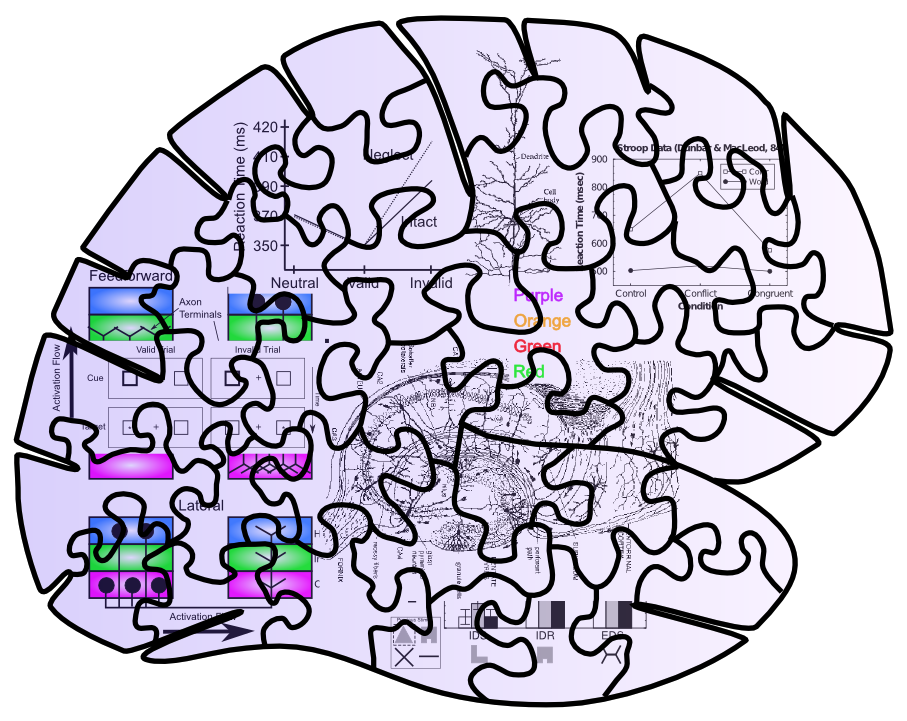

+++
Name = "Computational Cognitive Neuroscience"
Categories = ["Axon"]
bibfile = "ccnlab.json"
+++

**Computational Cognitive Neuroscience** is the title of the [[book]] based on the [[Leabra]] framework, and it represents an attempt to identify the specific goals of the work presented on this `compcogneuro.org` website. Specifically, the goal is to develop a computationally tractable and effective ([[computation|"computational"]]), cognitively accurate ([[cognition|"cognitive"]]), and neurobiologically accurate ([[neuroscience|"neuroscience"]]) model of the mammalian brain.

Each of these aspects is given significant weight in constraining the approach, such that we seek a "golden middle" approach that satisfies each of these factors, while avoiding over-focus on any individual one at the expense of the other. Thus, there are certainly more computationally efficient [[artificial neural network]] models, and more neurobiologically detailed models, and simpler models of cognition that might use Bayesian equations to provide a normative account of behavior. But the [[Axon]] model may well represent the best simultaneous satisfaction of all three of these constraints.

The remainder of this page is adapted from the introduction to the CCN book, providing a bit more explanation and perspective about the approach taken here.

## Computational modeling

What are the advantages and disadvantages of a computational modeling approach to understanding the brain? An obvious advantage of computer modeling is its ability to wrestle with complexity that often proves daunting to otherwise unaided human understanding. How could we possibly hope to understand how billions of neurons interacting with tens of thousands of other neurons produce complex human cognition, just by talking in vague verbal terms, or simple paper diagrams? Certainly, nobody questions the need to use computer models in climate modeling, to make accurate predictions and understand how the many complex factors interact with each other. The situation is only more dire in cognitive neuroscience.

Nevertheless, in all fields where computer models are used, there is a fundamental distrust of the models. They are themselves complex, created by people, and have no necessary relationship to the real system in question. How do we know these models aren't just completely made-up fantasies? The answer seems simple: the models must be constrained by data at as many levels as possible, and they must generate predictions that can then be tested empirically.

In an ideal world, one might imagine that the neurons in the neural model would be mirror images of those in the actual brain, replicating as much detail as is possible given the technical limitations for obtaining the necessary details. They would be connected exactly as they are in the real brain. And they would produce detailed behaviors that replicate exactly how the organism in question behaves across a wide range of different situations. Then you would feel confident that your model is sufficiently "real" to trust some of its predictions.

But even if this were technically feasible, you might wonder whether the resulting system would be any more comprehensible than the brain itself! In other words, we would only have succeeded in transporting the fundamental mysteries from the brain into our model, without developing any actual understanding about how the thing really works. From this perspective, the most important thing is to develop _the simplest possible model that captures the most possible data_ --- this is basically the principle of _Ockham's razor_, which is widely regarded as a central principle for all scientific theorizing.

In some cases, it is easy to apply this razor to cut away unnecessary detail. Certainly many biological properties of neurons are irrelevant for their core information processing function (e.g., cellular processes that are common to all biological cells, not just neurons). But often it comes down to a judgment call about what phenomena you regard as being important, which will vary depending on the scientific questions being addressed with the model.

The approach taken here is to find some kind of "happy" middle ground between biological detail and cognitive functionality. This middle ground might be considered "unhappy" to the extent that researchers concerned with either end of this continuum are dissatisfied with the level of the models. Biologists will worry that our neurons and networks are overly simplified. Cognitive psychologists will be concerned that our models are too biologically detailed, and they can make much simpler models that capture the same cognitive phenomena. We who relish this "golden middle" ground are happy when we've achieved important simplifications on the neural side, while still capturing important cognitive phenomena.

This level of modeling explores how consideration of neural mechanisms inform the workings of the mind, and reciprocally, how cognitive and computational constraints afford a richer understanding of the problems these mechanisms evolved to solve. It can thus make predictions for how a cognitive phenomenon (e.g., memory interference) is affected by changes at the neural level (due to disease, pharmacology, genetics, or similarly due to changes in the cognitive task parameters). The model can then be tested, falsified and refined.

In this sense, a model of cognitive neuroscience is just like any other theory, except that it is explicitly specified and formalized, forcing the modeler to be accountable for their theory if/when the data don't match up. Conversely, models can sometimes show that when an existing theory is faced with challenging data, the theory may hold up after all due to a particular dynamic that may not be considered from verbal theorizing.

Ultimately, it comes down to aesthetic or personality-driven factors, which cause different people to prefer different overall strategies to computer modeling. Each of these different approaches has value, and science would not progress without them, so it is fortunate that people vary in their personalities so that different people end up doing different things. Some people value simplicity, elegance, and cleanliness most highly --- these people will tend to favor abstract mathematical (e.g., Bayesian) cognitive models. Other people value biological detail above all else, and don't feel very comfortable straying beyond the most firmly established facts --- they will prefer to make highly elaborated individual neuron models incorporating everything that is known. To live in the middle, you need to be willing to take some risks, and value most highly the process of _emergence_, where complex phenomena can be shown to emerge from simpler underlying mechanisms.

The criteria for success here are a bit murkier and subjective --- basically it boils down to whether the model is sufficiently simple to be comprehensible, but not so simple as to make its behavior trivial or otherwise so fully transparent that it doesn't seem to be doing you any good in the first place. One last note on this issue is that the different levels of models are not mutually exclusive. Each of the low level biophysical and high level cognitive models have made enormous contributions to understanding and analysis in their respective domains. In fact, much ground can be (and to some extent already has been) gained by attempts to understand one level of modeling in terms of the other. At the end of the day, linking from molecule to mind spans multiple levels of analysis, and like studying the laws of particle physics to planetary motion, require multiple formal tools.

## Emergent phenomena

What makes something a satisfying scientific explanation? A satisfying answer is that you can explain a seemingly complex phenomenon in terms of simpler underlying mechanisms, that interact in specific ways. The classic scientific process of _reductionism_ plays a critical role here, where the complex system is reduced to simpler parts. However, one also needs to go in the opposite, oft-neglected direction, _reconstructionism_, where the complex system is actually reconstructed from these simpler parts. Often the only way to practically achieve this reconstruction is through computational modeling. The result is an attempt to capture the essence of emergence.

{id="figure_gears"}
![The principle of *emergence*, simply illustrated. The gears on the left do not interact, and nothing interesting happens. However, on the right, the interaction between the gears produces interesting, useful phenomena that *cannot* be reduced to the individual gears _separately_. For example, the little gear will spin faster, but the larger one will have higher torque at its axel --- these properties would be entirely different if either gear interacted with a different sized gear. Furthermore, the material that the gear is made from really doesn't matter very much --- the same basic behavior would be produced by plastic, metal, wood, etc. Thus, even in this simple case, there is something just slightly magical and irreducible going on --- when two gears get together, something emerges that is more than the sum of the parts, and exists in a way independent of the parts, even while being entirely dependent on actually *having* those parts to make it happen.  This is a good analogy for the relationship between the mind and the brain, and computer models can capture many complex interactions between neurons in the brain, and reveal nonobvious kinds of emergence.](media/fig_gears.png)

Emergence can be illustrated in a very simple physical system, two interacting gears, as shown in [[#figure_gears]]. It is not mysterious or magical. On the other hand, it really is. You can make the gears out of any kind of sufficiently hard material, and they will still work. There might be subtle factors like friction and durability that vary. But over a wide range, it doesn't matter what the gears are made from. Thus, there is a level of _transcendence_ that occurs with emergence, where the behavior of the more complex interacting system does not depend on many of the detailed properties of the lower level parts. In effect, the interaction itself is what matters, and the parts are mere place holders. Of course, they have to be there, and meet some basic criteria, but they are nevertheless replaceable.

Taking this example into the domain of interest here, does this mean that we can switch out our biological neurons for artificial ones, and everything should still function the same, _as long as we capture the essential interactions in the right way?_ Some of us believe this to be the case, and that when we finally manage to put enough neurons in the right configuration into a big computer simulation, the resulting brain will support consciousness and everything else, just like the ones in our own heads. One interesting further question arises: how important are all the interactions between our physical bodies and the physical environment? There is good reason to believe that this is critical. Thus, we'll have to put this brain in a robot. Or perhaps more challengingly, in a virtual environment in a virtual reality, still stuck inside the computer. It will be fascinating to ponder this question on your journey through the simulated brain...

## Why should we care about the brain?

Many people are tempted to find ways to ignore all the complexity and difficulty of understanding how the brain actually works, in favor of more purely computational or cognitive levels of analysis, under the assumption that these functional levels are all that _really_ matters in the end. By way of analogy, we don't need to know much of anything about how computer hardware works to program in Python, for example. Vastly different kinds of hardware can all run the same programming languages and software. Can't we just focus on the _software_ of the mind and ignore the _hardware_?

Exactly this argument has been promulgated in many different forms over the years. David Marr was perhaps the most influential in arguing that one can somewhat independently examine cognition at three different [[levels of analysis]] ([[@Marr77]]):

* **Computational** --- what computations are being performed? What information is being processed?

* **Algorithmic** --- how are these computations being performed, in terms of a sequence of information processing steps?

* **Implementational** --- how does the hardware actually implement these algorithms?

This way of dividing up the problem has been used to argue that one can safely ignore the implementation (i.e., the brain), and focus on the computational and algorithmic levels, because, like in a computer, the hardware really doesn't matter so much.

However, the key oversight of this approach is that the reason hardware doesn't matter in standard computers is that _they are all specifically designed to be functionally equivalent in the first place!_ Sure, there are lots of different details, but they are all implementing a basic serial Von Neumann architecture. What if the brain has a vastly different architecture, which makes some algorithms and computations work extremely efficiently, while it cannot even support others? Then the implementational level would matter a great deal.

There is every reason to believe that this is the case. The brain is _not_ at all like a general purpose computational device. Instead, it is really a custom piece of hardware that implements a very specific set of computations in massive parallelism across its 20 billion neurons. In this respect, it is much more like the specialized graphics processing units ([[GPU]]s) in modern computers, which are custom designed to efficiently carry out in massive parallelism the specific computations necessary to render complex 3D graphics.

More generally, the field of computer science is discovering that parallel computation is exceptionally difficult to program, and one has to completely rethink the algorithms and computations to obtain efficient parallel computation. Thus, the hardware of the brain likely imposes key constraints, and provides many important clues as to what kind of algorithms and computations are being performed.

Historically, the "ignore the brain" approaches have taken an interesting trajectory. In the 1960's through the early 1990's, the dominant approach was to assume that the brain actually operates much like a standard computer, and researchers tended to use concepts like logic and symbolic propositions in their cognitive models. Since then, a more statistical metaphor has become popular, with the Bayesian probabilistic framework being widely used in particular. This is an advance in many respects, as it emphasizes the graded nature of information processing in the brain (e.g., integrating various graded probabilities to arrive at an overall estimate of the likelihood of some event), as contrasted with hard symbols and logic, which didn't seem to be a particularly good fit with the way that many (though not all!) aspects of cognition actually operate.

However, the actual mathematics of Bayesian probability computations are not a particularly good fit to how the brain operates at the neural level, and much of this research operates without much consideration for how the brain actually functions. Instead, a version of Marr's computational level has been adopted, by assuming that whatever the brain is doing, it must be at least close to optimal, and Bayesian models can often tell us how to optimally combine uncertain pieces of information.

Regardless of the validity of this optimality assumption, it is definitely useful to know what the optimal computations are for given problems, so this approach certainly has a lot of value in general. However, optimality is typically conditional on a number of assumptions, and it is often difficult to decide among these different assumptions.

{id="figure_puzzle-blue-sky" style="height:30em"}

If you really want to know for sure how the brain is actually producing cognition, clearly you need to know how the brain actually functions. Yes, this is hard. But it is not impossible, and the state of [[neuroscience]] these days is such that there is a wealth of useful information to inform all manner of insights into how the brain actually works. It is like working on a jigsaw puzzle --- the easiest puzzles are full of distinctive textures and junk everywhere, so you can really see when the pieces fit together [[#figure_puzzle-clutter]]). 

The rich tableau of neuroscience data provides all this distinctive junk to constrain the process of puzzling together cognition. In contrast, abstract, purely cognitive models are like a jigsaw puzzle with only a big featureless blue sky [[#figure_puzzle-blue-sky]]. You only have the logical constraints of the piece shapes, which are all highly similar and difficult to discriminate. It takes forever.

{id="figure_puzzle-clutter" style="height:30em"}

Here are a couple of the most satisfying instances where all the pieces come together to complete a puzzle (see [[synergies]] for a collection):

* The detailed biology of the [[hippocampus]], including high levels of inhibition and broad diffuse connectivity, fit together with its unique role in rapidly learning new [[episodic memory|episodic memories]], and the remarkable data from patient HM who had his hippocampus resected to prevent intractable epilepsy. The computational models of the hippocampus ([[hippocampus simulation]])) show how these biological details produce high levels of _pattern separation_ which keep memories highly distinct, and thus enable rapid learning without creating catastrophic levels of interference.

* The detailed biology of the connections between dopamine, basal ganglia, and prefrontal cortex fit together with the computational requirements for making decisions based on prior reward history, and learning what information is important to hold on to, versus what can be ignored. These principles are captured in the [[Rubicon]] framework, which show how the [[dopamine]] system can exhibit a kind of time travel needed to translate later utility into an earlier decision of what information to maintain. And the interaction between the [[basal ganglia]] and the [[prefrontal cortex]] enables basal ganglia decisions to influence what is maintained and acted upon in the prefrontal cortex. There are a lot of pieces here, but the fact that they all fit together so well into a functional model --- and that many aspects of them have withstood the test of direct experimentation --- makes it that much more likely that this is really what is going on.

## Reverse-engineering the brain

The process of trying to figure out what the brain actually does at a computational level is often described as _reverse-engineering the brain_, and many thought experiments have been discussed by analogy with reverse-engineering a computer or some other complex system. The conclusion is often that the brain is a very complex thing that would be hard to reverse-engineer, without knowing a lot about the different levels of analysis, like we do with computers.

One response to this is that, in fact, we do know a lot about both the computational and cognitive levels of description for what the brain is doing, and that by putting all of this together, we can actually have some reasonable hope of understanding what the brain is doing. In many aspects of brain function, including [[synaptic plasticity]], [[perception]], and [[memory]], there is a sufficiently well-established concensus understanding spanning across these levels, that it is reasonable to be relatively confident that we truly do understand what the brain is doing.

Furthermore, the general problem of [[reinforcement learning]] in complex, real-world environments is sufficiently intractable due to the [[curse of dimensionality]] that all animals rely heavily on evolution for significant survival-relevant skills. Thus, the only way to really understand how the human brain functions is to somehow reverse-engineer what we start with from evolution, and how that shapes subsequent learning over our lifetimes. This is the objective of the [[Rubicon]] framework.

## AI, ML, and neuroscience

The core material on which this framework is based has been around for 25 years now, since 2000 ([[@OReillyMunakata00]]), and the overall popularity of neural network models has fluctuated considerably during that time (see [[abstract neural network]] models for a succinct review). There has been a sustained and seemingly exponentially increasing interest in neural networks since 2012, driven by the increasingly impressive performance of these models as they have been scaled up in size. Interestingly, the core principles powering these new "AI" ([[artificial intelligence]]) models are consistent with many of those based on how the brain functions, including the [[error backpropagation]] learning algorithm that Axon approximates.

However, these new AI models also include many mechanisms that are _not_ consistent with the underlying biology, and the performance-based goals for these models are often at odds with the more purely scientific goals of understanding how the brain works. In any case, we attempt to learn as much from the success of these models as possible, while remaining focused on the overall scientific mission of understanding how the brain actually works.

## Links

Next in [[Intro Book]]: [[Neuron]]

