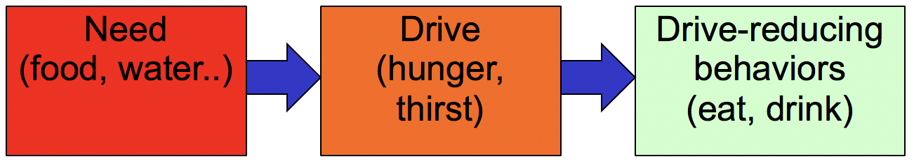

+++
Categories = ["Rubicon", "Neuroscience", "Cognition"]
bibfile = "ccnlab.json"
+++

[This page covers needs, drives, motivation, and affect in relation to emotion]

**Emotion** is something everyone experiences but it remains somewhat difficult to define precisely, in part because of our strong subjective experiences ([[@EkmanDavidson94]]; [[@LeDoux00]]). From the computational and neuroscience perspective taken here, we can provide a more precise definition:

> Emotion reflects the activity of midbrain and brainstem systems that have been shaped by evolution to guide the behavior of the organism in adaptive ways to satisfy its **needs** in relation to the external and internal state. Most emotional states involve midbrain **neuromodulatory systems** such as [[dopamine]] and [[serotonin]] that broadcast signals reflecting important changes in body state and have widespread effects on the entire brain.

These brain systems overlap with many elements of the [[limbic system]], and are anchored by the **hypothalamus**, **periaqueductal gray**, **parabrachial area**, and associated nuclei that directly sense the internal body state (interoception), which is conveyed in part by the vagus nerve via the medulla oblongota.

Multiple layers of additional processing and control over the brainstem systems have been added and elaborated over the course of brain evolution, including:

* The [[amygdala]], which makes connections between sensory inputs processed by the cortex (visual, auditory) and underlying body states.

* Ventral and medial [[basal ganglia]] (e.g., the nucleus accumbens) including the ventral pallidum output pathway that interconnects widely with the midbrain areas.

* The [[lateral habenula]], which integrates a wide range of sensory inputs to determine when to "give up", according to the [[Rubicon]] framework.

* Ventral and medial [[prefrontal cortex]] areas, that receive and send extensive connections to all of the other emotion-processing areas, providing a higher level of integration and control that is the focus of the [[Rubicon]] framework.

* Ventral [[hippocampus]], which is also extensively interconnected with all of these areas, and provides the ability to rapidly encode emotional states associated with distinct events in time and space.

Psychologically based accounts have struggled with attempts to categorize the number and nature of emotional states, and to delineate boundaries between emotion and cognition ([[@EkmanDavidson94]]; [[@LeDoux00]]). By contrast, the Rubicon framework is based on the idea that the goal-driven, motivational aspect of emotional states is essential for driving the learning and cognitive control that shapes all cognitive functions.

Computationally, much of this falls within the domain of [[reinforcement learning]] (RL). However, RL typically only deals with a very limited scope of "emotion", as captured in a single scalar reward value, whereas the Rubicon framework encompasses a broader range of states and the relationship between needs / drives and the current internal state, including goals and **motivational** state.

The term **affect** typically encompasses a broader scope than emotion, but we use them essentially interchangably here, under the above definition. Likewise, the psychological distinction between **mood** and emotion is not a primary concern in our framework, where the relevant internal states can extend across a range of different timescales.

## Categorizing emotion

{id="figure_valence-arousal" style="height:25em"}

{id="figure_plutchik" style="height:40em"}

From a subjective, psychological perspective, emotions can be categorized most broadly in terms of **valence** (positive vs. negative) and **arousal** (high vs. low) ([[#figure_valence-arousal]]). Progressively more differentiated systems have been developed, with Plutchik's wheel of emotions providing a nice comprehensive set ([[#figure_plutchik]]; [[@Plutchik01]]).

{id="figure_maslow" style="height:35em"}

What about more basic feelings, like _hunger_, _thirst_, etc? [[@^Maslow43]] developed a hierarchical schema to organize human needs, with the most basic ones providing the foundation, and higher-level ones only entertained once the basic needs are satisfied ([[#figure_maslow]]).

{id="figure_needs" style="height:40em"}
![Emotional states as providing guidance toward satisfying needs, with a lack of need satisfaction generally driving negative emotional states, while need satisfaction drives positive ones. The list of needs is ordered  with the most essential needs at the bottom, as in Maslow's hierarchy. We don't usually think of things like hunger and thirst as emotions, but according to this system, they play the same overall role, and share many neural substrates in common. Resources refers to any kind of material thing needed to survive in the current physical environment (money, territory, nesting material, tools, building materials, etc). The social factors include S = self perspective and O = other perspective. Most of these needs apply across all species of mammals and other vertibrates to variable extents. The social needs are particularly important for shaping flexible, open-ended human cognition.](media/fig_emotion_needs.png)

We can build on this schema to define a comprehensive organization of emotions organized around the things that humans need to do from an evolutionary perspective, as summarized in [[#figure_needs]]. This table provides a place for most of the terms in Plutchik's wheel of emotions, and covers most of the needs in Maslow's hierarchy, providing a reasonable basis for seeing how emotions help guide us toward the things we need to survive and thrive.

Interestingly, most of these needs apply across all species of mammals and even more broadly to all animals. This suggests that emotion per se is widely shared across the animal kingdom, not something that is uniquely human, which is consistent with emotion being rooted in the deepest, most evolutionarily ancient portions of the brainstem. What the human brain adds is a much enlarged [[neocortex]] and an associated ability to gain [[conscious awareness]] of all this emotional stuff going on, largely via the extensive connectivity from these brainstem areas into the medial and ventral regions of the [[prefrontal cortex]].

{id="figure_drives" style="height:5em"}

From a computational perspective, we can define each of these needs as having a current **drive** level ([[@Hull43]]), which reflects the current lack of satisfaction of the need ([[#figure_drives]]). This is the model incorporated in the [[Rubicon]] model, with a variable number of need factors that each have associated drives and USs that satisfy them.

## Social needs

Like many other species, humans are strongly social animals, and we depend on others to survive and thrive. There is a strong correlation between brain size and size of social networks in primates ([[@Dunbar92]]; [[@Dunbar16]]), suggesting that we owe our big brains to being highly social animals: it takes careful thought and planning to navigate the complexities of the social world.

Furthermore, [[@^Tomasello01]] argues that humans have a unique drive to share that is not evident in even our closest primate relatives (e.g., chimpanzees). This sharing instinct is what drives the pervasive nature of our cultural evolution, where we acquire much of our knowledge from the accumulated wisdom of those who have come before us.

A major function of emotion is to communicate and share our internal states with others, so they can help us satisfy our needs as well. This is nicely conveyed in the movie _Inside Out_ with respect to the important role of sadness. Considerable work has identified a set of facial expressions that are universally recognized across cultures ([[@EkmanFriesen75]]): anger, disgust, fear, happiness, sadness and surprise. Note that this small set is not thought to be exhaustive, and not all emotional states are communicated: the ones on this list are those that are clearly useful to communicate.

