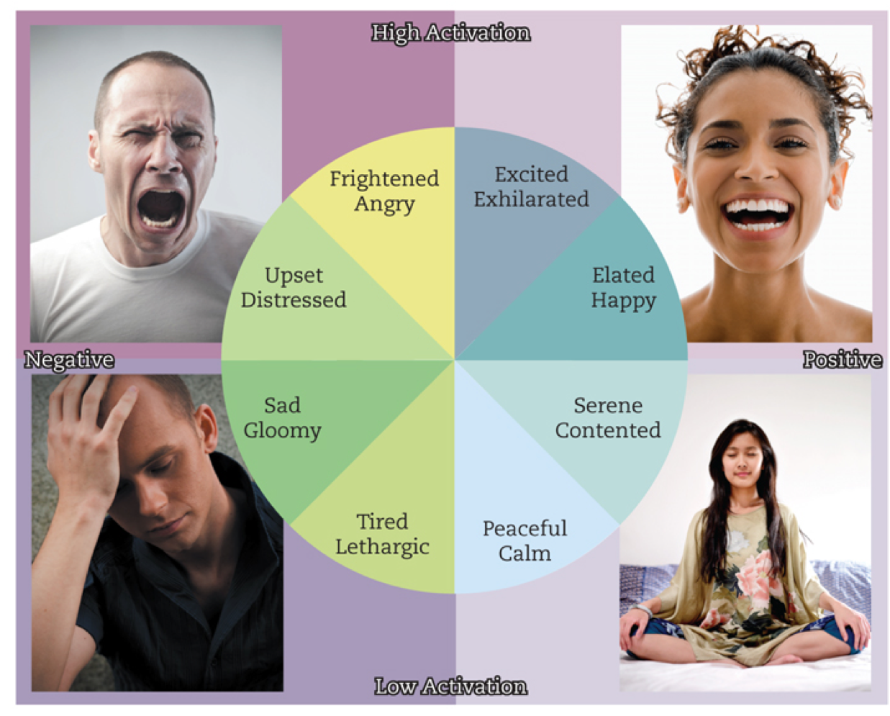
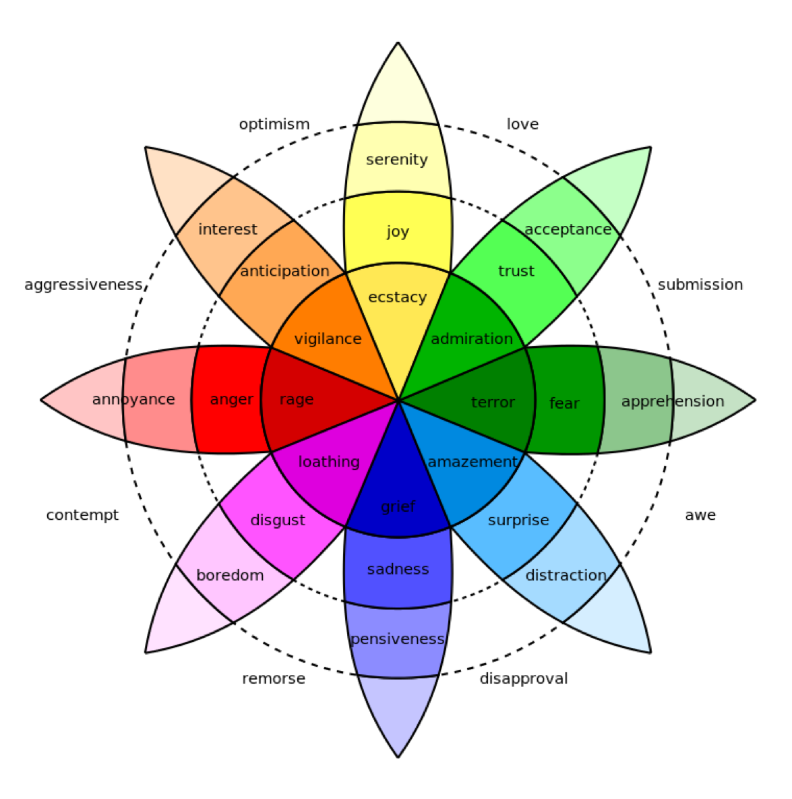
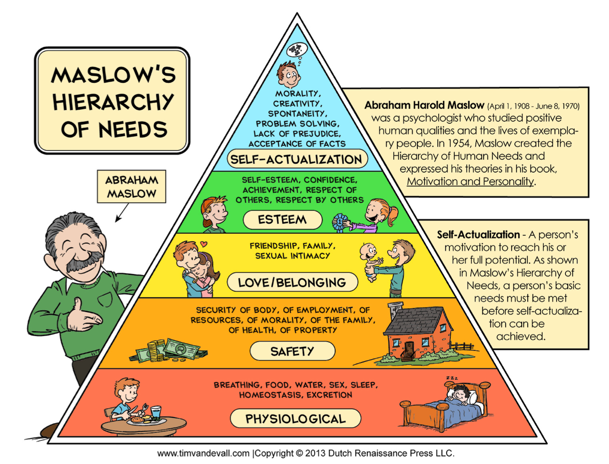

+++
Categories = ["Rubicon", "Neuroscience"]
bibfile = "ccnlab.json"
+++

**Emotion** is something everyone experiences but it remains somewhat difficult to define precisely. From the computational and neuroscience perspective taken here, we can provide a more precise definition:

> Emotion reflects the activity of midbrain and brainstem systems that have been shaped by evolution to guide the behavior of the organism in adaptive ways in relation to its external and internal state. These brain systems are anchored by the hypothalamus and associated nuclei that directly sense the internal body state (interoception), many of which are conveyed by the vagus nerve via the medulla oblongota. The [[amygdala]] makes connections between sensory inputs processed by the cortex (visual, auditory) and underlying body states. Important changes in body state are signalled by neuromodulators such as [[dopamine]] and [[serotonin]] that are driven by these systems, and have widespread effects on the entire brain. There are many layers of control, integration, and modulation of these systems, including the ventral and medial [[basal ganglia]] via the ventral pallidum, the [[lateral habenula]], and ventral and medial [[prefrontal cortex]] areas.

In other words, emotion by this definition is the domain of the [[limbic system]], and computationally is related to [[reinforcement learning]] (RL). However, RL typically only deals with a very limited scope of "emotion", as captured in a single scalar reward value. The [[Rubicon]] framework encompasses a broader range of states and the relationship between needs / drives and the current internal state.

The term **affect** typically encompasses a broader scope than emotion, but we use them essentially interchangably here, under the above definition.

{id="figure_valence-arousal" style="height:25em"}

{id="figure_plutchik" style="height:40em"}

From a subjective, psychological perspective, emotions can be categorized most broadly in terms of **valence** (positive vs. negative) and **arousal** (high vs. low) ([[#figure_valence-arousal]]). Progressively more differentiated systems have been developed, with Plutchik's wheel of emotions providing a nice comprehensive set ([[#figure_plutchik]]; [[@Plutchik01]]).

{id="figure_maslow" style="height:35em"}

What about more basic feelings, like _hunger_, _thirst_, etc? [[@^Maslow43]] developed a hierarchical schema to organize human needs, with the most basic ones providing the foundation, and higher-level ones only entertained once the basic needs are satisfied ([[@figure_maslow]]).

{id="figure_needs" style="height:40em"}
![Emotional states as providing guidance toward satisfying needs. The list of needs is roughly in terms of overall necessity, with the most essential needs at the bottom, as in Maslow's hierarchy. We don't usually think of things like hunger and thirst as emotions, but according to this system, they play the same overall role, and share many neural substrates in common. Resources refers to any kind of material thing needed to survive in the current physical environment (money, tools, building materials, etc).](media/fig_emotion_needs.png)

We can build on this schema to define a comprehensive organization of emotions organized around the things that humans need to do from an evolutionary perspective, as summarized in [[#figure_needs]]. This table provides a place for most of the terms in Plutchik's wheel of emotions, and covers most of the needs in Maslow's hierarchy, providing a reasonable basis for seeing how emotions help guide us toward the things we need to survive and thrive.

From a computational perspective, we can define each of these needs as having a current drive level, which reflects the 

