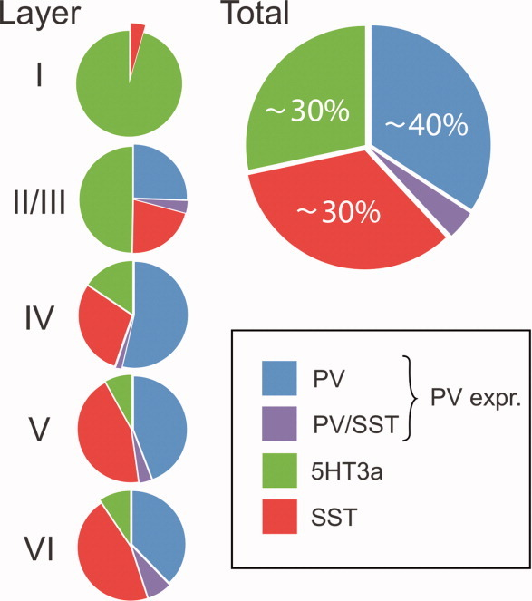

+++
Categories = ["Activation", "Axon"]
bibfile = "ccnlab.json"
+++

**Inhibitory competition**, mediated by specialized **inhibitory interneurons** in the [[neocortex]] ([[@Cardin18]]) is important for providing dynamic regulation of overall network activity, which is especially critical when there are positive feedback loops between neurons as in the case of [[bidirectional connectivity]]. The existence of epilepsy in the human neocortex indicates that achieving the right balance between inhibition and excitation is difficult. The fact that the neocortex remains so close to the edge of controlling these positive feedback loops strongly suggests that the many functional benefits of this bidirectional excitatory connectivity are indeed crucial from an evolutionary perspective.

Inhibition gives rise to **sparse** [[distributed representations]] (having a relatively small percentage of neurons active at a time, e.g., 15% or so), which have numerous advantages over distributed representations that have many neurons active at a time, and are a well-established property of the cortex ([[@SimoncelliOlshausen01]]; [[@OlshausenField96]]; [[@Barlow61]]). In addition, inhibitory competition plays a key role in the learning process, analogous to the Darwinian "survival of the fittest" dynamic ([[@RumelhartZipser85]]; [[@Edelman87]]), and is widely used in [[abstract neural network]]s via the softmax function and max-pooling mechanisms. See the [[self-organization sim]] for a demonstration.

An air conditioner (AC) provides a useful analogy for how inhibition works, using as thermostat control that determines when it turns on as a function of the ambient temperature. This kind of **feedback control** system allows the room to warm up to a given **set point** (e.g., 75 degrees F) before it starts to counter the heat. Similarly, inhibition in the cortex is proportional to the amount of excitation, and it produces a similar set point behavior, where activity is prevented from getting too high: typically no more than roughly 15-25% of neurons in any given area are active at a time.

Another useful analogy comes from what happens when you place a microphone near a speaker that is playing the sound from that microphone: this is a bidirectional excitatory system, and it quickly leads to that familiar, very loud "feedback" squeal. If one's audio system had the equivalent of the inhibitory system in the cortex, it would actually be able to prevent this feedback by dynamically turning down the input gain on the microphone, and/or the output volume of the speaker.

Inhibition is also critical for [[attention]], for suppressing the activity of many weaker inputs and allowing processing to focus on the most active one(s). For example, when searching for a friend in a crowd, you cannot process all of the people at once, so only a relatively few capture your attention, while the rest are ignored. In neural terms, we say that the detectors for the attended few were sufficiently excited to out-compete all the others, which remain below the firing threshold due to the high levels of inhibition. Both bottom-up and top-down factors can contribute to which neural detectors get over threshold or not, but without inhibition, there wouldn't be any ability to select only a few to focus on in the first place.

People with Balint's syndrome, who have bilateral damage to the parietal cortex (which plays a critical role in spatial attention of this sort), show reduced attentional effects and also are typically unable to process anything if a visual display contains more than one item (i.e., _simultanagnosia_, which is the inability to recognize objects when there are multiple simultaneously present in a scene). You can explore a simulation of this phenomenon in the [[attention sim]]. 

## Feedforward and feedback inhibition

{id="figure_inhib-types"}

There are two distinct patterns of neural connectivity that drive inhibitory interneurons in the cortex, **feedforward** and **feedback** ([[#figure_inhib-types]]). Just to keep things interesting, these are not the same as the connections among excitatory neurons. Functionally, feedforward inhibition can *anticipate* how excited the excitatory neurons will become, whereas feedback accurately reflects the actual level of activation they achieve.

Feedback inhibition is the most intuitive, so we'll start with it. Here, the inhibitory interneurons are driven by the same excitatory neurons that they then project back to and inhibit. This is the classical "feedback" circuit from the AC example. When a set of excitatory neurons starts to get active, they then communicate this activation to the inhibitory interneurons (via _excitatory glutamatergic_ synapses onto inhibitory interneurons --- inhibitory neurons have to get excited just like everyone else). This excitation of the inhibitory neurons then causes them to fire action potentials that come right back to the excitatory neurons, opening up their inhibitory ion channels via GABA release.

The influx of $Cl^-$ (chloride) ions from the inhibitory input [[neuron channels#GABA-A|channels]] on these excitatory neurons acts to drive them back down in the direction of the inhibitory driving potential (in the tug-of-war analogy in [[neuron]], the inhibitory guy gets bigger and pulls harder). Thus, excitation begets inhibition which counteracts the excitation and keeps everything under control, just like a blast of cold air from the AC unit.

Feedforward inhibition is perhaps a bit more subtle. It operates when the excitatory synaptic inputs to excitatory neurons in a given area also drive the inhibitory interneurons in that area, causing the interneurons to inhibit the excitatory neurons _in proportion to the amount of excitatory input they are currently receiving._ This would be like a thermostat reacting to the _anticipated_ amount of heat, for example, by turning on the AC based on the _outside_ temperature. Thus, the key difference between feedforward and feedback inhibition is that **feedforward reflects the net excitatory input**, whereas **feedback reflects the actual activation output** of a given set of excitatory neurons.

The anticipatory function of feedforward inhibition is crucial for limiting the kinds of dramatic feedback oscillations that can develop in a purely feedback-driven system. However, too much feedforward inhibition makes the system very slow to respond, so there is an optimal balance of the two types that results in a  robust and responsive inhibitory dynamic.

Furthermore, the way in which inhibition and excitation interact through the tug-of-war dynamic as we saw in [[neuron]] is _essential_ for enabling these inhibitory dynamics to be as robust as they are. For example, the shunting nature of inhibition, which only starts to resist once the membrane potential starts to rise, enables the neurons to get some level of activity and then get pulled back down --- an alternative subtractive form of inhibition (i.e., simply subtracting away from excitation) would either prevent activation entirely or not generate enough inhibition to control the excitation.

See the [[inhibition sim]] to explore the roles of feedforward and feedback inhibitory connectivity.

## Fast-spiking vs slower-acting inhibitory interneurons

{id="figure_pv-sst-vip" style="height:25em"}

{id="figure_pv-sst-vip-layers"  style="height:20em"}

By far the greatest diversity of neuron types in the [[neocortex]] is in the inhibitory interneurons, and attempts to develop highly detailed models end up spending a huge amount of effort capturing all these details ([[@MarkramMullerRamaswamyEtAl15]]; [[@Schneider-MizellBodorBrittainEtAl25]]). However, [[#figure_pv_sst_vip]] shows that there is a much simpler overarching categorization of this complexity into three primary types ([[@RudyFishellLeeEtAl11]]; [[@Cardin18]]):

* Fast-spiking parvalbumin positive (PV) neurons, which encompass the prevalent _basket_ and _chandelier_ morphological subtypes that target cell bodies. These are the "first responders", providing quick control of activity, responding to new excitatory input, allowing the first spiking pyramidal neurons to quickly shut off other competitors, and maintain a sparse overall level of activity. The PV activity level (and consequent inhibitory conductance into pyramidal cells, `Gi`) closely tracks the incoming excitatory conductance `Ge`, which keeps neurons in their sensitive dynamic range ([[@ShadlenNewsome94]]).

* Slower-responding somatostatin positive (SST) neurons, which are primarily _Martinotti_ cells that target the dendrites of pyramidal neurons. These higher-threshold neurons require repetitive, facilitating afferent input to be activated, and likely regulate the dendritic integration of synaptic inputs over a longer timescale. 

* Modulatory neurons with serotonin receptors (5Ht3aR), of which the most relevant subtypes are VIP (vasoactive intestinal peptide) and Reelin positive cells. These are likely to be involved in transitions between waking and sleeping states (serotonin is the primary neuromodulator involved in such transitions) ([[@Cardin18]]). Furthermore, these neurons are the dominant type in cortical layer 1 ([[#figure_pv-sst-vip-layers]]) that receives significant projections from the thalamus, which is thought to have dynamic modulatory influences over the cortex, likely involving these interneurons. The modulatory effects of the thalamus are critical for the function of the [[basal ganglia]] in the [[Rubicon]] model.

The fast-spiking PV neurons and slower-responding SST neurons have been most thoroughly studied, and are likely to play a dominant role in generating inhibitory input to neocortical neurons during normal waking behavioral states, while the modulatory 5Ht3aR cells can be simulated using longer time-scale modulatory mechanisms.

Thus, we focus on understanding the contributions of the complementary fast-vs-slow PV and SST interneurons. One critical biological mechanism present in these neurons is direct electrical coupling via _gap junctions_ ([[@GibsonBeierleinConnors99]]; [[@GalarretaHestrin99]]; [[@Cardin18]]), which will cause this network of neurons to work together in a more coordinated way than most other neurons (e.g., like a "hive mind"). This raises the important question as to whether it might be more efficient and reasonably accurate to simulate an larger population of such neurons using one function and shared state variables, instead of spending a lot of extra compute cycles rendering each individual such neuron.

Indeed, we have developed such a framework, and found that it works well for controlling overall levels of excitation in bidirectionally connected neurons, and for supporting learning in large multilayer ("deep") networks. This can be thought of as an explicitly _pooled_ form of inhibition, where a group or pool of excitatory neurons all share a corresponding pooled set of inhibitory interneurons, which are likely to be significantly interconnected electrically through gap junctions. In our simulations, we have control over the size of such a pool, which can be adjusted depending on the scale and anatomical specifics of the area being simulated.

## FS-FFFB inhibition function

This approach of using a summary function instead of separate inhibitory interneurons dates back to the earliest versions of [[Leabra]], which used an abstract computed _k-Winners-Take-All_ (kWTA) form of inhibition. Later, a more biologically based FFFB (feedforward, feedback) inhibition function was developed, which computed the pooled inhibitory conductance `Gi` as a simple scaled function of the average excitatory conductance of neurons in the pool ($\langle Ge \rangle$), reflecting the FF component, and the average rate-code activation reflecting the FB component ($\langle Act \rangle$).

{id="figure_fs_vs_fffb" style="height:20em"}

This inhibition function was initially used in [[Axon]] with reasonable success, before developing the purely spike-based equations described below. Interestingly [[#figure_fs_vs_fffb]] shows that best parameters for the new spike-based function produced a nearly identical resulting `Gi` value as the previous Leabra FFFB function based on time-integrated Ge and Act rate-code functions. This correspondence was only discovered after optimizing the new equations based on learning performance across a range of models, and it was originally hoped that some kind of novel, improved inhibitory dynamic emerge. Instead, it appears that there is a fairly specific, "conserved" functional form that works best. The fact that this form depends critically on a mix of a fast PV-like component and a slow SST-like component provides a nice [[synergies|synergy]] between computation and the underlying neurobiology.

The new spike-based equations incorporate the distinct contributions of the PV (fast-spiking) and SST (slow-spiking) neuron types, and the FF and FB connectivity patterns, and is thus named `FS-FFFB` (fast-slow FFFB). The slow contribution simulating the SST neurons corresponds to the slow responding of the time-integrated activation component of the original FFFB model, while the fast contribution of PV neurons corresponds to the rapid responses of the Ge component of original FFFB. Thus, the strong correspondence in results shown in [[#figure_fs_vs_fffb]] and the dependence on a mix of fast and slow signals suggests that these different time constants are critical for an effective form of inhibition. Furthermore, it is easy to see that only using the fast PV or slow SST components does not work in practice.

{id="table_fs-fffb-params" title="FS-FFFB Parameters"}
| Param    | Default | Doc                                                   |
|----------|---------|-------------------------------------------------------|
| Gi       | 1       | overall multiplier for Total Gi                       |
| FB       | 1       | feedback (FB) spikes added to fast spiking (FF = 1)   |
| FSTau    | 6       | Fast spiking (PV) decay time constant                 |
| SS       | 30      | Slow spiking (SST) scaling factor (FS is always * 1)  |
| SSfTau   | 20      | Slow spiking facilitation (SSf) decay time constant   |
| SSiTau   | 50      | Slow spiking integration (SSi) time constant (rise and decay) |
| FS0      | 0.1     | Fast spiking zero point threshold                     | 
| FFAvgTau | 50      | Feedforward running average integration time constant |

{id="table_fs-fffb-vals" title="FS-FFFB State values"}
| Value    | Doc                                                                |
|----------|--------------------------------------------------------------------|
| FFs      | all feedforward incoming excitatory spikes normalized by pool size |
| FBs      | all feedback outgoing spikes from neurons in this pool, normalized |
| FSi      | the fast spiking PV integration of FFs feedforward spikes          |
| SSi      | the slow spiking SST integration of FBs feedback spikes            |
| SSf      | the slow spiking facilitation factor based on recent activity      |
| FSGi     | the overall fast-spiking inhibitory conductance                    |
| SSGi     | the overall slow-spiking inhibitory conductance                    |
| TotalGi  | the overall inhibitory conductance = FSGi + SSGi                   |

{id="eq_fsi" title="Fast spiking (PV) integration"}
$$
FSi = FSi + (FFs + FB * FBs) - \frac{1}{FSTau} FSi
$$

[[#eq_fsi]] updates the integrated fast spiking value FSi, which represents the activity of the PV neurons. It has an instantaneous rise and decays with the FSTau [[time constant]] (6 ms default). The fast spiking value integrates both feedforward (FF) and feedback (FB) inputs, where FF always contributes with a factor of 1, and FB has a parameter that can scale the FB contributions -- it defaults to 1 but can sometimes benefit from being larger for layers with very sparse activity.

{id="eq_ssi" title="Slow spiking (SST) integration"}
$$
SSi = SSi + \frac{1}{SSiTau} (SSf * FBs - SSi)
$$

[[#eq_ssi]] updates the integrated slow spiking value SSi, which represents the activity of the SST neurons. SSi is driven exclusively by feedback spikes (FBs) and the rise is dependent on the SSf facilitation factor, which reflects the fact that SST neurons have strongly facilitating synapses that start weak and get stronger as a function of the spikes coming into the SST neurons. Rise and decay are governed by the same [[time constant]] SSiTau.

{id="eq_ssf" title="Slow spiking facilitation factor (SSf)"}
$$
SSf = SSf + FBs*(1-SSf) - \frac{1}{SSfTau} SSf
$$

[[#eq_ssf]] updates the slow spiking facilitation factor (SSf), as a function of the incoming FBs spikes and a slow decay factor.

{id="eq_total" title="Total inhibitory conductance"}
$$
TotalGi = Gi * (SS * SSi + [FSi - FS0]_+)
$$

[[#eq_total]] computes the total inhibitory conductance as a function of the SSi and FSi integrated values. Note that the FSi value is subject to the FS0 threshold, where values below FS0 are truncated to 0.

Finally, because the SST neurons specifically target dendrites instead of cell bodies, 

Again see the [[inhibition sim]] to explore these equations and parameters in a simple network with full instrumentation to record all the FS-FFFB values.

## Inhibition pages

