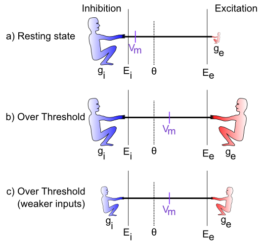

+++
Categories = ["Activation", "Axon"]
bibfile = "ccnlab.json"
+++

{id="figure_tug-of-war"}


The process of integrating the three different types of input signals (excitation, inhibition, leak) lies at the heart of neural computation. This section provides a conceptual, intuitive understanding of this process, and how it relates to the underlying electrical properties of neurons. Later, we'll see how to translate this process into mathematical equations that can actually be simulated on the computer.

The integration process can be understood in terms of a **tug-of-war** ([[#figure_tug-of-war]]). This tug-of-war takes place in the space of **electrical potentials** that exist in the neuron relative to the surrounding extracellular medium in which neurons live (interestingly, this medium, and the insides of neurons and other cells as well, is basically salt water with sodium ($Na^+$), chloride ($Cl^-$) and other ions floating around --- we carry our remote evolutionary environment around within us at all times). The core function of a neuron can be understood entirely in electrical terms: voltages (electrical potentials) and currents (flow of electrically charged ions in and out of the neuron through tiny pores called **ion channels**).

To see how this works, let's just consider excitation versus inhibition (inhibition and leak are effectively the same for our purposes at this time). The key point is that **the integration process reflects the relative strength of excitation versus inhibition** --- if excitation is stronger than inhibition, then the neuron's electrical potential (voltage) increases, perhaps to the point of getting over threshold and firing an output action potential. If inhibition is stronger, then the neuron's electrical potential decreases, and thus moves further away from getting over the threshold for firing.

Before we consider specific cases, let's introduce some obscure terminology that neuroscientists use to label the various actors in our tug-of-war drama (going from left to right in the Figure):

*  $g_i$ --- the **inhibitory conductance** (*g* is the symbol for a conductance, and *i* indicates inhibition) --- this is the total strength of the inhibitory input (i.e., how strong the inhibitory guy is tugging), and plays a major role in determining how strong of an inhibitory current there is. This corresponds biologically to the proportion of inhibitory ion channels that are currently open and allowing inhibitory ions to flow (these are **chloride** or **$Cl^-$** ions in the case of GABA **inhibition**, and **potassium** or **$K^+$** ions in the case of **leak** currents). For electricity buffs, the conductance is the inverse of resistance --- most people find conductance more intuitive than resistance, so we'll stick with it.

* $E_i$ --- the **inhibitory driving potential** --- in the tug-of-war metaphor, this just amounts to where the inhibitory guy happens to be standing relative to the electrical potential scale that operates within the neuron. Typically, this value is around -75mV where **mV** stands for **millivolts** --- one thousandth (1/1,000) of a volt. These are very small electrical potentials for very small neurons.

* $\Theta$ --- the **action potential threshold** --- this is the electrical potential at which the neuron will fire an action potential output to signal other neurons. This is typically around -50mV. This is also called the **firing threshold** or the **spiking threshold**, because neurons are described as "firing a spike" when they get over this threshold.

* $V_m$ --- the **membrane potential** of the neuron (V = voltage or electrical potential, and m = membrane). This is the current electrical potential of the neuron relative to the extracellular space outside the neuron. It is called the membrane potential because it is the cell membrane (thin layer of fat basically) that separates the inside and outside of the neuron, and that is where the electrical potential really happens. An electrical potential or voltage is a relative comparison between the amount of electric charge in one location versus another. It is called a "potential" because when there is a difference, there is the potential to make stuff happen. For example, when there is a big potential difference between the charge in a cloud and that on the ground, it creates the potential for lightning. Just like water, differences in charge always flow "downhill" to try to balance things out. So if you have a lot of charge (water) in one location, it will flow until everything is all level. The cell membrane is effectively a dam against this flow, enabling the charge inside the cell to be different from that outside the cell. The ion channels in this context are like little tunnels in the dam wall that allow things to flow in a controlled manner. And when things flow, the membrane potential changes! In the tug-of-war metaphor, think of the membrane potential as the flag attached to the rope that marks where the balance of tugging is at the current moment.

* $E_e$ --- the **excitatory driving potential** --- this is where the excitatory guy is standing in the electrical potential space (typically around 0 mV).

* $g_e$ --- the **excitatory conductance** --- this is the total strength of the excitatory input, reflecting the proportion of excitatory ion channels that are open (these channels pass **sodium** ($Na^+$) ions --- our deepest thoughts are all just salt water moving around).

{id="figure_tug-of-war-cases"}


[[#figure_tug-of-war-cases]] shows specific cases in the tug-of-war scenario. In the first case, the excitatory conductance $g_e$ is very low (indicated by the small size of the excitatory guy), which represents a neuron at rest, not receiving many excitatory input signals from other neurons. In this case, the inhibition/leak pulls much more strongly, and keeps the membrane potential ($Vm$) down near the -70mV territory, which is also called the **resting potential** of the neuron. As such, it is below the action potential threshold $\Theta$, and so the neuron does not output any signals itself. Everyone is just chillin'.

In the next case (b), the excitation is as strong as the inhibition, and this means that it can pull the membrane potential up to about the middle of the range. Because the firing threshold is toward the lower-end of the range, this is enough to get over threshold and fire a spike! The neuron will now communicate its signal to other neurons, and contribute to the overall flow of information in the brain's network.

The last case (c) is particularly interesting, because it illustrates that the integration process is fundamentally **relative** --- what matters is how strong excitation is *relative* to the inhibition. If both are overall weaker, then neurons can still get over firing threshold. Can you think of any real-world example where this might be important? Consider the neurons in your visual system, which can experience huge variation in the overall amount of light coming into them depending on what you're looking at (e.g., compare snowboarding on a bright sunny day versus walking through thick woods after sunset). It turns out that the total amount of light coming into the visual system drives a "background" level of inhibition, in addition to the amount of excitation that visual neurons experience. Thus, when it's bright, neurons get greater amounts of both excitation and inhibition compared to when it is dark. *This enables the neurons to remain in their sensitive range for detecting things* despite large differences in overall input levels.

## Computing Activation Output

The membrane potential $Vm$ is not communicated directly to other neurons --- instead it is subjected to a **threshold** and only the strongest levels of excitation are then communicated, resulting in a much more efficient and compact encoding of information in the brain. In human terms, neurons avoid sharing "TMI" (too much information), and instead communicate only relevant, important information, as if they were following ["Gricean maxims"](https://en.wikipedia.org/wiki/Cooperative_principle).

Actual neurons in the Neocortex compute discrete **spikes** or **action potentials**, which are very brief ( &lt; 1 ms) and trigger the release of neurotransmitter that then drives the excitation or inhibition of the neurons they are sending to. After the spike, the membrane potential $Vm$ is reset back to a low value (at or even below the resting potential), and it must then climb back up again to the level of the threshold before another spike can occur. This process results in different *rates of spiking* associated with different levels of excitation --- it is clear from eletrophysiological recordings of neurons all over the neocortex that this **spike rate** information is highly informative about behaviorally and cognitively relevant information. There remains considerable debate about the degree to which more precise differences in spike timing contain additional useful information.

In our computer models, we can simulate discrete spiking behavior directly in a very straightforward way (see below for details). However, we often use a **rate code** approximation instead, where the activation output of the neuron is a *real valued number* between 0-1 that corresponds to the overall rate of neural spiking. We typically think of this rate code as reflecting the net output of a small population of roughly 100 neurons that all respond to similar information --- the neocortex is organized anatomically with **microcolumns** of roughly this number of neurons, where all of the neurons do indeed code for similar information. Use of this rate code activation enables smaller-scale models that converge on a stable interpretation of the input patterns rapidly, with an overall savings in computational time and model complexity. Nevertheless, there are tradeoffs in using these approximations, which we will discuss more in the Networks and other chapters. Getting the rate code to produce a good approximation to discrete spiking behavior has been somewhat challenging in the Leabra framework, and only recently has a truly satisfactory solution been developed, which is now the standard in the [emergent](https://github.com/emer) software.

## Mathematical Formulations

Now you've got an intuitive understanding of how the neuron integrates excitation and inhibition. We can capture this dynamic in a set of mathematical equations that can be used to simulate neurons on the computer. The first set of equations focuses on the effects of inputs to a neuron. The second set focuses on generating outputs from the neuron. We will cover a fair amount of mathematical ground here. Don't worry if you don't follow all of the details. As long as you follow conceptually what the equations are doing, you should be able to build on this understanding when you get your hands on the actual equations themselves and explore how they behave with different inputs and parameters. You will see that despite all the math, the neuron's behavior is indeed simple: the amount of excitatory input determines how excited it gets, in balance with the amount of inhibition and leak. And the resulting output signals behave pretty much as you would expect.

### Computing Inputs

We begin by formalizing the "strength" by which each side of the tug-of-war pulls, and then show how that causes the $Vm$ "flag" to move as a result. This provides explicit equations for the tug-of-war dynamic integration process. Then, we show how to actually compute the conductance factors in this tug-of-war equation as a function of the inputs coming into the neuron, and the synaptic weights (focusing on the excitatory inputs for now). Finally, we provide a summary equation for the tug-of-war which can tell you where the flag will end up in the end, to complement the dynamical equations which show you how it moves over time.

#### Neural Integration

The key idea behind these equations is that each guy in the tug-of-war pulls with a strength that is proportional to both its overall strength (conductance), and how far the "flag" ($Vm$) is away from its position (indicated by the driving potential E). Imagine that the tuggers are planted in their position, and their arms are fully contracted when the $Vm$ flag gets to their position (E), and they can't re-grip the rope, such that they can't pull any more at this point. To put this idea into an equation, we can write the "force" or **current** that the excitatory guy exerts as:

{id="eq_Ie"}
$$
I_e = g_e \left(E_e-V_m\right)
$$

The excitatory current is $I_e$ (I is the traditional term for an electrical current, and e again for excitation), and it is the product of the conductance $g_e$ times *how far the membrane potential is away from the excitatory driving potential*. If $V_m = E_e$ then the excitatory guy has "won" the tug of war, and it no longer pulls anymore, and the current goes to zero (regardless of how big the conductance might be --- anything times 0 is 0). Interestingly, this also means that the excitatory guy pulls the strongest when the $Vm$ "flag" is furthest away from it --- i.e., when the neuron is at its resting potential. Thus, it is easiest to excite a neuron when it's well rested.

The same basic equation can be written for the inhibition guy, and also separately for the leak guy (which we can now reintroduce as a basic clone of the inhibition term):

{id="eq_Ii"}
$$
I_i = g_i \left(E_i-V_m\right)
$$

leak current:

{id="eq_Il"}
$$
I_l = g_l \left(E_l-V_m\right)
$$

(only the subscripts are different).

Next, we can add together these three different currents to get the **net current**, which represents the net flow of charged ions across the neuron's membrane (through the ion channels):

{id="eq_Inet"}
$$
I_{net} = I_e + I_i + I_l
$$

$$
= g_e \left(E_e-V_m\right) + g_i \left(E_i-V_m\right) + g_l \left(E_l-V_m\right)
$$

So what good is a net current? Recall that electricity is like water, and it flows to even itself out. When water flows from a place where there is a lot of water to a place where there is less, the result is that there is less water in the first place and more in the second. The same thing happens with our currents: the flow of current changes the membrane potential (height of the water) inside the neuron:

{id="eq_Vm"}
$$
V_m\left(t\right) = V_m\left(t-1\right) + dt_{vm} I_{net}
$$

$V_m(t)$ is the current value of $Vm$, which is updated from value on the previous time step $V_m(t-1)$, and the $dt_{vm}$ is a **rate constant** that determines how fast the membrane potential changes --- it mainly reflects the capacitance of the neuron's membrane).

The above two equations are the essence of what we need to be able to simulate a neuron on a computer! It tells us how the membrane potential changes as a function of the inhibitory, leak and excitatory inputs --- given specific numbers for these input conductances, and a starting $Vm$ value, we can then **iteratively** compute the new $Vm$ value according to the above equations, and this will accurately reflect how a real neuron would respond to similar such inputs!

To summarize, here's a single version of the above equations that does everything:

{id="eq_Vm-full"}
$$
V_m(t) = V_m(t-1) + dt_{vm} \left[ g_e (E_e-V_m) + g_i (E_i-V_m) + g_l (E_l-V_m) \right]
$$

For those of you who noticed the issue with the minus sign above, or are curious how all of this relates to **Ohm's law** and the process of diffusion, please see the Chapter Appendix section *Electrophysiology of the Neuron*. If you're happy enough with where we've come, feel free to move along to finding out how we compute these input conductances, and what we then do with the $Vm$ value to drive the output signal of the neuron.

#### Computing Input Conductances

The excitatory and inhibitory input conductances represent the total number of ion channels of each type that are currently open and thus allowing ions to flow. In real neurons, these conductances are typically measured in nanosiemens (nS), which is $10^{-9}$ siemens (a very small number --- neurons are very tiny). Typically, neuroscientists divide these conductances into two components:

* $\bar{g}$ ("g-bar") --- a constant value that determines the **maximum conductance** that would occur if every ion channel were to be open, and:

* $g\left(t\right)$ --- a dynamically changing variable that indicates at the present moment, what fraction of the total number of ion channels are currently open (goes between 0 and 1).

Thus, the total conductances of interest are written as: **excitatory conductance:**

{id="eq_gbar-e"}
$$
\overline{g}_e g_e(t)
$$

and the **inhibitory conductance:**

{id="eq_gbar-i"}
$$
\overline{g}_i g_i(t)
$$

and the **leak conductance:**

{id="eq_gbar-l"}
$$
\overline{g}_l
$$

(note that because leak is a constant, it does not have a dynamically changing value, only the constant g-bar value).

This separation of terms makes it easier to compute the conductance, because all we need to focus on is computing the proportion or fraction of open ion channels of each type. This can be done by computing the average number of ion channels open at each synaptic input to the neuron:

{id="eq_gbar-e-sum"}
$$
g_e(t) = \frac{1}{n} \sum_i x_i w_i
$$

where $x_i$ is the **activity** of a particular sending neuron indexed by the subscript *i*, $w_i$ is the **synaptic weight strength** that connects sending neuron *i* to the receiving neuron, and *n* is the total number of channels of that type (in this case, excitatory) across all synaptic inputs to the cell. As noted above, the synaptic weight determines what patterns the receiving neuron is sensitive to, and is what adapts with learning --- this equation shows how it enters mathematically into computing the total amount of excitatory conductance.

The above equation suggests that the neuron performs a very simple function to determine how much input it is getting: it just adds it all up from all of its different sources (and takes the average to compute a proportion instead of a sum --- so that this proportion is then multiplied by $\overline{g}_e$ to get an actual conductance value). Each input source contributes in proportion to how active the sender is, multiplied by how much the receiving neuron cares about that information --- the synaptic weight value. We also refer to this average total input as the **net input**.

The same equation holds for inhibitory input conductances, which are computed in terms of the activations of inhibitory sending neurons, times the inhibitory weight values.

There are some further complexities about how we integrate inputs from different categories of input sources (i.e., projections from different source brain areas into a given receiving neuron), which we deal with in the Chapter Appendix subsection *Net Input Detail*. But overall, this aspect of the computation is relatively simple and we can now move on to the next step, of comparing the membrane potential to the threshold and generating some output.

#### Equilibrium Membrane Potential

Before finishing up the final step in the detection process (generating an output), we will need to use the concept of the **equilibrium membrane potential**, which is the value of $Vm$ that the neuron will settle into and stay at, *given a fixed set of excitatory and inhibitory input conductances* (if these aren't steady, then the the $Vm$ will likely be constantly changing as they change). This equilibrium value is interesting because it tells us more clearly how the tug-of-war process inside the neuron actually balances out in the end. Also, we will see in the next section that it is useful mathematically.

To compute the equilibrium membrane potential ($V_m^{eq}$), we can use an important mathematical technique: set the change in membrane potential (according to the iterative $Vm$ updating equation from above) to 0, and then solve the equation for the value of $Vm$ under this condition. In other words, if we want to find out what the equilibrium state is, we simply compute what the numbers need to be such that $Vm$ is no longer changing (i.e., its rate of change is 0). Here are the mathematical steps that do this:

$$
V_m(t) = V_m(t-1) + dt_{vm} \left[ g_e (E_e-V_m) + g_i (E_i-V_m) + g_l (E_l-V_m) \right]
$$

(the **iterative $Vm$ update equation:**)

This is the part that is driving the changes (time constant omitted as we are looking for equilibrium):

$$
\Delta V_m = g_e \left(E_e-V_m\right) + g_i (E_i-V_m) + g_l (E_l-V_m)
$$

which we set to zero to find when it stops changing:
$$
0 = g_e \left(E_e-V_m\right) + g_i (E_i-V_m) + g_l (E_l-V_m)
$$

and then do some algebra to solve for $Vm$:

$$
V_m = \frac{g_e}{g_e + g_i + g_l} E_e + \frac{g_i}{g_e + g_i + g_l} E_i + \frac{g_l}{g_e + g_i + g_l} E_l
$$

The detailed math is shown in the Chapter Appendix section *Math Derivations*.

In words, this says that the excitatory drive $E_e$ contributes to the overall $Vm$ as a function of the proportion of the excitatory conductance $g_e$ relative to the sum of all the conductances ($g_e + g_i + g_l$). And the same for each of the others (inhibition, leak). This is just what we expect from the tug-of-war picture: if we ignore $g_l$, then the $Vm$ "flag" is positioned as a function of the relative balance between $g_e$ and $g_i$ --- if they are equal, then $g_e / (g_e + g_i)$ is .5 (e.g., just put a "1" in for each of the g's --- 1/2 = .5), which means that the $Vm$ flag is half-way between $E_i$ and $E_e$. So, all this math just to rediscover what we knew already intuitively! (Actually, that is the best way to do math --- if you draw the right picture, it should tell you the answers before you do all the algebra). But we'll see that this math will come in handy next.

Here is a version with the conductance terms explicitly broken out into the "g-bar" constants and the time-varying "g(t)" parts:

$$
V_m = \frac{\overline{g}_e g_e(t)}{\overline{g}_e g_e(t) + \overline{g}_i g_i(t) + \overline{g}_l} E_e  \frac{\overline{g}_i g_i(t)}{\overline{g}_e g_e(t) + \overline{g}_i g_i(t) + \overline{g}_l} E_i + \frac{\overline{g}_l}{\overline{g}_e g_e(t) + \overline{g}_i g_i(t) + \overline{g}_l} E_l
$$

For those who really like math, the equilibrium membrane potential equation is shown to be a Bayesian Optimal Detector in the Appendix.

### Generating Outputs

The output of the neuron can be simulated at two different levels: discrete spiking (which is how neurons actually behave biologically), or using a rate code approximation. We cover each in turn, and show how the rate code must be derived to match the behavior of the discrete spiking neuron, when averaged over time (it is important that our approximations are valid in the sense that they match the more detailed biological behavior where possible, even as they provide some simplification).

#### Discrete Spiking

To compute discrete action potential spiking behavior from the neural equations we have so far, we need to determine when the membrane potential gets above the firing threshold, and then emit a spike, and subsequently reset the membrane potential back down to a value, from which it can then climb back up and trigger another spike again, etc. This is actually best expressed as a kind of simple computer program:

``` C
if (Vm > Theta) then: y = 1; Vm = Vm_r; else y = 0
```

where y is the activation output value of the neuron, and $Vm_r$ is the *reset potential* that the membrane potential is reset to after a spike is triggered. Biologically, there are special potassium ($K^+$) channels that bring the membrane potential back down after a spike.

This simplest of spiking models is not *quite* sufficient to account for the detailed spiking behavior of actual cortical neurons. However, a slightly more complex model can account for actual spiking data with great accuracy (as shown by Gerstner and colleagues [[@BretteGerstner05]], even winning several international competitions!). This model is known as the *Adaptive Exponential* or AdEx model ([Scholarpedia Article on AdEx](http://www.scholarpedia.org/article/Adaptive_exponential_integrate-and-fire_model). We typically use this AdEx model when simulating discrete spiking, although the simpler model described above is also still an option. The critical feature of the AdEx model is that the effective firing threshold adapts over time, as a function of the excitation coming into the cell, and its recent firing history. The net result is a phenomenon called **spike rate adaptation**, where the rate of spiking tends to decrease over time for otherwise static input levels. Otherwise, however, the AdEx model is identical to the one described above.

