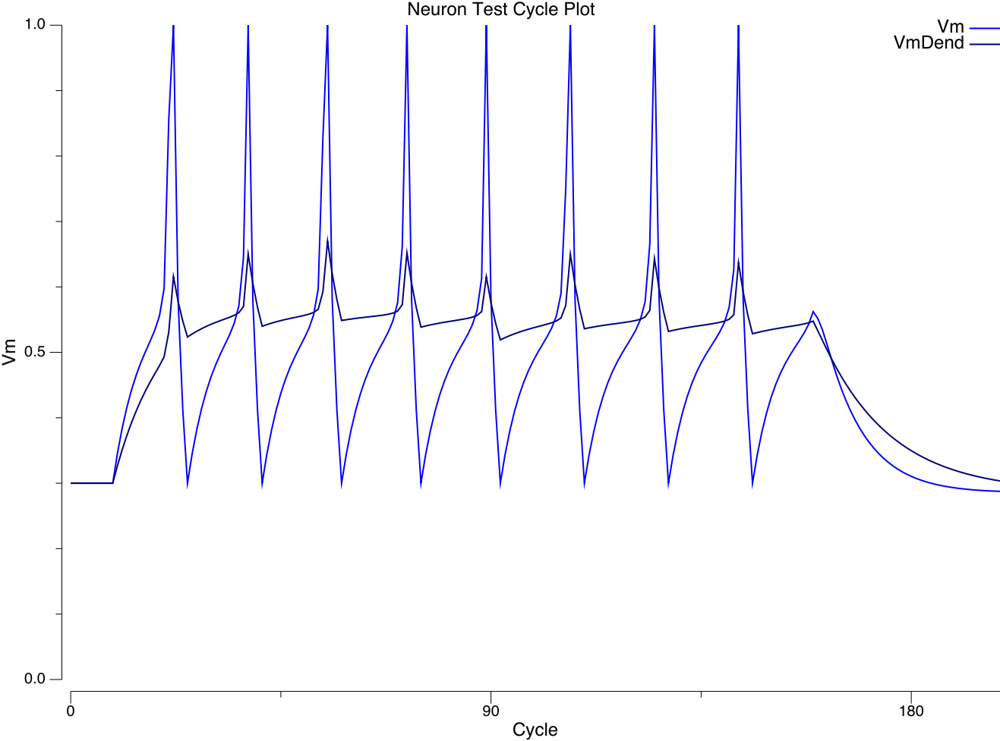

+++
Categories = ["Activation", "Axon", "Neuroscience"]
bibfile = "ccnlab.json"
+++

A key dividing line in biological realism of neural models concerns the inclusion of separate dynamics for dendrites versus the soma, with a considerable literature arguing that significant computational functionality arises from nonlinear dynamics in the dendritic integration process ([[@HausserMel03]]; [[@MiglioreHoffmanMageeEtAl99]]; [[@PoiraziBrannonMel03]]; [[@JarskyRoxinKathEtAl05]]; [[@Spruston08]]; [[@PoiraziPapoutsi20]]). The standard way of capturing these additional dendritic dynamics is to use _multi-compartment_ models, that separately simulate the electrical and channel dynamics for dendritic compartments vs the soma. By contrast, AdEx ([[@BretteGerstner05]]) is a single compartment "point neuron" model (soma only), which nevertheless does an excellent job at capturing the firing properties of real neocortical neurons. Obviously there is a major tradeoff in computational cost associated with modeling dendritic dynamics within individual neurons in any detail.

In Axon, we have taken a middle ground (as usual) using three distinct mechanisms to capture dendritic dynamics:

1. Each distinct source of input to a given neuron (i.e., a _pathway_) is integrated separately, and has its own specific set of _scaling_ parameters that determine its overall impact on the overall somatic membrane potential ($V_m$). Thus, we can capture the fact that inputs on distal dendrites are likely to be weaker overall than those on proximal dendrites, for example.

2. Any subset of pathways can be designated as a _modulatory_ input, such that its input values have a _multiplicative_ instead of _additive_ impact on the overall synaptic integration (i.e., these inputs multiply the other input values). This uses rescaling parameters to ensure that the multiplicative values are in a suitable range.

3. A separate dendritic membrane potential `VmDend` is computed, that better reflects the dynamics of depolarization in the dendrites, relative to the standard `Vm` which reflects full integration in the soma. Voltage-gated channels localized in the dendrites, including NMDA and GABA-B, are driven by this `VmDend`, and doing so results in significantly better learning performance vs. using the somatic `Vm`.

These ways of capturing dendritic dynamics probably capture a reasonable proportion of the relevant functional properties in the biology, but more work with direct comparisons with fully detailed compartmental models is necessary to understand these issues better.

## Separate integration and scaling of input pathways

Here we describe in full detail how the excitatory conductance $g_e$ or _net input_ to the neuron is computed, taking into account differences across different sources of input to a given neuron. In [[neuron]], the core computation is summarized, as an average of the weights times sending activations:

{id="eq_gesum" title="Excitatory proportion open"}
$$
g_e(t) = \frac{1}{n} \sum_i x_i w_i
$$

where _n_ is the total number of channels, and $x_i$ is the **activity** of a particular sending neuron indexed by the subscript _i_, and $w_i$ is the **synaptic weight strength** that connects sending neuron _i_ to the receiving neuron.

The overall goal of the more elaborate net input calculation described here, which is what is actually used in [[Axon]] simulations, is to ensure that inputs from different layers having different overall levels of activity have a similar impact on the receiving neuron in terms of overall magnitude of net input, while also allowing for the strength of these different inputs to be manipulated in ways that continue to work functionally. For example, it is critical for top-down pathways to be significantly weaker than bottom-up pathways, to keep the models from hallucinating.

For example, a "localist" input layer may have only one unit active out of 100 (1%) whereas a hidden layer may have 25% activity (e.g., 25 out of 100) --- this vast difference in overall activity level would make these layers have very disparate influence on a receiving layer if not otherwise compensated for.  Terminologically, we refer to the set of connections from a given sending layer as a **pathway**.

The full equation for the net input is as follows, which contains a double sum, first over the different pathways, indexed by the letter _k_, and then within that by the receiving connections for each pathway, indexed by the letter _i_ (where these are understood to vary according to the outer pathway loop):

{id="eq_get" title="Net input scaling"}
$$
g_e(t) = \sum_k \left[ s_k \left(\frac{r_k}{\sum_p r_p}\right) \frac{1}{\alpha_k} \frac{1}{n_k} \sum_i \left( x_i w_i \right) \right]
$$

The factors in this equation are:

* $s_k$ = absolute multiplicative scaling parameter for the pathway, set by `PathScale.Abs` parameter in the Axon `PathParams`.

* $r_k$ = relative scaling parameter for the pathway, which is always normalized by the sum of the relative parameters for all the other pathways, which is what makes it relative: the total is constant and one can only alter the relative contributions. This is set by `PathScale.Rel` in `PathParams`.

* $\alpha_k$ = effective expected activity level for the sending layer, computed as described below, which serves to equalize pathways regardless of differences in expected activity levels.

* $n_k$ = number of connections within this pathway.

The equations for computing the effective expected activity level $\alpha_k$ are based on the integer counts of numbers of expected active inputs on a given pathway. This takes into account both the sending layer expected activation, and the number of connections being received.  

For example, consider a pathway from a layer having 1% activity (1 out of 100 units active), with only a single incoming connection from that layer. Even though the odds of this single incoming connection having an active sending unit are 1% on average, _some_ receiving unit in the layer is highly likely to be getting that 1 sending unit active. Thus, we use the "highest expected activity level" on the layer, which is 1, rather than the average expected sending probability, which is 1%.

Specifically, the equations, using pseudocode variables with longer names instead of mathematical symbols, are:

* `alpha_k = min(pct_activity * n_recv_cons + sem_extra, r_max_act_n)`

    + `pct_activity` = % expected activity on sending layer.
    + `n_recv_cons` = number of receiving connections in pathway.
    + `sem_extra` = standard error of the mean (SEM) extra buffer, set to 2 by default. This makes it the highest expected activity level by including effectively 4 SEM's above the mean, where the real SEM depends on `pct_activity` and is a maximum of .5 when `pct_activity` = .5.
    + `r_max_act_n = min(n_recv_cons, pct_activity * n_units_in_layer)` = hard upper limit maximum on number of active inputs: can't be any more than either the number of connections we receive, or the total number of active units in the layer

## Modulatory inputs

A common conclusion from biologically-based multi-compartment models is that the A-type K channel can be inactivated as a result of elevated $V_m$ in the dendrite, driving a nonlinear gating-like interaction between dendritic inputs: when enough input comes in (e.g., from 2 different pathways), then the rest of the inputs are all integrated more-or-less linearly, but below this critical threshold, inputs are much more damped by the active A-type K channels. There are also other complications associated with VGCC L-type and T-type voltage-gated Ca channels which can drive Ca spikes, to amplify regular AMPA conductances, relative weakness and attenuation of active HH Na spiking channels in dendrites, and issues of where inhibition comes in ([[@Spruston08]]; [[@PoiraziPapoutsi20]]).

One critical issue that must be considered is that many of the relevant electrophysiological studies are done with anesthetized animals or isolated slice preparations (_in vitro_), and comparisons with those done in the awake behaving context (_in activo_) often reveal significant differences. For example, there is always a reasonable background level of synaptic input in the awake brain, such that the A-type K channels are largely inactivated anyway. Thus, dramatic differences in neural integration and bursting properties that have been described in terms of an "upstate" vs. a "downstate" largely disappear in awake behaving vs. anesthetized or slice preparations.

Furthermore, these modulatory, multiplicative dynamics are likely more important for some specific neuron types than others, and much of the research has focused on CA1 pyramidal neurons in the [[hipppocampus]] and layer 5 pyramidal tract (PT) neurons in the [[neocortex]]. In [[Axon]] we have found that the "standard" layer 2/3 superficial cortical neurons that perform the bulk of the computation in our models do not benefit from modulatory dynamics, which is consistent with recent attempts to quantify the complexity of these neurons vs. the layer 5 neocortical neurons ([[@BeniaguevSegevLondon21]]; see [[predictive learning]] for more discussion).

The neuron types that we have specifically found to benefit from modulatory inputs are:

* The MSN (medium spiny neurons) of the [[basal ganglia]].
* The `PT` (pyramidal tract, layer 5, IB intrinsic bursting) neurons.

## Dendritic vs. soma potential

{id="figure_dendrite-soma" style="height:30em"}

{id="figure_vmdend" style="height:30em"}

[[#figure_dendrite-soma]] from [[@^LarkumZhuSakmann99]] shows significant differences in the temporal integration properties during backpropagating action potentials in the dendrites vs. the soma, which are captured in the Axon neuron model ([[#figure_vmdend]], which you can reproduce yourself by clicking on the `VmDend` variable in the [[neuron simulation]]) using the following mechanisms:

* The `Kdr` delayed rectifier channel, part of the classical HH model, resets the membrane potential back to resting after a spike -- according to detailed traces from the [[@^UrakuboHondaFroemkeEtAl08]] model with this channel, and the above figures, this is not quite an instantaneous process, with a time constant somewhere between 1-2 msec. This is not important for overall spiking behavior, but it is important when Vm is used for more realistic Ca-based learning (as in the Urakubo model). This more realistic `VmR` reset behavior is captured in Axon via the `RTau` time constant, which decays `Vm` back to `VmR` within the `Tr` refractory period of 3 msec, which fits well with the Urakubo traces for isolated spikes.

* The `Dend` params specify a `GbarExp` parameter that applies a fraction of the Exp slope to `VmDend`, and a `GbarR` param that injects a proportional amount of leak current during the spike reset (`Tr`) window to bring the Vm back down a bit, reflecting the weaker amount of `Kdr` out in the dendrites. This produces traces that resemble the above figure, as shown in the following run of the `examples/neuron` model, comparing `VmDend` with `Vm`. Preliminary indications suggest this has a significant benefit on model performance overall (on ra25 and fsa so far), presumably by engaging NMDA and GABAB channels better.

