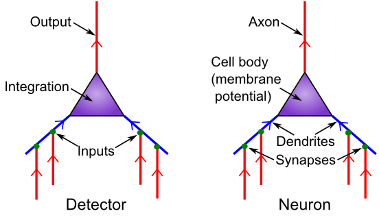

+++
Categories = ["Activation", "Neuroscience"]
bibfile = "ccnlab.json"
+++

There is a useful high-level, conceptual way of understanding of [[neuron|neural]] function in terms of the process of **detection**. Neurons receive thousands of different input signals from other neurons, looking for specific patterns that are "meaningful" to them. A very simple analogy is with a smoke detector, which samples the air and looks for telltale traces of smoke. When these exceed a specified threshold limit, the alarm goes off. Similarly, the neuron has a **threshold** and only sends an "alarm" signal to other neurons when it detects something significant enough to cross this threshold. The alarm is called an **action potential** or **spike** and it is the fundamental unit of communication between neurons.

{id="figure_detector" style="height:20em"}

[[#figure_detector]] shows the correspondence between neural biology and the detection functions they serve. **Synapses** are the connection points between **sending neurons** (the ones firing an alarm and sending a signal) and **receiving neurons** (the ones receiving that signal). Most synapses are on **dendrites,** which are the large branching trees (the word "dendrite" is derived from the Greek "dendros," meaning tree), which is where the neuron integrates all the input signals.

Like tributaries flowing into a major river, all these signals flow into the main dendritic trunk and into the **cell body**, where the final integration of the signal takes place. The thresholding takes place at the very start of the output-end of the neuron, called the **axon** (this starting place is called the **axon hillock** --- apparently it looks like a little hill or something). The axon also branches widely and is what forms the other side of the synapses onto other neuron's dendrites, completing the next chain of communication. And onward it goes.

At the most basic level, that is all you need to know about the functional biology of the neuron: it receives inputs, integrates them, and decides whether the integrated input is sufficiently strong to trigger an output signal. However, there are some additional biological properties regarding the nature of these input signals, which have implications for neural function, including making the integration process better able to deal with large changes in overall input signal strength.

There are three major sources of input signals to the neuron:

* **Excitatory inputs**: these are the "normal", most prevalent type of input from other neurons (roughly 85% of all inputs), which have the effect of exciting the receiving neuron (making it more likely to get over threshold and fire an "alarm"). They are conveyed via a synaptic channel called **AMPA**, which is opened by the neurotransmitter **glutamate**.

* **Inhibitory inputs**: these are the other 15% of inputs, which have the opposite effect to the excitatory inputs --- they cause the neuron to be *less* likely to fire, and serve to make the integration process more robust by keeping the excitation in check. There are specialized neurons in the brain called **inhibitory interneurons** that generate this inhibitory input (see [[inhibition]] for details). This input comes in via **GABA** synaptic channels, driven by the neurotransmitter GABA.

* **Leak inputs**: these aren't technically inputs, as they are always present and active, but they serve a similar function to the inhibitory inputs, by counteracting the excitation and keeping the neuron in balance overall. Biologically, leak channels are **potassium channels (K)**.

The inhibitory and excitatory inputs come from _different_ neurons in the cortex: a given neuron can only send either excitatory or inhibitory outputs to other neurons, not both (although neurons in other brain areas do violate this constraint, neocortical pyramidal neurons appear to obey it). We will see the multiple implications of this constraint throughout the text.

Finally, we introduce the notion of the **net synaptic efficacy** or **weight**, which represents the total impact that a sending neuron activity signal can have on the receiving neuron, via its synaptic connection. _The synaptic weight is one of the most important concepts in the entire field of computational cognitive neuroscience!_. It is also a key element of [[abstract neural network]] models.

Biologically, the weight represents the net ability of the sending neuron's action potential to release **neurotransmitter**, and the ability of that neurotransmitter to open synaptic channels on the postsynaptic side (including the total number of such channels that are available to be opened). For the excitatory inputs, the weight depends on the amount of glutamate released by the sending neuron into the synapse, and the number and efficacy of AMPA channels on the receiving neuron's side of the synapse ([[neuron#figure_synapse]]).

Computationally, the weights determine what a neuron is detecting. A strong weight value indicates that the neuron is very sensitive to that particular input signal, while a low weight means that that input is relatively unimportant. Learning is essentially just changing these synaptic weights as a function of neural activity patterns in the sending and receiving neurons.

In short, _everything you know, every cherished memory in your brain, is encoded as a pattern of synaptic weights!_  This detection process supports [[categorization]] and also, in linear algebra terms, the _projection_ of high-dimensional input spaces along specific _dimensions_ or _bases_ or _axes_ (all synonyms for our purposes). Thus, this detection process is truly the fundamental engine of neural computation, and can be described in many different ways that all amount to the same essential process we deconstruct here.

## Links

Next in [[Intro Book]]: [[Neuron]]

