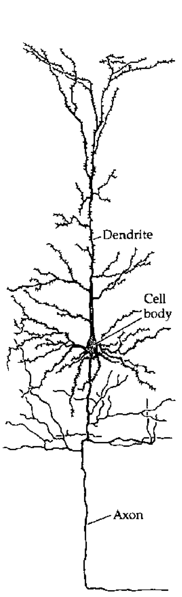
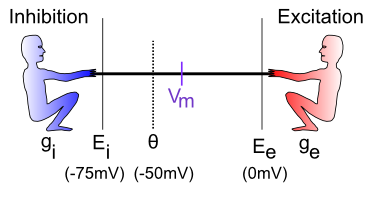
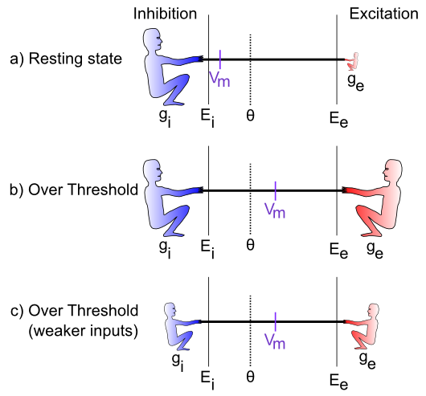

+++
Categories = ["Activation", "Axon"]
bibfile = "ccnlab.json"
+++

This page describes the computational model of spiking neurons used in [[Axon]], which accurately characterizes the behavior of neurons in the [[neocortex]] and other brain areas, and enables many different types of [[neuron channels|channels]] to be used to modify the [[#neural-integration]] behavior to capture a wide range of neurobiologically identified neuron types.

Conceptually these neural integration dynamics can be understood in terms of the [[neuron detector|detector model]] of the neuron, where each neuron is continuously monitoring its synaptic inputs, looking for specific patterns that, when detected, cause it to signal the finding to other neurons.

{id="figure_cortical-neuron" style="height:30em"}


Most biological neurons have a system of ion channels that drive a brief (&lt; 1 ms (millisecond)) **spike** in electrical potential, followed by an _afterhyperpolarization (AHP)_ that resets the potential back down to or below the resting potential. This spike triggers the **action potential** by initiating a travelling wave of depolarization down the **axon**, resulting in the release of _neurotransmitter(s)_ that then propagate the neural communication on to other neurons ([[#figure_cortical-neuron]], [[#figure_synapse]]). Critically, there is an effective **threshold** for this spiking dynamic to be initiated, so that electrical potentials below this threshold do not result in a spike or the consequent signal being sent.

{id="figure_synapse" style="height:25em"}
![Schematic of a synapse, showing a presynaptic terminal button which releases neurotransmitter (NT) into the synaptic cleft. The NT binds to postsynaptic receptors, causing ion channels to open (e.g., sodium ions for excitatory AMPA channels), and thus activating the receiving neuron.  Metabotropic receptors such as mGluR do not open to allow ions to flow (as ionotropic ones do), and instead they trigger second-messenger cascades of reactions that can affect learning and other processes in the postsynaptic cell.](media/fig_synapse.png)

The $Na^+$ (sodium) and $K^+$ (potassium) channels underlying neural spiking were first described by [[@^HodgkinHuxley52]], and have remained a cornerstone of neuroscience since then. However, the actual "HH" channel dynamics require a very fast rate of numerical integration because a lot happens in a very short period of time, so they are not computationally efficient to use directly. Instead, we adopt in axon a widely-used and well-established approximation called _AdEx_ ( _Adaptive Exponential_; [[@BretteGerstner05]]), that uses an exponential function to approximate the voltage spike, and it also captures the spike rate [[adaptation]] dynamics of the actual HH equations.

To explore the full behavior of Axon spiking neurons interactively, see the [[neuron sim]], which allows you to observe the behavior of the different channels.

Spiking neurons have several important differences from [[rate code activation]]s, which are dominant in more [[abstract neural network]] models such as those used in [[large language model]]s (LLMs), and were used in the [[Leabra]] model. In a rate code, neurons continuously communicate a floating point value representing something like the instantaneous rate of spiking.

When used in a biologically-realistic context where neural signals are being updated and communicated continuously over time, typically at a roughly 1 ms (millisecond) resolution, a rate code neuron is _constantly_ sending its signal to influence other neurons, with no gaps or pauses. By contrast, discrete spiking naturally creates significant periods of _silence_ in terms of the output of a given neuron, and this silence turns out to be golden, because it allows other neurons to send their signals in turn, without every neuron constantly being influenced by every other neuron. In practice, this allows spiking networks to much more robustly integrate graded and high-dimensional signals over time, compared to rate code neurons. 

The temporal dynamics of neural integration in spiking neurons exhibits the properties of **temporal summation** and **spatial summation** that are often discussed in introductory neuroscience textbooks: spikes that arrive close together in time can have an additive impact, and likewise there are important impacts of the spatial organization of synaptic inputs across the _dendritic branches_ of a neuron ([[#figure_cortical-neuron]]).

The [[#neural-integration]] dynamics of biological neurons described in detail below are well-characterized using simple electronic circuit equations, reflecting the _conductance_ of ions into and out of the cell across _ion channels_, and the resulting effects of this electrical current on the overall _electrical potential_ of the neuron, as measured across its lipid membrane (i.e., the _membrane potential_, $V_m$).

Axon uses this standard _conductance model_ to update the membrane potential of neurons, incorporating a number of more complex ion channels with various modulatory properties, that shape the overall information integration properties of the neuron across time. See also the [Biological neuron model](https://en.wikipedia.org/wiki/Biological_neuron_model) wikipedia page for an excellent broader treatment of these models.

## Neural integration

The primary inputs to a neuron are **excitation** and **inhibition**, along with a constant **leak** channel, the dynamics of which can be understood using basic principles of electricity. We first provide a conceptual, intuitive understanding of this process, and then show how it relates to the underlying electrical properties of neurons. Then, we'll see how to translate this process into mathematical equations that can actually be simulated on the computer.

{id="figure_tug-of-war"}


The neural integration process can be understood in terms of a **tug-of-war** ([[#figure_tug-of-war]]). This tug-of-war takes place in the space of **electrical potentials** (measured in millivolts, _mV_) that exist in the neuron relative to the surrounding extracellular medium in which neurons live. Interestingly, this medium, and the insides of neurons and other cells, is basically salt water, with sodium ($Na^+$), chloride ($Cl^-$) and other ions floating around: we carry our ancient evolutionary environment around within us at all times. The electrical potentials (and differences in concentration) cause the electrically charged ions to flow in and out of the neuron through tiny pores called **ion channels**, creating small amounts of electrical **current**.

To see how this works, let's just consider excitation versus inhibition (inhibition and leak are effectively the same for our purposes at this time). The key point is that **the integration process reflects the relative strength of excitation versus inhibition:** if excitation is stronger than inhibition, then the neuron's electrical potential (voltage) increases, perhaps to the point of getting over threshold and firing an output action potential. If inhibition is stronger, then the neuron's electrical potential decreases, and thus moves further away from getting over the threshold for firing.

{id="sim_vm_gbar" title="Membrane potential tug-of-war" collapsed="true"}
```Goal
vmTau := 10.0 // time constant for vm integration
gbarE := 0.2
gbarI := 0.4
var gbarEStr, gbarIStr, vmTauStr string

##
totalTime := 100
gE := zeros(totalTime) // excitatory conductance
gI := zeros(totalTime) // inhibitory conductance
Vm := zeros(totalTime) // membrane potential
##

func vmRun() {
    gbarEStr = fmt.Sprintf("E: %7.4g", gbarE)
    gbarIStr = fmt.Sprintf("I: %7.4g", gbarI)
    vmTauStr = fmt.Sprintf("Vm Tau: %7.4g", vmTau)
    ##
    vm := 0.0 // current excitation
    tau := array(vmTau)
    gbE := array(gbarE)
    gbI := array(gbarI)
    ##
    for t := range 100 {
        ##
        ge := gbE * (1.0 - vm)
        gi := gbI * (0.0 - vm)
        dvm := (1.0 / tau) * (ge + gi)
		vm += dvm
        Vm[t] = vm
        gE[t] = gbE
        gI[t] = gbI
        ##
    }
}

vmRun()

plotStyler := func(s *plot.Style) {
    s.Range.SetMax(1).SetMin(0)
    s.Plot.XAxis.Label = "Time"
    s.Plot.XAxis.Range.SetMax(100).SetMin(0)
	s.Plot.Legend.Position.Left = true
}
plot.SetStyler(Vm, plotStyler) 

fig1, pw := lab.NewPlotWidget(b)
Vml := plots.NewLine(fig1, Vm)
gIl := plots.NewLine(fig1, gI)
gEl := plots.NewLine(fig1, gE)
fig1.Legend.Add("Vm", Vml)
fig1.Legend.Add("I", gIl)
fig1.Legend.Add("E", gEl)

func updt() {
    vmRun()
    Vml.SetData(Vm)
    gEl.SetData(gE)
    gIl.SetData(gI)
    pw.NeedsRender()
}

func addTauSlider(label *string, val *float64, mxVal float32) {
    tx := core.NewText(b)
    tx.Styler(func(s *styles.Style) {
        s.Min.X.Ch(40)  // clean rendering with variable width content
    })
    core.Bind(label, tx)
    core.Bind(val, core.NewSlider(b)).SetMin(1).SetMax(mxVal).
        SetStep(1).SetEnforceStep(true).SetChangeOnSlide(true).OnChange(func(e events.Event) {
    	updt()
        tx.UpdateRender()
    })
}

func addSlider(label *string, val *float64, mxVal float32) {
    tx := core.NewText(b)
    tx.Styler(func(s *styles.Style) {
        s.Min.X.Ch(40)  // clean rendering with variable width content
    })
    core.Bind(label, tx)
    core.Bind(val, core.NewSlider(b)).SetMin(0.02).SetMax(mxVal).
        SetStep(0.02).SetEnforceStep(true).SetChangeOnSlide(true).OnChange(func(e events.Event) {
    	updt()
        tx.UpdateRender()
    })
}

addSlider(&gbarIStr, &gbarI, 1)
addSlider(&gbarEStr, &gbarE, 1)
addTauSlider(&vmTauStr, &vmTau, 50)
```

[[#sim_vm_gbar]] provides an interactive exploration of this tug-of-war dynamic. As you drag the `E` (excitation) and `I` (inhibition) sliders, you control the strength of these two inputs, which are also plotted for easy visualization. The membrane potential `Vm` starts at 0, and is pushed up toward 1 by the `E` inputs, and down toward 0 by the `I` inputs. Thus, if you move `E` down toward 0, you can see that `Vm` barely gets off the ground, whereas if it is equal to `I` (e.g., both are 0.4) then `Vm` goes to exactly 0.5, reflecting an even balance between these opposing forces. When `E` is greater than `I` then, `Vm` goes increasingly higher, closer to 1. The `Vm Tau` slider controls the _rate_ at which `Vm` is updated (see [[time constant]] for critical background on such parameters), with larger values taking a longer time to converge on a stable final `Vm` value.

* What happens when `E` and `I` are both tied, but both at 0.2, or both at 0.8? Are these cases equivalent in all respects in terms of the resulting `Vm` plot? If not, in which ways do they differ?

Hopefully, you can see the _relative_ nature of this neural integration process: what matters most (though not entirely) is the relative balance between these values, not their absolute values.

The standard neuroscience notation in [[#figure_tug-of-war]] is as follows:

*  $g_i$ --- the **inhibitory conductance** (*g* is the symbol for a conductance, and *i* indicates inhibition) --- this is the total strength of the inhibitory input (i.e., how strong the inhibitory guy is tugging), and plays a major role in determining how strong of an inhibitory current there is. This corresponds biologically to the proportion of inhibitory ion channels that are currently open and allowing inhibitory ions to flow (these are **chloride** or **$Cl^-$** ions in the case of GABA **inhibition**, and **potassium** or **$K^+$** ions in the case of **leak** currents). For electricity buffs, the conductance is the inverse of resistance --- most people find conductance more intuitive than resistance, so we'll stick with it.

* $E_i$ --- the **inhibitory driving potential** --- in the tug-of-war metaphor, this just amounts to where the inhibitory guy happens to be standing relative to the electrical potential scale that operates within the neuron. Typically, this value is around -75mV where **mV** stands for **millivolts** --- one thousandth (1/1,000) of a volt. These are very small electrical potentials for very small neurons.

* $\Theta$ --- the **action potential threshold** --- this is the electrical potential at which the neuron will fire an action potential output to signal other neurons. This is typically around -50mV. This is also called the **firing threshold** or the **spiking threshold**, because neurons are described as "firing a spike" when they get over this threshold.

* $V_m$ --- the **membrane potential** of the neuron (V = voltage or electrical potential, and m = membrane). This is the current electrical potential of the neuron relative to the extracellular space outside the neuron. It is called the membrane potential because it is the cell membrane (thin layer of fat basically) that separates the inside and outside of the neuron, and that is where the electrical potential really happens. An electrical potential or voltage is a relative comparison between the amount of electric charge in one location versus another. It is called a "potential" because when there is a difference, there is the potential to make stuff happen.

    For example, when there is a big potential difference between the charge in a cloud and that on the ground, it creates the potential for lightning. Just like water, differences in charge always flow "downhill" to try to balance things out. So if you have a lot of charge (water) in one location, it will flow until everything is all level. The cell membrane is effectively a dam against this flow, enabling the charge inside the cell to be different from that outside the cell. The ion channels in this context are like little tunnels in the dam wall that allow things to flow in a controlled manner. And when things flow, the membrane potential changes! In the tug-of-war metaphor, think of the membrane potential as the flag attached to the rope that marks where the balance of tugging is at the current moment.

* $E_e$ --- the **excitatory driving potential** --- this is where the excitatory guy is standing in the electrical potential space (typically around 0 mV).

* $g_e$ --- the **excitatory conductance** --- this is the total strength of the excitatory input, reflecting the proportion of excitatory ion channels that are open (these channels pass **sodium** ($Na^+$) ions --- our deepest thoughts are all just salt water moving around).

{id="figure_tug-of-war-cases"}


[[#figure_tug-of-war-cases]] illustrates specific cases in the tug-of-war scenario. In the first case, the excitatory conductance $g_e$ is very low (indicated by the small size of the excitatory guy), which represents a neuron at rest, not receiving many excitatory input signals from other neurons. In this case, the inhibition/leak pulls much more strongly, and keeps the membrane potential ($V_m$) down near the -70mV territory, which is also called the **resting potential** of the neuron. As such, it is below the action potential threshold $\Theta$, and so the neuron does not output any signals itself. 

In the next case (b), the excitation is as strong as the inhibition, and this means that it can pull the membrane potential up to about the middle of the range. Because the firing threshold is toward the lower-end of the range, this is enough to get over threshold and fire a spike. The neuron will now communicate its signal to other neurons, and contribute to the overall flow of information in the brain's network.

The last case (c) illustrates how the integration process is sensitive to the _relative_ balance of excitation versus inhibition. If both are overall weaker, then neurons can still get over firing threshold. This is important for example in the visual system, which can experience huge variation in the overall amount of light depending on the environment (e.g., compare snowboarding on a bright sunny day versus walking through thick woods after sunset). The total amount of light coming into the visual system also drives a "background" level of inhibition, in addition to the amount of excitation that visual neurons experience. Thus, when it's bright, neurons get greater amounts of both excitation and inhibition compared to when it is dark. *This enables the neurons to remain in their sensitive range for detecting things* despite large differences in overall input levels.

## Spiking output

The membrane potential $V_m$ is not communicated directly to other neurons; instead it is subject to a **threshold**, so that only the strongest relative levels of excitation are then communicated, resulting in a more efficient and compact encoding of information in the brain. In human terms, neurons avoid sharing "TMI" (too much information), and instead communicate only relevant, important information, as if they were following ["Gricean maxims"](https://en.wikipedia.org/wiki/Cooperative_principle).

{id="figure_spiking" style="height:30em"}
![Trace of an Axon neuron spiking action potentials in response to an excitatory input. The Vm line shows the membrane potential and its spikes, with resetting after each spike (afterhyperpolarization or AHP) and the climb back up to spike again, as a function of the relative excitatory and inhibitory currents. The spikes increase in frequency over time as the NMDA current shown in Gnmda increases in strength. The Act line shows an integrated rate of spiking based on the average inter-spike-interval (ISI).](media/fig_neuron_spiking.png)

As described above, the firing of discrete spikes when $V_m$ gets above threshold occurs in biological neurons via the fast $Na^+$ and $K^+$ channels as first described by [[@HodgkinHuxley52]], and we use the _AdEx_ ( _Adaptive Exponential_; [[@BretteGerstner05]]) model to approximate these fast dynamics. There is an overall cycle of spiking followed by afterhyperpolarization (AHP) and a subsequent rise in $V_m$ driven by continued excitation ([[#figure_spiking]]), which results in an overall **spike rate** that reflects the relative balance of excitation vs. inhibition.

In [[rate code activation]] models, this expected rate of spiking is computed directly from the inputs to a neuron, and is then computed as an overall **activation** value to other neurons. The validity of this rate code approximation is a matter of considerable debate, which is discussed further in the [[rate code activation]] page. Briefly, the [[Leabra]] model used rate code signaling, and direct comparisons with the discrete spiking [[Axon]] model show that rate codes can capture many of the same functional and cognitive phenomena as a discrete spiking model, but overall they are more brittle and require a significant tradeoff between representing graded, probabilistic information, and the speed and responsiveness of the network overall.

Specifically, a key functional advantage of discrete spiking is that considerable information about a new stimulus input can be rapidly propagated throughout the network via a cascade of _first spike_ responses [[@ThorpeDelormeVanRullen01]]. Electrophysiological recordings show that this initial wave of responding conveys significant information about the stimulus within a relatively short window of roughly 50-70 ms after it first hits the neocortex, with the relative timing of these first spikes being strongly correlated with the subsequent rate of firing. However, the subsequent firing is also critical for resolving many important properties of the stimulus, and provides a window for top-down and bottom-up signals to converge on a consistent interpretation. Thus, discrete spiking enables this "best of both worlds" of fast initial responding plus effective subsequent integration of more graded signals.

## Mathematical formulation

With the above intuitive understanding of how the neuron integrates excitation and inhibition, we can now see how a set of mathematical equations can be used to simulate this behavior in our models.

### Neural integration

We begin by formalizing the "strength" by which each side of the tug-of-war pulls, and then show how that causes the $V_m$ "flag" to move as a result. This provides explicit equations for the tug-of-war dynamic integration process. Then, we show how to actually compute the conductance factors in this tug-of-war equation as a function of the inputs coming into the neuron, and the synaptic weights (focusing on the excitatory inputs for now).

The key idea behind these equations is that each side in the tug-of-war pulls with a strength that is proportional to both its overall strength (conductance), and how far the "flag" ($V_m$) is away from its position (indicated by the driving potential E). Imagine that the tuggers are planted in their position, and their arms are fully contracted when the $V_m$ flag gets to their position (E), and they can't re-grip the rope, such that they can't pull any more at this point. To put this idea into an equation, we can write the "force" or **current** that the excitatory side exerts as:

{id="eq_Ie" title="Excitation"}
$$
I_e = g_e \left(E_e-V_m\right)
$$

The excitatory current is $I_e$ (_I_ is the traditional term for an electrical current, and _e_ again for excitation), and it is the product of the conductance $g_e$ times how far the membrane potential is away from the excitatory driving potential. If $V_m = E_e$ then the excitatory side has "won" the tug of war, and it no longer pulls anymore, and the current goes to zero (regardless of how big the conductance might be --- anything times 0 is 0). Interestingly, this also means that the excitatory side pulls the strongest when the $V_m$ "flag" is furthest away from it --- i.e., when the neuron is at its resting potential. Thus, it is easiest to excite a neuron when it's well rested.

This equation is known as **Ohm's Law**, one of the most basic laws of electricity, which you might have learned about in terms of _resistance_, which is 1 / conductance. Conductance is more intuitive in this case because it can be directly understood as the size and number of the channel openings that allow ions to flow.

The same basic equation can be written for the inhibition side, and also separately for the leak "side" (which we can now reintroduce as a clone of the inhibition term):

{id="eq_Ii" title="Inhibition"}
$$
I_i = g_i \left(E_i-V_m\right)
$$

{id="eq_Il" title="Leak"}
$$
I_l = g_l \left(E_l-V_m\right)
$$

(only the subscripts are different in all of these equations).

Next, we can add together these three different currents to get the **net current**, which represents the net flow of charged ions across the neuron's membrane (through the ion channels):

{id="eq_Inet" title="Net current"}
$$
I_{net} = I_e + I_i + I_l
$$

$$
= g_e \left(E_e-V_m\right) + g_i \left(E_i-V_m\right) + g_l \left(E_l-V_m\right)
$$

So what good is a net current? Recall that electricity is like water, and it flows to even itself out. When water flows from a place where there is a lot of water to a place where there is less, the result is that there is less water in the first place and more in the second. The same thing happens with our currents: the flow of current changes the membrane potential (height of the water) inside the neuron:

{id="eq_Vm" title="Membrane potential"}
$$
V_m\left(t\right) = V_m\left(t-1\right) + \frac{1}{\tau_{vm}} I_{net}
$$

$V_m(t)$ is the current value of $V_m$, which is updated from value on the previous time step $V_m(t-1)$, and the $\tau_{vm}$ is a [[time constant]] that determines how fast the membrane potential changes. It mainly reflects the capacitance of the neuron's membrane.

The above two equations are the most essential tools we need to simulate a neuron on a computer. It tells us how the membrane potential changes as a function of the inhibitory, leak and excitatory inputs --- given specific numbers for these input conductances, and a starting $V_m$ value, we can then **iteratively** compute the new $V_m$ value according to the above equations, and this will accurately reflect how a real neuron would respond to similar such inputs.

To summarize, here's a single version of the above equations that does everything:

{id="eq_Vm-full" title="Full update"}
$$
V_m(t) = V_m(t-1) + \frac{1}{\tau_{vm}} \left[ g_e (E_e-V_m) + g_i (E_i-V_m) + g_l (E_l-V_m) \right]
$$

For those of you who noticed the issue with the minus sign above, or are curious know more details about where these equations come from, see [[neuron electrophysiology]]. If you're happy enough with where we've come, feel free to move along to finding out how we compute these input conductances, and what we then do with the $V_m$ value to drive the output signal of the neuron.

### Computing input conductances

The excitatory and inhibitory input conductances represent the total number of ion channels of each type that are currently open and thus allowing ions to flow. In real neurons, these conductances are typically measured in nanosiemens (nS), which is $10^{-9}$ siemens (a very small number --- neurons are very tiny). Typically, neuroscientists divide these conductances into two components:

* $\overline{g}$ ("g-bar") --- a constant value that determines the **maximum conductance** that would occur if every ion channel were to be open, and:

* $g\left(t\right)$ --- a dynamically changing variable that indicates at the present moment, what fraction of the total number of ion channels are currently open (goes between 0 and 1). All of the computed values in simulations go into this value, with the $\overline{g}$ effectively just providing a conversion of these normalized 0..1 values into the appropriate neurobiological units, as shown in [[#Units and parameters]].

Thus, the total conductances of interest are written as:

{id="eq_gbar-e" title="Excitatory conductance"}
$$
\overline{g}_e g_e(t)
$$

{id="eq_gbar-i" title="Inhibitory conductance"}
$$
\overline{g}_i g_i(t)
$$

{id="eq_gbar-l" title="Leak conductance"}
$$
\overline{g}_l
$$

(note that because leak is a constant, it does not have a dynamically changing value, only the constant g-bar value).

This separation of terms makes it easier to compute the conductance, because all we need to focus on is computing the proportion or fraction of open ion channels of each type. This can be done by computing the average number of ion channels open at each synaptic input to the neuron:

{id="eq_gbar-e-sum" title="Excitatory proportion open"}
$$
g_e(t) = \frac{1}{n} \sum_i x_i w_i
$$

where $x_i$ is the **activity** of a particular sending neuron indexed by the subscript *i*, $w_i$ is the **synaptic weight strength** that connects sending neuron *i* to the receiving neuron, and *n* is the total number of channels of that type (in this case, excitatory) across all synaptic inputs to the cell. As discussed in [[neuron detector]], the synaptic weight determines what patterns the receiving neuron is sensitive to, and is what adapts with learning --- this equation shows how it enters mathematically into computing the total amount of excitatory conductance.

The above equation suggests that the neuron performs a very simple function to determine how much input it is getting: it just adds it all up from all of its different sources (and takes the average to compute a proportion instead of a sum). Each input source contributes in proportion to how active the sender is, multiplied by how much the receiving neuron cares about that information, determined by the synaptic weight value. We also refer to this average total input as the **net input**.

The same equation holds for inhibitory input conductances, which are computed in terms of the activations of inhibitory sending neurons, times the inhibitory weight values.

The _activity_ factor $x_i$ in [[#eq_gbar-e-sum]] reflects the time-varying synaptic conductance after the sending neuron fires a spike (action potential), which is described in more detail in [[neuron channels]] for the different channel types. For example, the excitatory _AMPA_ channels open when the sending neuron releases the neurotransmitter _glutamate_ (as shown in [[#figure_synapse]]), and this conductance decays exponentially with a time constant of about 5 ms ([[@HestrinNicollPerkelEtAl90]]). _GABA_ inhibitory channels have a time constant of around 7 ms ([[@XiangHuguenardPrince98]]).

Functionally, this extra trace of discrete spiking inputs supports the _temporal summation_ of inputs over time, so that inputs arriving within this temporal integration window can add together to drive larger overall excitatory conductances.

{id="table_conduction" title="Axonal conduction delays"}
| Pathway          | Minimum   | Mean or Median |
|------------------|-----------|------------------------------|
| Corticocortical  | 2 ms      | 2.3 (magno visual) -- ~10 ms |
| Corticothalamic  | 2 ms      | ~10 ms     |
| Thalamocortical  | 0.5 ms    | ~1 ms      |
| Collosal         | ~2 ms     | ~10 ms     |

It takes time for action potentials to propagate down the axon, which is generally a function of the distance travelled and also the extent of _myelination_ of the axon, where the myelin acts as an insulator that speeds conduction velocities by reducing the capacitance of the axonal membrane. [[#table_conduction]] shows approximate values from [scholarpedia](http://www.scholarpedia.org/article/Axonal_conduction_delay) assembled from various sources and species (e.g., [[@FerrainaPareWurtz02]]; [[@Swadlow90]]; [[@Swadlow00]]). We include this axonal conduction delay in the model, with a default value of 2 ms, under the assumption that most of our models represent relatively small brains at this point. In practice, using a value of 10 ms does not significantly affect the performance of the models.

There are some further complexities about how we integrate inputs from different input sources (i.e., projections from different source brain areas into a given receiving neuron), which we discuss in [[neuron dendrites]]. These mechanisms account in part for the biological complexities associated with inputs coming into different branches on the dendrites ([[@MiglioreHoffmanMageeEtAl99]]; [[@PoiraziBrannonMel03]]; [[@JarskyRoxinKathEtAl05]]). 

{id="sim_vm_g" title="Membrane potential tug-of-war: currents" collapsed="true"}
```Goal
vmTau := 10.0 // time constant for vm integration
gbarE := 0.2
gbarI := 0.4
var gbarEStr, gbarIStr, vmTauStr string

##
totalTime := 100
iE := zeros(totalTime) // excitatory current
iI := zeros(totalTime) // inhibitory current
Vm := zeros(totalTime) // membrane potential
##

func vmRun() {
    gbarEStr = fmt.Sprintf("gbar E: %7.4g", gbarE)
    gbarIStr = fmt.Sprintf("gbar I: %7.4g", gbarI)
    vmTauStr = fmt.Sprintf("Vm Tau: %7.4g", vmTau)
    ##
    vm := 0.0 // current excitation
    tau := array(vmTau)
    gbE := array(gbarE)
    gbI := array(gbarI)
    ##
    for t := range 100 {
        ##
        ie := gbE * (1.0 - vm)
        ii := gbI * (0.0 - vm)
        dvm := (1.0 / tau) * (ie + ii)
		vm += dvm
        Vm[t] = vm
        iE[t] = ie
        iI[t] = -ii
        ##
    }
}

vmRun()

plotStyler := func(s *plot.Style) {
    s.Range.SetMax(1).SetMin(0)
    s.Plot.XAxis.Label = "Time"
    s.Plot.XAxis.Range.SetMax(100).SetMin(0)
	s.Plot.Legend.Position.Left = true
}
plot.SetStyler(Vm, plotStyler) 

fig1, pw := lab.NewPlotWidget(b)
Vml := plots.NewLine(fig1, Vm)
iIl := plots.NewLine(fig1, iI)
iEl := plots.NewLine(fig1, iE)
fig1.Legend.Add("Vm", Vml)
fig1.Legend.Add("I_i", iIl)
fig1.Legend.Add("I_e", iEl)

func updt() {
    vmRun()
    Vml.SetData(Vm)
    iEl.SetData(iE)
    iIl.SetData(iI)
    pw.NeedsRender()
}

func addTauSlider(label *string, val *float64, mxVal float32) {
    tx := core.NewText(b)
    tx.Styler(func(s *styles.Style) {
        s.Min.X.Ch(40)  // clean rendering with variable width content
    })
    core.Bind(label, tx)
    core.Bind(val, core.NewSlider(b)).SetMin(1).SetMax(mxVal).
        SetStep(1).SetEnforceStep(true).SetChangeOnSlide(true).OnChange(func(e events.Event) {
    	updt()
        tx.UpdateRender()
    })
}

func addSlider(label *string, val *float64, mxVal float32) {
    tx := core.NewText(b)
    tx.Styler(func(s *styles.Style) {
        s.Min.X.Ch(40)  // clean rendering with variable width content
    })
    core.Bind(label, tx)
    core.Bind(val, core.NewSlider(b)).SetMin(0.02).SetMax(mxVal).
        SetStep(0.02).SetEnforceStep(true).SetChangeOnSlide(true).OnChange(func(e events.Event) {
    	updt()
        tx.UpdateRender()
    })
}

addSlider(&gbarIStr, &gbarI, 1)
addSlider(&gbarEStr, &gbarE, 1)
addTauSlider(&vmTauStr, &vmTau, 50)
```

[[#sim_vm_g]] provides an interactive summary of these neural integration dynamics, plotting the excitatory vs inhibitory _currents_ instead of the conductances as in [[#sim_vm_gbar]]. The inhibitory current is plotted as an absolute value (it actually has a negative sign in our equations), so that it can be directly compared with the excitatory current.

As before, the $V_m$ value continues to reflect the relative balance between excitation and inhibition, but now you can see how that balance arises in terms of the currents. You should see that no matter what you do to the `gbar` sliders that control the strength of excitation vs. inhibition, the resulting currents always converge to the same magnitude over time. Why is this?

### AdEx spiking equations

Spiking in real neurons according to the [[@^HodgkinHuxley52]] equations is driven by a fast sequence of _voltage-gated sodium channels_ that cause a rapid rise in membrane potential once it gets above a critical threshold level, followed by _sodium-gated potassium channels_ that quickly bring the membrane potential back down to a level below the resting potential (afterhyperpolarization, AHP). 

Implementing these HH dynamics in a model requires very fast time integration rates that would significantly slow down computation, so we use a much simpler approximation that just sets a `Spike` value to 1 whenever the membrane potential gets over the spiking threshold. This spike value is then reset to 0 on the next time step, which accounts for the fact that a spike impulse typically lasts about 1 ms, which is the numerical integration step size that we use.

This logic is simpler to express in pseudocode:

``` C
if (Vm > Theta) then: Spike = 1; Vm = Vm_r; else Spike = 0
```

where `Theta` is the effective spiking threshold, and `Vm_r` is the "reset" or "refractory" membrane potential that the Hodgkin-Huxley sodium-gated potassium channels produce. The extra potassium from these channels stays around for a few additional milliseconds, producing a **refractory period** when the neuron is effectively inactivated and cannot spike again. We use a time constant of 3 ms for this refractory period, during which we simply do not update the `Vm` variable.

To capture the HH spiking dynamics more accurately, yet still efficiently, [[@^BretteGerstner05]] added an exponential term to the Vm computation (introduced by [[@Fourcaud-TrocmeHanselVreeswijkEtAl03]]), that simulates the rapid rise caused by the voltage-gated sodium channels:

{id="eq_adex-exp" title="Exponential rise"}
$$
\overline{g}_l \Delta_T e^{\frac{V_m - \Theta}{\Delta_T}}
$$

where $\Delta_T = 2 mV$ is the _slope factor_ for the exponential function, and $\Theta = -50 mV$ is the spiking threshold.

The other main feature of the AdEx model is [[adaptation]] which makes it harder for the neuron to fire spikes as a function of ongoing activity. This is implemented in [[Axon]] using specialized [[neuron channels|channels]].

## Units and parameters

{id="table_units" title="Neural scale units"}
| Dimension   | Unit                         | Multiplier | Axon Unit      |
|-------------|------------------------------|------------|----------------|
| potential   | volt (V)                     | 0.001      | mV millivolt   |
| current     | ampere (A)                   | $10^{-12}$ | pA picoamperes |
| time        | second (s)                   | 0.001      | ms millisecond |
| conductance | siemens S = A / V            | $10^{-9}$  | nS nanosiemens |
| capacitance | farad F = (s ⋅A) / V         | $10^{-12}$ | pF picofarads  |

[[#table_units]] shows the standard neural-scale units that are used in [[Axon]] for all of the electrical parameters. [[#table_units-ex]] shows some example parameters in these units, with relevant values from [[@^DestexheMainenSejnowski98]] and [[@^MiglioreHoffmanMageeEtAl99]].

{id="table_units-ex" title="Neural scale parameters"}
| Parameter                                                       | Value   |
|-----------------------------------------------------------------|---------|
| Resting potential                                               | -70 mV  |
| Spiking threshold $\Theta$                                      | -50 mV  |
| $g_{ampa}$ = conductance per excitatory AMPA channel            | 0.05 nS |
| $g_{syn}$ = conductance per excitatory synapse = ~20 channels   |   1 nS  |
| $\overline{g}_e$ = ~ max total excitatory input = ~100 synapses | 100 nS  |
| $\overline{g}_{leak}$                                           |  20 nS  |
| max $I_e(V=-70 mV)$                                             | 7000 pA |
| standard membrane capacitance C                                 |  281 pF |
| change in V over 1 ms from $I_e(V=-70 mV)$ = I_e / C            |   25 mV |

[[#table_erev]] shows the full set of reversal potentials for the basic channels:

{id="table_erev" title="Electrical potentials"}
| Parameter                  | Value   |
|----------------------------|---------|
| Resting potential          | -70 mV  |
| Leak $E_l$                 | -70 mV  |
| Excitatory $E_e$           |   0 mV  |
| Inhibition $E_i$           | -90 mV  |
| Spiking threshold $\Theta$ | -50 mV  |
| Exp Slope $\Delta_T$       | 2 mv    |

## Other channels

See the page on [[neuron channels]] for more details about the biological properties of the excitatory and inhibitory channels, and a number of other channel types that further modify the dynamics of neurons in functionally important ways. The most important of these additional channels are [[adaptation]] channels that cause the neuron to reduce its firing over time in response to sustained excitatory input, and the synergistic effects of [[neuron channels#NMDA]] and [[neuron channels#GABA-B]] channels that work together to support [[stable activation]] states which are critical for learning.

## Additional details

There are several additional in-depth pages providing more details about biological and computational neurons:

* [[Neuron sim]]: provides an interactive exploration of the full set of [[Axon]] neuron equations responding to a simple pulse of excitation.

* [[Neuron detector]]: describes the high-level conceptual model of a neuron as a detector, including a simulation thereof.

* [[Neuron electrophysiology]]: more detailed description of the electrophysiology of the neuron, and how the underlying concentration gradients of ions give rise to the electrical integration properties of the neuron.

* [[Neuron dendrites]]: details on how excitatory and other neural inputs are computed and scaled across multiple different input projections, in ways that capture some of the additional computational power of dendritic processing within individual neurons.

* [[Neuron equilibrium potential]]: shows how to derive the _equilibrium_ (steady-state) $V_m$ equation, which clearly exhibits the relative tug-of-war dynamic.

* [[Neuron bayesian|Neuron as a Bayesian optimal detector]]: shows how the equilibrium membrane potential represents a Bayesian optimal way of integrating the different inputs to the neuron.


