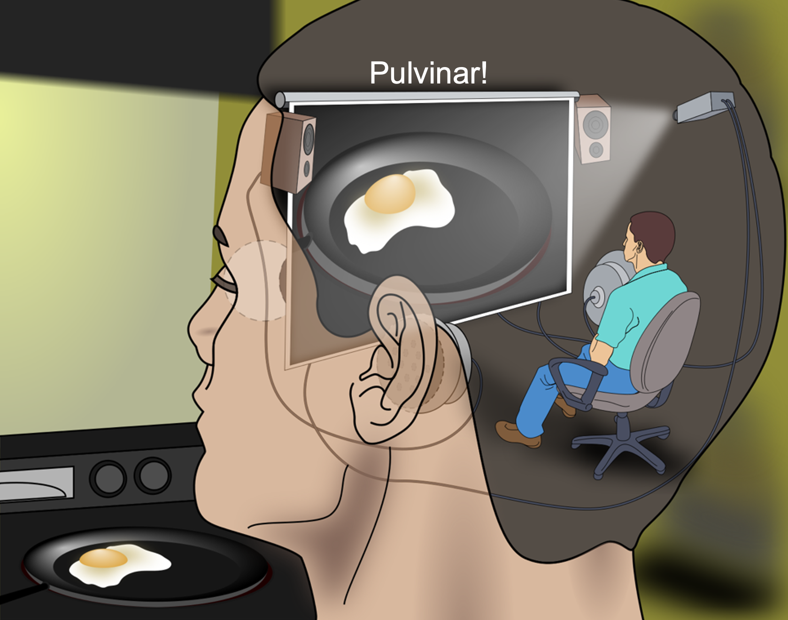

+++
Categories = ["Axon", "Learning"]
bibfile = "ccnlab.json"
+++

**Predictive learning** refers to a form of [[error-driven learning]] where the error signals derive from **prediction errors**: errors in the ability to predict what will happen next. This form of learning has been explored by many researchers in many forms over the years, and it is the primary driver of learning in the current generation of [[large language model]]s (LLMs) that power Chat GPT and related models. The amazing capabilities of these models demonstrates the key advantage of this form of learning: it works with raw, _unlabled_ data, because learning is driven simply by predicting what will happen next.

In the LLM context, this means predicting the next word that occurs in a stream of text. The impressive power of these models derives directly from their ability to learn from vast collections of written material scraped from the internet, and this is only possible because of the use of predictive learning. By contrast, earlier error-driven learning models required human-labeled datasets, for example the [ImageNet](https://www.image-net.org/) dataset with human-generated category labels for each image, to provide the supervised target signals that drive learning in standard [[error backpropagation]] models. The labor involved in generating these labels (even when it is stolen from users in the form of those annoying reCAPTCHA image-labeling prompts) limits the size of these datasets relative to the massive quantities of raw unlabeled text that an LLM can use.

The same principle applies to the brain: we can learn a tremendous amount about our world simply by trying to predict what happens next. The seemingly passive gaze of pre-mobile infants belies the extensive amount of predictive learning going on in their brains, as they soak up all of the _structure_ present in the world around them.

An essential constraint on predictive learning is that the environment must be somehow predictable, which is what we mean by _structure_: things are not completely random in our world (although sometimes it may feel like that). For example, the laws of physics, at least at a macroscopic level, are deterministic and cause objects to behave in predictable ways. Animate objects (animals and especially other humans) are much less predictable, but still our brains cause us to behave in at least somewhat predictable ways, and discovering how other people behave in different situations is a huge part of what we spend our time learning.

LLMs demonstrate that human language has deep structure that captures a large amount of human knowledge. Indeed, one major accomplishment that most users of these models likely do not appreciate, is that they demonstrate beyond a reasonable doubt that human language can be learned to a high level of competence without any explicit instruction, and without any significant innate knowledge ([[@Piantadosi23]]). This puts to rest a long debate going back to Noam Chomsky's early work ([[@Chomsky65]]) about the _poverty of the stimulus_ in language learning, which motivated his theory of an innate universal grammar underlying our ability to learn language (although die-hard Chomsky theorists attempt to fend off such arguments (e.g., [[@LanChemlaKatzir24]]), they seem to be fighting a losing battle in the face of ever-improving LLM performance).

## Biological mechanisms of predictive learning

Going beyond these _ecological_ arguments about the wealth of knowledge that can be extracted from the environment via predictive learning, there is considerable evidence and longstanding theorizing that the brain is specifically structured to perform predictive error-driven learning ([[@Helmholtz67]]; [[@Elman90]]; [[@ElmanBatesKarmiloff-SmithEtAl96]]; [[@Mumford92]]; [[@KawatoHayakawaInui93]]; [[@DayanHintonNealEtAl95]]; [[@RaoBallard99]]; [[@Friston05]]; [[@HawkinsBlakeslee04]]; [[@Clark13]]; [[@SummerfielddeLange14]]). Most of these proposals involve some kind of _explicit_ representation of prediction errors, often involving a computation comparing bottom-up sensory signals vs. top-down predictions generated from higher-level internal representations.

{id="figure_minus-plus-pulvinar" style="height:20em"}

The [[temporal derivative]] mechanism for representing errors more _implicitly_, as changes in activity state over time, is consistent with a specific set of neural mechanisms involving the _pulvinar_ nucleus of the thalamus. The pulvinar represents an initial _prediction_ activity state followed by an _outcome_ activity state ([[#figure_minus-plus-pulvinar]]; compare with [[temporal derivative#figure_minus-plus]] in [[temporal derivative]]: the pulvinar is effectively the output layer in a standard three-layer network).

{id="figure_prjn-screen" style="height:20em"}

This function of the pulvinar is consistent with considerable neurobiological data, and earlier theoretical frameworks that emphasized its broad interconnectivity with the neocortex, allowing it to function somewhat like a _blackboard_ ([[@Mumford91]]) or a _projection screen_ ([[#figure_prjn-screen]]).

{id="figure_pulv-conns" style="height:15em"}
![Connectivity between the neocortex and the pulvinar nucleus of the thalamus, in the case of primary and secondary visual areas, that is uniquely well suited for driving predictive error-driven learning.  The numerous and relatively weaker projections from layer 6 (VI) neurons are well-suited for activating a prediction over the pulvinar, that integrates the signals from multiple cortical areas and neurons to synthesize the prediction, which improves over the course of learning throughout the neocortex and in these final projections into the pulvinar. By contrast, the strong, focal driver inputs from layer 5 (V) intrinsic bursting (5IB) neurons are good for activating an outcome representation that is essentially an unlearned copy of the activity pattern in lower cortical layers (e.g., V1 trains V2 predictions in this case). Diagram based on Sherman & Guillery (2006).](media/fig_pulvinar_connectivity.png)

In particular, as shown in [[#figure_pulv-conns]], the _thalmocortical_ network involving the neocortex and pulvinar has two critical properties that make it uniquely well-suited to play this role in predictive learning ([[@OReillyRussinZolfagharEtAl21]]):

* It receives two distinct projections from cells in two different layers of the [[neocortex]], that have quite different properties, suited to separately conveying (a) the prediction generated by the neocortex; and (b) the outcome of what actually happened. The prediction arrives via very dense (numerous), widely convergent (arising from multiple different neocortical areas), and individually weak connections from neurons in layer 6 (VI). These connections synthesize the prediction using multiple diverse inputs, which improve over time via the predictive error-driven learning throughout the neocortex and in this final projections into the pulvinar. Meanwhile, the outcome arrives via very sparse (few; even just one in many cases), strong, and focal projections arising from the most specialized type of neuron in the neocortex: layer 5 intrinsic bursting (_5IB_) neurons. These _driver_ inputs ([[@ShermanGuillery06]]) do not need to learn, and instead just provide essentially a _copy_ of the information present in the source layer (e.g., V1 sensory representations in the figure).

* The 5IB neurons, per their name, only fire in phasic bursts of activity, and are otherwise silent for periods of time. This silence provides the golden opportunity for the prediction pathway to generate the prediction in the minus phase prior to receiving the outcome burst of strong driving input.

The convergence of these critical properties, along with a large amount of other consistent data reviewed in [[@^OReillyRussinZolfagharEtAl21]], is remarkably consistent with the hypothesized role of this circuitry in predictive learning.

One further property of note is that the layer 6CT (corticothalamic) neurons that are hypothesized to drive the predictions in the pulvinar are known to exhibit delayed patterns of firing relative to ongoing sensory inputs ([[@HarrisShepherd15]]; [[@SakataHarris09]]; [[@Thomson10]]), which is important for the overall timing of everything in the predictive learning context. Specifically, this delayed firing property allows the system to use the "t-1" prior state to predict essentially _what is happening right now_. This allows most everything in the cortex to represent the present moment ("t"; or at least as close as it can get to that given neural processing delays), while still learning to predict this present state by only using "old" information available at t-1.

Given that the 5IB neurons have an intrinsic bursting frequency of 10 hz (i.e., every 100 ms; also known as the _alpha_ rhythm), the minimum predictive time window is around 100 ms. Indeed there are numerous perceptual effects and illusions that all converge around this critical time window of 100 ms / 10 hz (e.g., [[@BuffaloFriesLandmanEtAl11]]; [[@VanRullenKoch03]]; [[@MathewsonGrattonFabianiEtAl09]]; [[@JensenBonnefondVanRullen12]]; [[@ClaytonYeungKadosh18]]).

This phasic bursting from 5IB neurons is hypothesized to drive both the outcome activity on the pulvinar and the updating of the layer 6CT neurons, which then receive a sustained residual conductance that we hypothesize represents a large NMDA-driven conductance as a result of 5IB bursting inputs. Because the 5IB neurons don't burst again until the next alpha cycle, this effectively insulates the 6CT neurons from additional input, allowing them to represent the t-1 prior state information.

{id="figure_deep-time-v1v2" style="height:20em"}
![Schematic showing the time evolution of the V1 -- V2 visual neocortex and associated thalamic areas. A sequence of movie frames is shown unfolding over the Retina, illustrating the three key steps taking place within a single 125 ms time window, broken out separately across the three panels: (a) prior context is updated in the V2 CT layer; (b) which is then used to generate a prediction over the pulvinar (V2 P); (c) against which the outcome, driven by bottom-up 5IB bursting, represents the prediction error as a temporal difference between the prediction and outcome states over the pulvinar. Changes in synaptic weights (learning) in all superficial (S) and CT layers are driven from the local temporal difference experienced by each neuron, as shown in terms of contrastive hebbian learning (CHL), where the + superscripts indicate outcome activations in the plus phase, and -- superscripts indicate prediction in the minus phase.](media/fig_deepleabra_v1v2_time.png)

[[#figure_deep-time-v1v2]] shows a schematic of how the V1 -- V2 circuit shown in [[#figure_pulv-conns]] evolves over this alpha rhythm time frame in the course of one cycle of predictive learning.

[[@^OReillyRussinZolfagharEtAl21]] provides many more details and an implemented model that demonstrates how predictive learning in the visual system can extract structure from short movies of 3D objects tumbling through space.

See the [[FSA simulation]] for a model of predictive learning of a probabilistically-generated sequence based on a _finite state automata (FSA)_, which has long been used to study learning ([[@Reber67]]; [[@CleeremansMcClelland91]]). This model provides a simple, concrete way to understand the essential computational mechanisms involved in predictive learning.

## Implementation

Because the key neocortical elements involved are located in the deep lamina (layers 5 and 6), we refer to this predictive learning mechanism as _deep predictive learning_ (previously deep [[Leabra]] in the context of that algorithm) -- it should also hopefully extract deep structure from the environment as well.

The implementation in Axon adds a specialized layer type for the layer 6CT neurons, to enable them to hold onto the prior t-1 temporal context, and a layer type for the pulvinar neurons, to simulate the effects of the driver inputs from layer 5IB neurons. For the time being, we have not needed an explicit implementation of the layer 5IB neurons themselves, because we can more easily simulate their behavior in a simplified, idealized manner, at the cost of not capturing the flexible entrainment of the alpha rhythm with external sensory events. Adding a biophysically-realistic 5IB layer is an important goal for future research, with every indication being that it will require more complex neural dynamics to do so (e.g., [[@BeniaguevSegevLondon21]]).

### 6CT neurons and pathways

The layer 6CT neurons receive a _context_ input conductance from projections that are only activated at the end of the plus phase, reflecting the 5IB bursting inputs at this time. This is stored in the `CtxtGe` variable, and it typically decays over the course of the subsequent trial.

Meanwhile, 6CT neurons also receive reciprocal input from the pulvinar layer that they are projecting the prediction onto, which also provides a sustaining excitatory conductance that is not otherwise "contaminated" by the current state information.

### Pulvinar neurons and pathways

Pulvinar neurons have a corresponding driver input layer with the same geometry, from which it implicitly receives a one-to-one driver projection.

