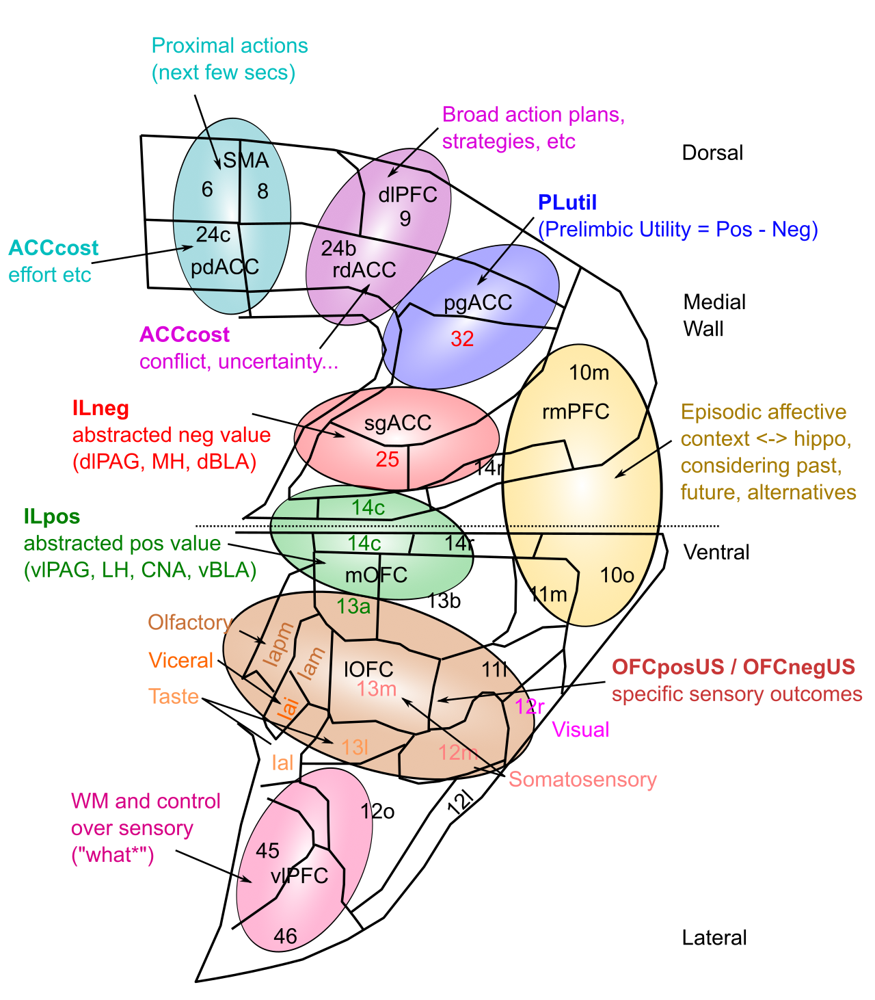

+++
Categories = ["Rubicon", "Neuroscience"]
bibfile = "ccnlab.json"
+++

## Functional organization of PFC

{id="figure_pfc-fun" style="height:30em"}

## Functional organization of the thalamus

Rovo et al. -- put this in pfc, not here.

connectivity of different thalmic areas.

broader connectivity of BG loops etc.

{id="figure_thal-rovo" style="height:30em"}

{id="figure_md-pfc" style="height:30em"}

