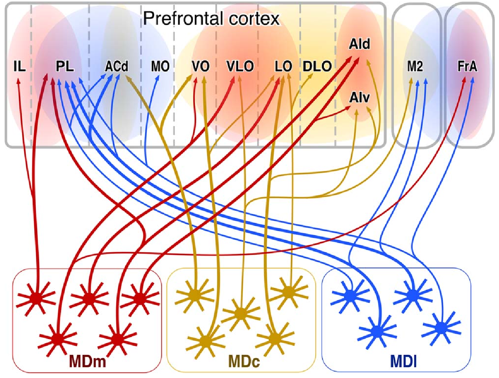
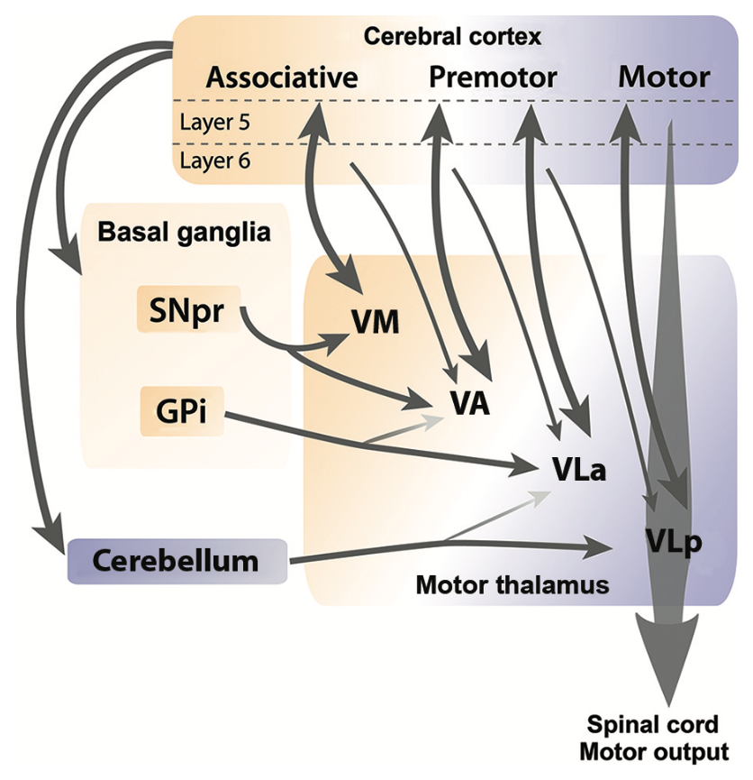

+++
Categories = ["Rubicon", "Neuroscience"]
bibfile = "ccnlab.json"
+++

The **prefrontal cortex** (PFC) is the main co-conspirator with the [[basal ganglia]] in guiding much of an organism's overall behavior. It is [[anatomy|anatomically]] the anterior portion of the **frontal** [[neocortex]], where the posterior frontal cortex has primary and secondary motor areas with neurons that project down to the spinal cord and can directly drive motor actions. The PFC provides direct _top-down_ projections to these motor frontal areas, along with extensive connections into posterior cortical areas, to guide behavior and cognition at a "higher level".

This role for the PFC is referred to as **executive function**, by analogy to an executive in a company ([[@MillerCohen01]]). However, this has the risk of infinite regress by invoking the full unexplained cognitive abilities of an intact human brain in the role of this PFC executive. When making autonomous computational models of the brain, we can't get away with this _homunculus_ ("little person") living in the PFC ([[@HazyFrankOReilly06]])! Thus, our challenge is to understand how the open-ended [[artificial intelligence|general intelligence]] that is unique to humans emerges from the biological systems that are largely similar to those in other primates and other mammals to varying degrees.

The approach taken to this challenge in the [[Rubicon]] framework is to first understand how the PFC supports the ability to select among different possible courses of action and then guide behavior and cognition to accomplish the selected objective. This **goal-driven** functionality is supported by a distributed network of PFC areas, working synergistically with interconnected regions of the basal ganglia and other subcortical areas.

The unique "superpower" that the PFC brings to the table is the ability to maintain neural firing in a robust manner over time (i.e., **working memory**; [[@BaddeleyHitch74]]; [[@MiyakeShah99]]; [[@KubotaNiki71]]; [[@FusterAlexander71]]; [[@Goldman-Rakic95a]]), which is the "glue" that keeps attention focused on the selected goal. The neural basis for this ability derives from strong bidirectional circuits with high levels of [[neuron channels#NMDA]] channels, producing a high degree of [[stable activation]] ([[@LismanFellousWang99]]; [[@BrunelWang01]]; [[@SandersBerendsMajorEtAl13]]).

The most salient way to understand what the PFC does in this regard comes from the fact that the PFC is inactivated during sleep ([[@HobsonPace-Schott02]]), such that your inability to maintain any kind of coherent focus while dreaming demonstrates the critical contributions of the PFC. The posterior neocortex in particular is great at generating semantic associations and potential connections and insights, but it is easily distracted and follows a stream-of-consciousness trajectory without the PFC there to keep it focused on the task at hand.

The following sections begin with a detailed consideration of the functional organization of the PFC across its many different regions, followed by an overview of the neural mechanisms supporting robust active maintenance, which also involve a critical role of the [[thalamus]] and its modulation by the basal ganglia.

## Functional organization of PFC

{id="figure_goal-bio" style="height:20em"}
![Distributed goal representations across different prefrontal cortex (PFC) areas, each with associated areas of the striatum of the basal ganglia. The mediodorsal (MD) thalamus provides a common point of disinhibitory gating control, by which phasic updating of the PFC goal state can be controlled at the point of goal selection and after the goal outcome. OFC = orbitofrontal cortex; IL = infralimbic; ACC = anterior cingulate cortex; PL = prelimbic; dlPFC = dorsolateral PFC (isomorphic to ALM = anteriolateral motor cortex in rodents).](media/fig_rubicon_loops_spiral_goals.png)

The [[Rubicon]] goal-driven framework distinguishes three different groups of PFC areas that together comprise a distributed representation of a behavioral goal, as shown in [[#figure_goal-bio]]:

* **OFC (orbitofrontal cortex)** and **IL (infralimbic cortex)** are ventral and medial PFC areas that represent motivationally-salient outcomes at different levels of abstraction, which we denote as USs (unconditioned stimuli) in the standard conditioning terminology. These are the things that you are trying to get when you engage in goal-driven behavior: food, water, praise, etc (see [[emotion]]).

* **ACC (anterior cingulate cortex)** and **PL (prelimbic cortex)** are dorsomedial (ACC) and anterior-medial (PL) PFC areas that represent the _costs_ associated with accomplishing a goal (effort, risk, uncertainty, in the ACC), and the net benefit vs. cost _utility_ associated with accomplishing the goal (in PL). Thus, PL is the single most important integrative area for goal-driven behavior, providing the net estimated value of actually taking on a given goal.

* **dlPFC (dorsolateral PFC)** (which is **ALM (anterior-lateral motor)** in rodents) represents high-level action plans that could be effective in obtaining the desired outcome. It projects extensively to the ACC to drive the cost etc estimates associated with these plans, and once a goal is selected and engaged, it provides a top-down bias on action representations in the SMA (supplementary motor area), which includes premotor cortex in this broad conception. These higher-level action areas likewise drive individual motor action representations in primary motor areas.

Thus, across these different PFC areas, all of the essential pieces of information necessary to evaluate and execute goals is encoded. The robust active maintenance (working memory) capabilities enable this distributed goal representation across these areas to persist over time and drive appropriate behaviors to accomplish the goal. 

As also shown in [[#figure_goal-bio]], each PFC area is extensively interconnected with corresponding areas in the [[basal ganglia]] (BG) and different regions of the thalamus, which form multiple parallel loops ([[@AlexanderDeLongStrick86]]; [[@FosterBarryKorobkovaEtAl21]]) that also have an overall _spiraling_ pattern such that the ventral-medial OFC, IL, PL, and ACC areas asymmetrically project to areas that interact with dlPFC and motor areas, but not the other way around, as shown in the figure ([[@HaberFudgeMcFarland00]]).

The functional role of these BG and thalamic connections has been a matter of considerable debate, but recent neuroscience data ([[@GuoYamawakiSvobodaEtAl18]]) is converging with earlier computational ideas ([[@FrankLoughryOReilly01]]; [[@OReillyFrank06]]) to support the idea that the BG can **gate** or toggle the sustained neural firing in PFC. However, this gating function is likely only associated with the initial goal-selection process, taking place across the ventral / medial PFC areas listed above, while the dorsolateral BG areas that interconnect with the frontal motor areas provide a modulatory learning signal that can drive learning in the cortex based on initial acquisition in the BG.

{id="figure_pfc-comp" style="height:40em"}

[[#figure_pfc-comp]] shows the core goal-driven PFC areas across a range of different species ([[@RobertsClarke19]]), from rat to human, with two "intermediate" species along the way (marmoset, which is an evolutionarily more ancient primate, and macaque, which is closer to the ape lineage that includes humans). The goal-driven PFC areas comprise the bulk of the PFC in a rat ([[#figure_pfc-rat]]), whereas primates have additional dorsal / lateral PFC areas, that support more elaborate action plans.

{id="figure_pfc-rat" style="height:20em"}

We can infer from this evolutionary trajectory that the goal-driven PFC areas do indeed support the most essential "core" aspects of PFC function, which are conserved across evolutionary time. This means that by focusing our computational modeling efforts on the rodent PFC, we can capture these most essential aspects of PFC function, and that subsequent models can then attempt to capture the elaborated planning and motor control capabilities of the primate brain.

{id="figure_pfc-fun" style="height:40em"}
![Functional anatomy of the prefrontal cortex in the primate brain, focusing on medial and ventral areas, based on data from Ongur & Price. The top is dorsal, which moves down to ventral at the center of the figure, and it then "splays out" to the ventrolateral regions at the bottom. As emphasized by Ongur & Price, strong subcortical projections drive the organization of these areas, as labeled in the figure. As is true of anything in the neocortex, none of this is crisp and modular, but considerable evidence supports the overall characterizations.](media/fig_rubicon_anatomy_macaque.png)

[[#figure_pfc-fun]] provides an elaborated version of the primate PFC, assigning more fine-grained functional labels based on the connectivity with subcortical areas described by [[@^OngurPrice00]]. These subcortical areas, which have relatively well-defined and circumscribed neural response properties that are under strong evolutionary control, can then anchor the learning in these corresponding PFC areas to represent the relevant information needed for control over survival relevant factors, as discussed in [[emotion]].

### Neural coding data

There is a wealth of neural recording data across multiple species that is generally consistent with the above functional anatomy of ventral and medial PFC areas. However, much of the data in animals is from individual neuron recordings, which inevitably shows that neurons across all of these different PFC areas exhibit some sensitivity to the functional variables that are ascribed to specific areas in the above framework (e.g., [[@KennerleyBehrensWallis11]] and references therein).

This _mixed selectivity_ of individual neural coding is ubiquitous as discussed in [[distributed representations]], which also explains why _representational similarity analysis_ (RSA) is the best tool to understand the distinctive encoding properties of a given brain area.

{id="figure_hunt-rsa" style="height:40em"}
![Representational similiarity analysis of OFC (top), DLPFC (middle), and ACC (bottom) population activity in a decision-making task with options on the left or right varying in magnitude and probability (Hunt et al, 2018). OFC neurons clearly encode stimulus identity and the value of the stimulus that the monkey was currently attending, while the other areas do not as shown in the bar graphs under each target regressor. DLPFC selectively encodes spatial attention, while both DLPFC and ACC encode the spatial value, consistent with the response action plan. ACC encodes the correct accept / reject decision based on integrating the total utility of the options. Each of these results is consistent with the functional anatomy shown in prior figures.](media/fig_pfc_ofc_acc_dlpfc_rsa_hunt_etal_18.png)

Fortunately, [[@^HuntMalalasekeradeBerkerEtAl18]] performed an RSA analysis of dlPFC, ACC, and OFC areas in a decision-making task, and found remarkable support for the functional specializations of these areas as shown in [[#figure_hunt-rsa]]. Specifically, OFC neurons encoded both the stimlus identity and reward value of the stimulus that the monkey was currently attending, consistent with representing the value of the outcome. DLPFC neurons instead encoded the left / right choice action that must be made (in advance of making it, i.e., an action plan), and, along with the ACC, the overall value of these action choices. Finally, the ACC represented the final accept / reject decision that integrates all of the variables.

Consistent with the parallel [[constraint satisfaction]] process operating via the [[bidirectional connectivity]] among these areas, these neural responses emerged in parallel across areas. Thus, even though each area is specialized to encode a specific aspect of the overall goal, they all work together to converge on a plan that satisfies the constraints from each.

Similar dynamics were observed in OFC by [[@^RichWallis16]] as the monkeys considered different options, consistent with the requirement that a single option is considered at any given point in time. This is necessary to avoid [[binding problems]] in the constraint satisfaction process ([[@HerdKruegerNairEtAl21]]).

## Mechanisms of active maintenance

{id="figure_pfc-maint-lamina" style="height:30em"}
![Detailed mapping of a standard occulomotor delayed response task onto patterns of neural activity across different lamina within the dlPFC. Superficial layer (II) neurons receive bottom-up sensory inputs encoding the cued location for a delayed visual saccade, in this case, the red light at 90 degrees to the left of the central yellow fixation point. Specialized deep layer III neurons with extensive lateral recurrent connectivity, expressing both NMDA and GABA-B channels, provide the reverberant attractor dynamics to sustain the cue location over the delay period, during which time the animal must maintain central fixation. When the fixation cross dissappears, the animal is allowed to respond, and deep layer V output neurons drive the motor response, to saccade to the previously-cued target location. Figure adapted from Arnsten et al., (2012)](media/fig_arnsten_et_al_12_fig1.png)

[[#figure_pfc-maint-lamina]] from [[@^ArnstenWangPaspalas12]] shows a widely-accepted framework for how bidirectional excitatory connections sustain neural activity robustly over time, in this case encoding the cue location within a standard oculomotor delayed response task. Specifically, a specialized population of deep layer 3 pyramidal neurons within the PFC has been identified, which have extensive lateral, mutually excitatory (recurrent) connectivity and a high concentration of NMDA receptors ([[@KritzerGoldman-Rakic95]]; [[@WangMarkramGoodmanEtAl06]]).

This pattern of connectivity has undergone a prominent evolutionary expansion in primates ([[@Elston03]]; [[@WangYangWangEtAl13]]), and several studies have shown that NMDA receptor blockade impairs working memory performance in multiple species ([[@KrystalAbi-SaabPerryEtAl05]]; [[@MoghaddamAdams98]]; [[@RobertsShafferSeymourEtAl10]]; [[@WangYangWangEtAl13]]). In rodents, evidence reviewed in the next section shows that active maintenance depends more on layer 5 PT neurons (which also have NMDA-enhanced recurrent connections; [[@WangStradtmanWangEtAl08]]) and bidirectional excitatory loops through the thalamus, whereas primates may be able to maintain neural firing more robustly based on the deep layer 3 loops.

The laminar specialization shown in [[#figure_pfc-maint-lamina]] is consistent with standard patterns of [[neocortex]] connectivity, where inputs activate superficial layers directly and indirectly via layer 4. The subcortical output from the PFC arises from the deep layers, with the large layer 5b output neurons providing direct motor-level output (i.e., their axons constitute the pyramidal tract (PT) projections to the spinal cord). These layer 5b neurons also project to the basal ganglia and other subcortical targets, and form thalamocortical loops as reviewed next.

In addition to driving output responses, the layer 5b output neurons also transmit both sensory input and sustained active maintenance signals, as revealed by the unambiguous recording of all of these firing patterns in identified layer 5b neurons ([[@SommerWurtz00]]). This can arise from different patterns of projections from layer 2 and 3 neurons into layer 5b, and can be computationally useful in enabling all aspects of the PFC activity to be available to subcortical systems.

## Systems-level dynamics

The dynamics of activity within the PFC are subject to strong influence from extensive projections from the [[thalamus]], which are in turn subject to inputs from a range of other brain areas, including the [[basal ganglia]] and the [[cerebellum]], along with other neuromodulatory inputs. The PFC in turn sends extensive projections into these and other areas. Here we review data on these systems-level interactions.

First, the extensive bidirectional excitatory connectivity between the thalamus and PFC has led many to develop computational models where these thalamocortical loops play a critical role in active maintenance, and in the dynamic control of when the information is updated versus maintained in PFC ([[@DomineyArbib92]]; [[@DomineyArbibJoseph95]]; [[@BeiserHouk98]]; [[@FrankLoughryOReilly01]]; [[@OReillyFrank06]]; [[@AshbyEllValentinEtAl05]]).

For example, the [[PBWM]] model (prefrontal-cortex basal ganglia working-memory) [[@OReillyFrank06]]) draws a direct connection between the computational insights from the widely-used [[LSTM]] model (long short-term memory; [[@HochreiterSchmidhuber97]]) and these thalamocortical circuits and their disinhibitory control via the basal ganglia.

The LSTM model demonstrates the computational power of a system with dynamic multiplicative _gating_ control over when information updates maintained working memory representations in PFC (and when this information is output to control behavior). The disinhibitory (modulatory) influence of the basal ganglia on thalamocortical loops produces effectively this same kind of gating function, and the PBWM model demonstrated how phasic [[dopamine]] signals could train this gating functionality in a biologically-plausible manner.

{id="figure_alm-thal-loop" style="height:25em"}
![Summary of thalamocortical loops between the anterior lateral motor area (ALM), which is the rodent analogue of dlPFC, and ventromedial thalamus (VM), based on detailed analysis by Guo et al., (2018). The X denotes possible connections that were specifically excluded, showing that the specific VM neurons targeted by the layer 5b pyramidal tract (PT) neurons are the ones that also project back to these same neurons. Furthermore, the layer 6 corticothalamic (CT) neurons do not receive the VM inputs.](media/fig_guo_etal_2018_alm_pt_ct_loops.png)

Recent experimental data has provided strong support for this gating-like influence of the thalamus over PFC active maintenance. In terms of anatomy, [[@^GuoYamawakiSvobodaEtAl18]] used multiple advanced neuroscience tools to determine the precise nature of the thalamocortical loops between layer 5b PT (pyramidal tract) neurons in area ALM (rodent dlPFC) and the VM (ventromedial) thalamic nucleus, as shown in [[#figure_alm-thal-loop]]. VM also projects to primary motor cortex (M1), but the specific neurons that receive inputs from the PFC PT neurons also send back up to ALM, not M1, forming a closed excitatory loop that is likely important for sustaining active neural firing.

{id="figure_economo-18" style="height:30em"}

Further refinement of the organization of the deep layer 5 PT neurons is provided by [[@^EconomoViswanathanTasicEtAl18]], who found evidence for two distinct types of these neurons as shown in [[#figure_economo-18]]. The PT-upper neurons are the ones involved in the thalamocortical loops shown in [[#figure_alm-thal-loop]], while the PT-lower neurons project down to brainstem motor areas such as the medulla oblongata.

The presence of these two neuron types provides a mechanism for distinguishing between preparatory motor planning versus actual motor execution, to prevent premature execution during the planning stage. However, [[@^EconomoViswanathanTasicEtAl18]] found that there was not a simple clean dissociation between these two neural populations, with both types of neurons exhibiting activity during delay and response phases. Nevertheless, there was an increased likelihood of PT-lower neurons firing immediately prior and during the response, while PT-upper neurons were more likely to exhibit sustained firing during the preparatory delay period. Thus, as discussed in [[distributed representations]] and shown in [[#figure_hunt-rsa]], population-level patterns shaped by learning are always the most relevant for driving behavior.

Consistent with the properties of these thalamocortical loops and the earlier computational models, multiple studies have shown that the thalamus indeed plays a critical role in shaping the dynamics of PFC activity in a task-relevant context ([[@StokesBest90]]; [[@GilmartinBalderstonHelmstetter14]]; [[@GuoLiHuberEtAl14]]; [[@BolkanStujenskeParnaudeauEtAl17]]; [[@SchmittWimmerNakajimaEtAl17]]; [[@RikhyeGilraHalassa18]]; [[@DacreColliganClarkeEtAl21]]; [[@InagakiChenRidderEtAl22]];  [[@WilhelmSychFominsEtAl23]]). 

{id="figure_bolkan-17" style="height:15em"}

{id="figure_guo-14" style="height:15em"}

There are a number of studies focusing on loops between the MD nucleus of the thalamus and PL PFC in rodents (see [[@ParnaudeauBolkanKellendonk18]] for a review). For example, [[#figure_bolkan-17]] shows the activity of PL neurons maintained over a relatively long delay period, which was dependent upon loops through the MD thalamus for maintenance ([[@BolkanStujenskeParnaudeauEtAl17]]), and also depended on input from the ventral hippocampus ([[@SpellmanRigottiAhmariEtAl15]]). Similar results on shorter time windows were found by [[@^SchmittWimmerNakajimaEtAl17]] and [[@^GuoLiHuberEtAl14]] as shown in [[#figure_guo-14]].

In these and other studies, they were able to dissect distinct circuits active at different phases of the task, where different populations of PFC or MD neurons were driving the interactions, based on maintained information in PFC and phasic updating signals arising from the MD. Thus, it is clear that complex sequential cognitive processing involves dynamic thalamocortical interactions, consistent with the earlier computational models.

{id="figure_inagaki-22" style="height:10em"}
![Summary of results from a study by Inagaki et al (2022) on the interactions between thalamus and ALM in a cued delayed response task. During motor planning, recurrent corticothalamic loops sustain the instruction cue information over a delay period. Then, when an auditory Go cue signals the time to respond, a different subset of thalamic neurons are activated, specifically exciting a population of layer 5b PT neurons, which then drives the response behavior, presumably via PT-lower motor-projecting neurons. The auditory cue activates neurons in the PPN (pedunculo-pontine nucleus) which has both cholinergic and glutamatergic projections into the dorsolateral striatum in addition to the thalamus. The PPN-thalamic projections were identified as glutamatergic.](media/fig_pfc_inagaki_etal_22.png)

In addition to the PL -- MD circuit, other PFC areas have similar thalamocortical dynamics. For example, [[#figure_inagaki-22]] shows the results from [[@^InagakiChenRidderEtAl22]] documenting a gating-like relationship between thalamic inputs to trigger motor responding driven by ALM preparatory activity. They interpret these results in terms of a direct auditory input to the PPN (pedunculo-pontine nucleus) projecting to the thalamus. However, the PPN also has extensive projections into the basal ganglia, which is likely to play a critical role in the acquisition of this task, and they showed that SNr neurons had short-latency disinhibitory responses to the Go cue.

The main reason this task depends on the PFC is the delay between the instruction cue and the Go cue to respond: the basal ganglia cannot maintain information reliably over that time interval. Also, they recorded from a number of thalamic areas that interact with the ALM, and the PPN projections were strongest to those that are strongly associated with the goal-driven PFC areas (e.g., MD and PF/CM, as discussed more below and in [[thalamus]]).

More direct evidence for the role of the basal ganglia in modulating the thalamocortical loops comes from multiple other studies, including the extensive literature reviewed in [[basal ganglia]]. For example, [[@^WilhelmSychFominsEtAl23]] document the importance of projections from PL neurons to dorsomedial striatum (DMS) in a working memory task, and [[@^AkhlaghpourWiskerkeChoiEtAl16]] show delay period activity of DMS neurons that is very similar to the PL neurons as shown in [[#figure_bolkan-17]].

<!--- TODO: need PPN page etc. -->

### Distinct thalamic gating circuits

{id="figure_haber-ct" style="height:30em"}

The Rubicon goal-driven framework posits that there are two qualitatively-distinct types of thalamocortical gating systems ([[#figure_haber-ct]] from [[@McFarlandHaber02]]):

* Goal gating: As shown in [[#figure_goal-bio]], there should be a common circuit that drives gating control over the distributed goal areas in the ventral and medial PFC areas, also including dlPFC-like areas (e.g., ALM in rodent). The unique connectivity of the MD (mediodorsal) nucleus of the thalamus provides precisely this form of connectivity, and is under disinhibitory control from the ventral and medial areas of the basal ganglia, via the ventral pallidum output pathway in addition to the standard BG output pathways.

* Working memory and motor gating: Within the context of an engaged goal, motor areas can be modulated by thalamic projections and sustain active maintenance to support anticipatory motor planning and other forms of active working memory. There are several other thalamic nuclei in the ventral region (e.g., VM, VA, VL) that support this functionality. Interestingly, the dlPFC areas, including ALM in rodents, are "dual ported" in that they belong to both the goal gating network, to engage an overall motor plan for accomplishing a goal, while also having more dynamic updates as the motor plan unfolds over time.

{id="figure_md-pfc" style="height:20em"}

{id="figure_motor-thal" style="height:30em"}

A more detailed discussion of these different thalamocortical loops is provided in the [[thalamus]] page, but the main points are summarized in [[#figure_md-pfc]] from [[@^KuramotoPanFurutaEtAl17]] showing the goal-gating connectivity of area MD in rodents, and [[#figure-motor-thal]] showing the motor area thalamocortical loops organized according to the motor hierarchy ([[@Bosch-BoujuHylandParr-Brownlie13]]).

In the case of the MD, the medial portion (MDm) provides a single locus of gating control over all of the goal-relevant PFC areas, while the central (MDc) provides more specific connectivity to OFC (outcome) areas, while lateral (MDl) connects with the PL and ACC areas. This is consistent with the idea that there are both global goal-wide gating signals for engaging an active goal, and more specific updating of the outcome and effort / utility aspects of the goal state as things progress.

## Computational implementation of PFC

* PT, PTp
