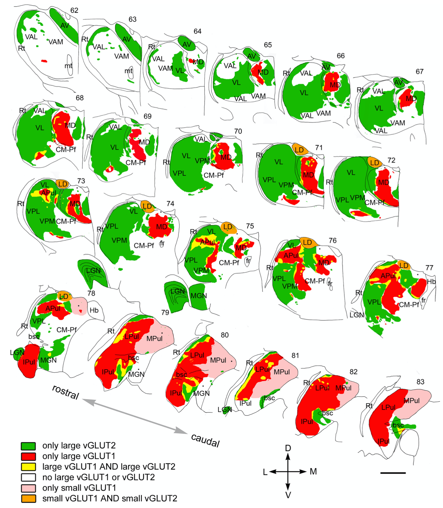

+++
Categories = ["Rubicon", "Neuroscience"]
bibfile = "ccnlab.json"
+++

The **prefrontal cortex** (PFC) is the main co-conspirator with the [[basal ganglia]] in guiding much of an organism's overall behavior. It is anatomically the anterior portion of the **frontal** [[neocortex]], where the posterior frontal cortex has primary and secondary motor areas with neurons that project down to the spinal cord and can directly drive motor actions. The PFC provides direct _top-down_ projections to these motor frontal areas, along with extensive connections into posterior cortical areas, to guide behavior and cognition at a "higher level".

This role for the PFC is referred to as **executive function**, by analogy to an executive in a company ([[@MillerCohen01]]). However, this has the risk of infinite regress by invoking the full unexplained cognitive abilities of an intact human brain in the role of this PFC executive. When making autonomous computational models of the brain, we can't get away with this _homunculus_ ("little person") living in the PFC ([[@HazyFrankOReilly06]])! Thus, our challenge is to understand how the open-ended [[artificial intelligence|general intelligence]] that is unique to humans emerges from the biological systems that are largely similar to those in other primates and other mammals to varying degrees.

The approach taken to this challenge in the [[Rubicon]] framework is to first understand how the PFC supports the ability to select among different possible courses of action and then guide behavior and cognition to accomplish the selected objective. This **goal-driven** functionality is supported by a distributed network of PFC areas, working synergistically with interconnected regions of the basal ganglia and other subcortical areas.

The unique "superpower" that the PFC brings to the table is the ability to maintain neural firing in a robust manner over time (i.e., **working memory**; [[@BaddeleyHitch74]]; [[@MiyakeShah99]]; [[@KubotaNiki71]]; [[@FusterAlexander71]]; [[@Goldman-Rakic95a]]), which is the "glue" that keeps attention focused on the selected goal. The neural basis for this ability derives from strong bidirectional circuits with high levels of [[neuron channels#NMDA]] channels, producing a high degree of [[stable activation]] ([[@LismanFellousWang99]]; [[@BrunelWang01]]; [[@SandersBerendsMajorEtAl13]]).

The most salient way to understand what the PFC does in this regard comes from the fact that the PFC is inactivated during sleep ([[@HobsonPace-Schott02]]), such that your inability to maintain any kind of coherent focus while dreaming demonstrates the critical contributions of the PFC. The posterior neocortex in particular is great at generating semantic associations and potential connections and insights, but it is easily distracted and follows a stream-of-consciousness trajectory without the PFC there to keep it focused on the task at hand.

The following sections begin with a detailed consideration of the functional organization of the PFC across its many different regions, followed by an overview of the neural mechanisms supporting robust active maintenance, which also involve a critical role of the [[thalamus]] and its modulation by the basal ganglia.

## Functional organization of PFC

{id="figure_goal-bio" style="height:20em"}
![Distributed goal representations across different prefrontal cortex (PFC) areas, each with associated areas of the striatum of the basal ganglia. The mediodorsal (MD) thalamus provides a common point of disinhibitory gating control, by which phasic updating of the PFC goal state can be controlled at the point of goal selection and after the goal outcome. OFC = orbitofrontal cortex; IL = infralimbic; ACC = anterior cingulate cortex; PL = prelimbic; dlPFC = dorsolateral PFC (isomorphic to ALM = anteriolateral motor cortex in rodents).](media/fig_rubicon_loops_spiral_goals.png)

The [[Rubicon]] goal-driven framework distinguishes three different groups of PFC areas that together comprise a distributed representation of a behavioral goal, as shown in [[#figure_goal-bio]]:

* **OFC (orbitofrontal cortex)** and **IL (infralimbic cortex)** are ventral and medial PFC areas that represent motivationally-salient outcomes at different levels of abstraction, which we denote as USs (unconditioned stimuli) in the standard conditioning terminology. These are the things that you are trying to get when you engage in goal-driven behavior: food, water, praise, etc (see [[emotion]]).

* **ACC (anterior cingulate cortex)** and **PL (prelimbic cortex)** are dorsomedial (ACC) and anterior-medial (PL) PFC areas that represent the _costs_ associated with accomplishing a goal (effort, risk, uncertainty, in the ACC), and the net benefit vs. cost _utility_ associated with accomplishing the goal (in PL). Thus, PL is the single most important integrative area for goal-driven behavior, providing the net estimated value of actually taking on a given goal.

* **dlPFC (dorsolateral PFC)** (which is **ALM (anterior-lateral motor)** in rodents) represents high-level action plans that could be effective in obtaining the desired outcome. It projects extensively to the ACC to drive the cost etc estimates associated with these plans, and once a goal is selected and engaged, it provides a top-down bias on action representations in the SMA (supplementary motor area), which includes premotor cortex in this broad conception. These higher-level action areas likewise drive individual motor action representations in primary motor areas.

Thus, across these different PFC areas, all of the essential pieces of information necessary to evaluate and execute goals is encoded. The robust active maintenance (working memory) capabilities enable this distributed goal representation across these areas to persist over time and drive appropriate behaviors to accomplish the goal. 

As also shown in [[#figure_goal-bio]], each PFC area is extensively interconnected with corresponding areas in the [[basal ganglia]] (BG) and different regions of the thalamus, which form multiple parallel loops ([[@AlexanderDeLongStrick86]]; [[@FosterBarryKorobkovaEtAl21]]) that also have an overall _spiraling_ pattern such that the ventral-medial OFC, IL, PL, and ACC areas asymmetrically project to areas that interact with dlPFC and motor areas, but not the other way around, as shown in the figure ([[@HaberFudgeMcFarland00]]).

The functional role of these BG and thalamic connections has been a matter of considerable debate, but recent neuroscience data ([[@GuoYamawakiSvobodaEtAl18]]) is converging with earlier computational ideas ([[@FrankLoughryOReilly01]]; [[@OReillyFrank06]]) to support the idea that the BG can **gate** or toggle the sustained neural firing in PFC. However, this gating function is likely only associated with the initial goal-selection process, taking place across the ventral / medial PFC areas listed above, while the dorsolateral BG areas that interconnect with the frontal motor areas provide a modulatory learning signal that can drive learning in the cortex based on initial acquisition in the BG.

{id="figure_pfc-comp" style="height:40em"}

[[#figure_pfc-comp]] shows the core goal-driven PFC areas across a range of different species ([[@RobertsClarke19]]), from rat to human, with two "intermediate" species along the way (marmoset, which is an evolutionarily more ancient primate, and macaque, which is closer to the ape lineage that includes humans). The goal-driven PFC areas comprise the bulk of the PFC in a rat ([[#figure_pfc-rat]]), whereas primates have additional dorsal / lateral PFC areas, that support more elaborate action plans.

{id="figure_pfc-rat" style="height:20em"}

We can infer from this evolutionary trajectory that the goal-driven PFC areas do indeed support the most essential "core" aspects of PFC function, which are conserved across evolutionary time. This means that by focusing our computational modeling efforts on the rodent PFC, we can capture these most essential aspects of PFC function, and that subsequent models can then attempt to capture the elaborated planning and motor control capabilities of the primate brain.

{id="figure_pfc-fun" style="height:40em"}
![Functional anatomy of the prefrontal cortex in the primate brain, focusing on medial and ventral areas, based on data from Ongur & Price. The top is dorsal, which moves down to ventral at the center of the figure, and it then "splays out" to the ventrolateral regions at the bottom. As emphasized by Ongur & Price, strong subcortical projections drive the organization of these areas, as labeled in the figure. As is true of anything in the neocortex, none of this is crisp and modular, but considerable evidence supports the overall characterizations.](media/fig_rubicon_anatomy_macaque.png)

[[#figure_pfc-fun]] provides an elaborated version of the primate PFC, assigning more fine-grained functional labels based on the connectivity with subcortical areas described by [[@^OngurPrice00]]. These subcortical areas, which have relatively well-defined and circumscribed neural response properties that are under strong evolutionary control, can then anchor the learning in these corresponding PFC areas to represent the relevant information needed for control over survival relevant factors, as discussed in [[emotion]].

### Functional organization of the thalamus

Rovo et al. -- put this in pfc, not here.

connectivity of different thalmic areas.

broader connectivity of BG loops etc.

{id="figure_thal-rovo" style="height:40em"}

{id="figure_md-pfc" style="height:30em"}

### PL

[[@FriedmanHommaGibbEtAl15]] test cost-benefit conflicts in rats, find selective effects in PL and projection to striosomes in [[basal ganglia]]. Also show that ACC encodes cost information and projects more to matrix.

## Mechanisms of active maintenance

