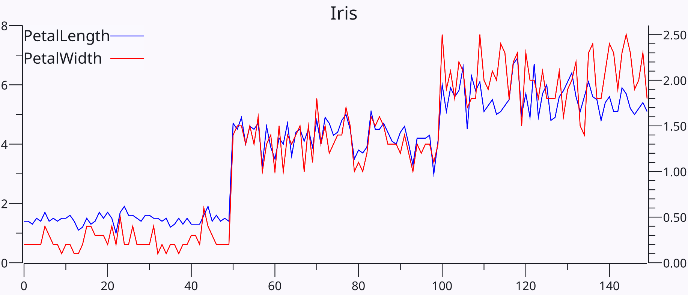

+++
Categories = ["Statistics", "Mechanisms"]
bibfile = "ccnlab.json"
+++

**Principal components analysis** (PCA) is a widely-used dimensionality reduction technique that computes new _basis vectors_ that capture the primary dimensions of variance in the _covariance matrix_ across a set of data (e.g., patterns of neural activity over time). By representing a high-dimensional state space using a small number of efficient basis vectors, which can be represented in a 2D or 3D plot, the essential structure of the representations can often be understood. See [[linear algebra]] for mathematical details behind these concepts and the eigenvector / eigenvalue framework that underlies the mathematics of PCA.

In addition to the practical utility of using PCA for analyzing neural representations, this process of re-representing information in a new _rotated_ set of axes or basis vectors is an essential feature of neural information processing as discussed in [[categorization]], driven by learning mechanisms that adjust synaptic weights, which provide the basis vectors by which information is represented in the brain.

Indeed, various forms of [[Hebbian learning]] have been shown to perform an approximations of PCA, and PCA provides a useful abstract, mathematically well-defined example of what Hebbian learning can accomplish. Specifically, PCA is based on _correlations_ among the input variables, and shows how Hebbian learning can usefully extract the _correlational structure_ of the input space.

In an [[information-theory]] framing, more variance means greater _entropy_ and thus greater _information_, so finding the maximum variance dimensions is the same as finding the most informative dimensions. Eliminating redundant, correlated signals in the input is equivalent to _compressing_ the information so it can be represented more efficiently. The closely-related _independent components analysis (ICA)_ method ([[@JuttenHerault91]]) is derived from the information-theoretic principle of minimizing mutual information, and it has certain advantages in some situations over PCA ([[@Hyvarinen13]]).

## Covariance matrix

{id="figure_iris-petal" style="height:20em"}

The computation of the PCA components starts with the covariance matrix of the data, which captures the extent to which different variables (e.g., neuron activity states) co-vary (correlate) with each other over the rows of data. Intuitively, if two variables exhibit the same pattern of activity over time, then they are _redundant_ and can be captured with just one variable instead of two ([[#figure_iris-petal]]). This same principle can be extended in a _soft_ manner by capturing the central tendency across multiple variables, that are only _partially_ redundant. This is what PCA can accomplish.

{id="figure_iris-covar" style="height:10em"}

[[#figure_iris-covar]] shows the covariance matrix for the UCI machine-learning standard [iris dataset](https://archive.ics.uci.edu/dataset/53/iris). Because 3 out of the 4 features strongly covary with each other across the three different iris flower species and the 50 individual samples of each species in the dataset, it can be more efficiently represented with just two principal components, which capture a large amount of the variance across this dataset.

## PCA projection

{id="figure_iris-pca" style="height:20em"}

[[#figure_iris-pca]] shows the projection of the iris data along the two strongest principal components. The relatively spread-out nature of the points in general is an indication of the PCA projection finding the axes that capture the dimensions of maximum variance within the data. The first principal component along the X axis clearly distinguishes the different species of irises, while the second component plotted along the Y axis maximizes the variance within species.

