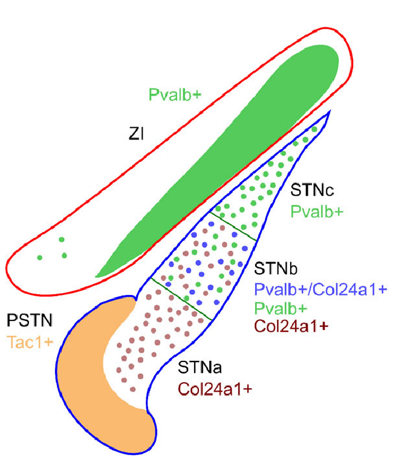

+++
Categories = ["Rubicon", "Neuroscience"]
Name = "STN"
bibfile = "ccnlab.json"
+++

The **subthalamic nucleus** (STN) is a part of the [[basal ganglia]] circuit, which receives direct input from the [[neocortex]], and is bidirectionally connected with the globus pallidus externus (GPe) and projects excitation to the output nuclei (SNr, GPi). In the PCore model, the STN is responsible for driving an initial brake on BG disinhibition by exciting these output nuclei, and then it receives a rebound inhibitory signal from the GPePr (prototypical GPe) neurons, which establishes a long-lasting pause in activity that opens up a brief time window for the BG to perform its decision-making function. This provides a mechanism behind the phasic firing of BG neurons.

This page provides a more detailed discussion of neural data on the STN to better understand its functionality, given that it plays such a critical and somewhat controversial role in the circuit.

As reviewed in [[basal ganglia]], much of the available data on BG firing is consistent with a brief, phasic window of activity for individual neurons, with otherwise remarkably silent striatal neurons outside of these brief windows. This is overall compatible with the contributions of the STN as hypothesized.

{id="figure_fujimoto-kita93" style="height:20em"}

{id="figure_magill04" style="height:20em"}

Furthermore, direct recordings of neural activity in the STN clearly demonstrate the pausing behavior, as shown in [[#figure_fujimoto-kita93]] and [[#figure_magill04]] from [[@^FujimotoKita93]] and [[@^MagillSharottBevanEtAl04]] respectively. There is a roughly 150 ms window during which the STN neurons experience sustained inhibition after the initial bursts.

The cause of this inhibition was unknown to the authors of the above papers, and unfortunately has not been a significant topic of focused research in the field in general. There are two major candidates from the existing electrophysiology literature:

* Small conductance calcium-activated K channels ([[neuron channels#SKCa]]), which were described by [[@^HallworthWilsonBevan03]] and are the mechanism included in the current PCore model. The Ca++ ions entering as a result of the initial bursting activity pattern then turn on a relatively long-lasting K+ current that depresses further firing.

* Inactivation of Na+ spike-driving channels due to a high sustained plateau potential ([[@KassMintz06]]). [[@BeurrierBioulacAudinEtAl01]]). This inactivation could be reversed by a dendritic calcium spike ([[@Kass09]]), suggesting that other excitatory synaptic inputs to STN neurons may be able to terminate the pause ([[@ChopekHultbornBrownstone19]]). 

There is also a role for NMDA channels in the bursting, which could couple to the SKCa channels ([[@ZhuMunhallShenEtAl04]]). Other papers have investigated various electrophysiological properties of STN neurons ([[@NakanishiKitaKitai87]]; [[@OtsukaAbeTsukagawaEtAl04]]; [[@KumaraveluBrockerGrill16), and [[@^ChopekHultbornBrownstone19]] provide a discussion of the complex electrophysiological properties of these neurons, including the pause in firing.

## Heterogeneity in the STN

{id="figure_stn-neurons" style="height:20em"}

There is considerable evidence for multiple cell types within the STN ([[@JeonLeeKwonEtAl22]]; [[@Wallen-MackenzieDumasPapathanouEtAl20]]) and different types of projection pathways out of STN neurons ([[@SatoParentLevesqueEtAl00]]; [[@KoshimizuFujiyamaNakamuraEtAl13]]), so the above characterization of STN function is likely only part of the story. [[#figure_stn-neurons]] from [[@^Wallen-MackenzieDumasPapathanouEtAl20]] shows that the PV+ type is only in the dorsolateral portion of the STN, which interconnects with the DL portions of the rest of the BG. This PV+ type exhibits bursting, while the PV- type does not ([[@JeonLeeKwonEtAl22]]).

{id="figure_mirzaei" style="height:10em"}

Thus, the tightly phasic windows of activity in DLS neurons shown in [[basal ganglia#figure_ds-actions]] in [[basal ganglia]] may be restricted to the PV+ type, while the somewhat broader and more varied activity profiles found in VMS neurons ([[basal ganglia#figure_vs-maze]]) may be associated with PV- STN neurons. [[#figure_mirzaei]] shows recording data from rat STN during a cued-choice task, where several of the recorded neurons exhibit the burst-pause-fire triphasic activity, while others do not, firing instead roughly 400 ms later. This paper also has relevant data consistent other others reviewed in [[basal ganglia]] on GPe neural firing patterns.

<!--- ## Hold-your-horses vs pause models -->

