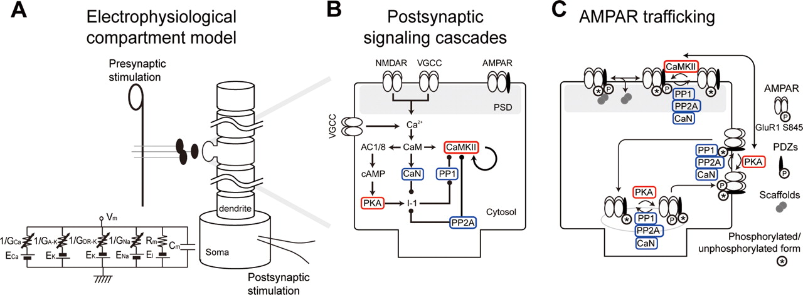

+++
Categories = ["Axon", "Learning"]
bibfile = "ccnlab.json"
+++

Synaptic plasticity is the well-established biological phenomenon that the strength of synaptic connections (i.e., _weights_) change in strength, which is known to be the primary basis for **learning** in the brain, consistent with the foundational hypothesis of [[abstract neural network]] models: _knowledge is encoded in synaptic weights_.

* **LTP = long-term potentiation** is the name for the phenomenon of persistent _increases_ in synaptic strength as a result of neural activity, as initially established by [[@^BlissLomo73]].

* **LTD = long-term depression** refers to _decreases_ in synaptic strength, which took a while longer to establish ([[@BearMalenka94]]).

Uncovering the biochemical basis for these phenomena has been one of the most successful collective research projects in neuroscience, resulting in a detailed understanding of many of the pathways and processes involved, which unfold over many different time scales as we briefly review here.

In an ideal world, the result of this effort would be a complete bottom-up grounding of the _functional_ nature of learning in the [[neocortex]]: we should be able derive the _learning algorithm_ at an algorithmic and computational [[levels of analysis|level of analysis]] based on a full understanding of the underlying hardware.

The existing attempts to derive this learning algorithm from the neurobiological mechanisms center around the principles of [[Hebbian learning]], which were presciently described by Donald Hebb in the 1940's ([[@Hebb49]]). The core idea here is captured in the saying: _neurons that fire together, wire together_. In other words, Hebbian learning is an _associative_ form of learning that builds connections among neurons that are somehow related to each other, to the extent that their patterns of neural activity co-occur in time. The resulting networks of associations seem like they would provide a suitable basis for our subjective conceptual understanding of the world: e.g., when we see smoke, we associate the concept of fire, and can therefore make useful inferences.

The phenomenon of [[#spike timing dependent plasticity]] (STDP) ([[@BiPoo98]]) added a further nuance to the Hebbian idea and provides an elegant integration of both LTP and LTD in one coherent framework: neurons are apparently also sensitive to the temporal order of firing, strengthening associations (LTP) if the presynaptic neuron fires before the postsynaptic one, and weakening associations (LTD) in the converse situation. Intuitively, this allows neurons to learn a _causal_ kind of association, if these timing relationships represent a causal ordering, which is not very likely as discussed below. Furthermore, the STDP phenomenon arises in highly specific, artificial conditions that do not generalize to the more naturalistic patterns of neural activity in the awake, behaving state ([[in activo]]).

As discussed in [[Hebbian learning]], this associative learning principle (even in the STDP version of it) does not have a mathematical or computational foundation supporting the idea that it should result in an effective overall organization of a deep layered network of neurons, capable of accomplishing the cognitive functions of the [[neocortex]]. All of these considerations lead us to conclude that Hebbian learning fails to provide a complete computational description of what the synaptic plasticity mechanisms are doing. 

Instead, we argue that a different temporal dynamic (vs STDP) is critical for providing a coherent computational-level description of synaptic plasticity that implements [[error-driven learning]] in a way that is consistent with [[predictive learning]]. Unlike Hebbian learning, error-driven learning provides the well-established basis for all of the modern [[abstract neural network]] models powering the current [[artificial intelligence]] (AI) advances, so we know it works at a computational level. Furthermore, the predictive learning framework captures much of the same intuitive understanding as the Hebbian associative learning framework: a major driver of learning in the neocortex is to predict what will happen next, which is another way of thinking about the smoke-fire associative learning example.

The critical temporal dynamic needed to implement error-driven learning using known synaptic plasticity mechanisms is the [[temporal derivative]], which can be computed via a competitive interaction between two processes that integrate neural activity with different [[time constant]]s. This is the basis for the [[kinase algorithm]] used in [[Axon]], which is named for the competitive interaction between two _kinases_ that determine the direction of synaptic plasticity (LTP vs LTD) ([[@GoodellZaegelCoultrapEtAl17]]). This algorithm builds on all of the mechanisms described below.

## Synaptic plasticity mechanisms

{id="figure_ltp-nmda" style="height:25em"}
![Critical steps in allowing calcium ions (Ca++) to enter postsynaptic cell via NMDA channels, inducing synaptic plasticity. 1. The postsynaptic membrane potential (Vm) must be elevated (from excitatory inputs to AMPA receptors across synapses of the postsynaptic neuron, and backpropagating action potential that comes back down the dendrite when the postsynaptic neuron fires). 2. Elevated Vm causes magnesium (Mg++) ions to be expelled from NMDA channel openings, thus unblocking them. 3. Presynaptic neuron fires an action potential, releasing glutamate. 4. Glutamate binds to NMDA receptors, causing them to open, allowing Ca++ to enter (only when also unblocked, per step 2). 5. The concentration of Ca++ in the postsynaptic spine drives second messenger systems (indicated by the X) that result in changes in AMPA receptor number and efficacy, thereby changing the synaptic weight. Ca++ can also enter from voltage-gated calcium channels (VGCCs), which depend only on postsynaptic Vm levels, and not sending activity --- these are weaker contributors to Ca++ levels.](media/fig_ltpd_synapse.png)

The synapse has a lot of moving parts (introduced in [[neuron]]), any one of which could potentially be the critical factor in causing its overall efficacy to change. How many can you think of? The search for the critical factor(s) dominated the early phase of research on synaptic plasticity, and evidence for the involvement of a range of different factors has been found over the years, from the amount of presynaptic neurotransmitter released, to number and efficacy of postsynaptic AMPA receptors, and even more subtle things such as the alignment of pre and postsynaptic components, and more dramatic changes such as the cloning of multiple synapses. However, the dominant factor for long-lasting learning changes appears to be the number and efficacy of postsynaptic AMPA receptors.

[[#figure_ltp-nmda]] shows the five critical steps in the cascade of events that drives change in AMPA receptor efficacy. The [[neuron channels#NMDA|NMDA]] receptors and the calcium ion ($Ca^{++}$) play a central role. NMDA channels allow $Ca^{++}$ to enter the postsynaptic spine. Across all cells in the body, $Ca^{++}$ typically plays an important role in regulating cellular function, and in the neuron, it is capable of setting off a series of chemical reactions that ends up controlling how many AMPA receptors are functional in the synapse. For details on these reactions, see [[#Biochemical cascades of kinases and phosphatases]]. Here's what it takes for the $Ca^{++}$ to get into the postsynaptic cell:

1. The postsynaptic membrane potential ($V_m$) must be elevated, as a result of all the excitatory synaptic inputs coming into the cell. The most important contributor to this $V_m$ level is actually the **backpropagating action potential** --- when a neuron fires an action potential, it not only goes forward out the axon, but also backward down the dendrites (via active voltage-sensitive $Na^+$ channels along the dendrites). Thus, the entire neuron gets to know when it fires --- we'll see that this is incredibly useful computationally.

2. The elevated $V_m$ causes magnesium ions ($Mg^{++}$) to be repelled (positive charges repel each other) out of the openings of NMDA channels, unblocking them.

3. The presynaptic neuron fires an action potential, releasing glutamate neurotransmitter into the synaptic cleft.

4. Glutamate binds to the NMDA receptor, opening it to allow $Ca^{++}$ ions to flow into the postsynaptic cell. This only occurs if the NMDA is also unblocked. This dependence of NMDA on both pre and postsynaptic activity was one of the early important clues to the nature of learning, as we see later.

5. The concentration of $Ca^{++}$ in the postsynaptic spine drives those complex chemical reactions that end up changing the number and efficacy of AMPA receptors. Because these AMPA receptors provide the primary excitatory input drive on the neuron, changing them changes the net excitatory effect of a presynaptic action potential on the postsynaptic neuron. This is what is meant by changing the synaptic efficacy, or *weight*.

The dependence of NMDA on having both pre and postsynaptic activity is essentially identical to the Hebbian learning principle ([[@LevySteward79]], [[@CollingridgeKehlMcLennan83]], [[@CollingridgeBliss87]]), which is why most neuroscientists naturally assumed this was the whole story ([[@Cooper05]]). It just seems like to much of a coincidence if this is not what is actually going on computationally. 

$Ca^{++}$ can also enter the postsynaptic cell via **voltage gated calcium channels** [[#neuron channels#VGCC|VGCC]] which are calcium channels that only open when the membrane potential is elevated. Unlike NMDA, however, they are _not_ sensitive to presynaptic neural activity --- they only depend on postsynaptic activity. This has important computational implications, as we discuss later. VGCCs contribute less to $Ca^{++}$ levels than NMDA, so NMDA is still the dominant player.

**Metabotropic glutamate receptors (mGlu)** also play an important role in synaptic plasticity. These receptors do not allow ions to flow across the membrane (i.e., they are not _ionotropic_), and instead they directly trigger chemical reactions when neurotransmitter binds to them. These chemical reactions can then modulate the changes in AMPA receptors triggered by $Ca^{++}$.

{id="figure_ltpd-ca"}

For a long time, researchers focused mainly on LTP (which is generally easier to induce), but eventually they realized that both directions of synaptic plasticity are equally important for learning ([[@DunwiddieLynch78]]; [[@Lisman89]]; [[@BearMalenka94]]). [[#figure_ltpd-ca]] shows the standard model for how this direction of change depends on the overall level of $Ca^{++}$ in the postsynaptic spine, accumulated over a few hundreds of milliseconds at least. Low levels drive LTD, while high levels produce LTP ([[@Lisman89]]; [[@BearMalenka94]]).

Interestingly, the shape of the function in [[#figure_ltpd-ca]] is essentially identical to one developed for a version of [[Hebbian learning]] known as the [[Hebbian learning#BCM]] rule in reference to the author's initials ([[@BienenstockCooperMunro82]]). To understand how the NMDA mechanism can lead to both LTD and LTP in this manner, we need to dig a little bit deeper into the biochemical processes that take place after $Ca^{++}$ enters the dendritic spine.

The basic story from [[@^Lisman89]] is that a _kinase_ known as _CaMKII_ drives LTP, while a competing _phosphatase_ pathway known as _PP1_ drives LTD, and that the differential sensitivities of these two pathways to the influx of $Ca^{++}$ results in the shape of the curve shown in [[#figure_ltpd-ca]]. Specifically, PP1 is dominant at low calcium levels and thus drives LTD, while CaMKII dominates at higher levels and thus drives LTP as calcium levels increase. This original hypothesis has withstood the test of time, but additional pathways have been discovered as discussed below.

## Spike Timing Dependent Plasticity

{id="figure_stdp"  style="height:20em"}

It is fair to say that the finding of spike-timing dependent plasticity (STDP) by [[@^BiPoo98]] has been the single most impactful experiment in the field since the original [[@^BlissLomo73]] finding, with more than 30,000 papers containing that term on [google scholar](https://scholar.google.com/scholar?q=%22spike+timing+dependent+plasticity%22) (in quotes!) and over 5,000 citations of the original paper. [[#figure_stdp]] shows the key result: synaptic learning seems to obey a simple, appealing _causality_ principle, such that LTP occurs when the presynaptic neuron fires before the postsynaptic one, and vice-versa for the opposite order. This intuitively appealing logic has proven especially attractive to a large number of computational modelers, who have extensively employed STDP-like mechanisms (e.g., [[@KheradpishehGanjtabeshThorpeEtAl18]]; [[@DiehlCook15]]).

A simple version of the causal argument suggests that if a given pre neuron actually played a role in driving the post neuron to fire, then it must necessarily have fired in advance of it, and according to the STDP results, its weights will increase in strength. Meanwhile, pre neurons that have no causal role in firing the postsynaptic cell will have their weights decreased.

The vast literature on STDP has since revealed a tremendous amount of variability in whether you get LTP, LTD, or neither, depending on many different variables ([[@DebanneInglebert23]]), including a dependency on the non-naturalistic calcium and magnesium concentrations used in the _in vitro_ experiments (see [[in activo]]). Furthermore, the original experiment required highly specific and artificial stimulation conditions involving single isolated pairs of spikes separated by a full second of no activity, with many repetitions of a given such timing pattern required to produce the STDP results.

Critically, when even slightly more complex spike trains were used, the results were not consistent with a simple application of the classical STDP plasticity function, and instead reveal considerable more complexity in the nature of the underlying mechanism ([[@FroemkeDan02]]; [[@FroemkeTsayRaadEtAl06]]; [[@UrakuboHondaFroemkeEtAl08]]). A similar conclusion was reached by [[@^ShouvalWangWittenberg10]], who argue that a version of the BCM ([[@BienenstockCooperMunro82]]) mechanism provides a better overall account. We replicate this conclusion using the biologically-detailed model of [[@^UrakuboHondaFroemkeEtAl08]] as described below and available for exploration in [[urakubo08 sim]]. In short, this work suggests that STDP is a special case consequence of more general 

Finally, a consideration of the natural patterns of neural activity in the awake, behaving [[neocortex]] raises fundamental questions about the causal logic behind the STDP theory in the first place. Specifically, there is considerable persistent ongoing neural activity at all levels of the neocortex, which has been shown to strongly contextualize the responses of neurons to incoming stimuli, for example ([[@ArieliSterkinGrinvaldEtAl96]]). Thus, contrary to the strictly feedforward causal direction envisioned by models based on STDP, activity in the brain does not have a simple reliable causal arrow due to the extensive [[bidirectional connectivity]].

## Biochemical cascades of kinases and phosphatases

{id="figure_urakubo-chem"}

To better understand how LTP and LTD work in the brain, we need to understand more about the complex biochemical cascades that are triggered by the influx of calcium into the postsynaptic spine. There are two major players here (in addition to the calcium itself):

* **kinases:** complex protein structures that act as a _catalyst_ for promoting other chemical reactions. They are typically activated by the binding of other substances at specific binding sites. One primary instance is the **CaMKII** kinase (_calcium/calmodulin-dependent protein kinase 2_), which plays a central role in synaptic plasticity, and binds directly to the NMDA receptor. In general, kinases act to _phosphorylate_ other molecules, which typically results in _activating_ them.

* **phosphatases** play an opposing role to kinases: they act to dephosphorylate other molecules, and thus typically deactivate or inhibit them. **PP1** (_protein phosphatase 1_) is a major opponent to CaMKII, according to the standard bidirectional model of [[@^Lisman89]].

[[#figure_urakubo-chem]] shows a cascade of chemical processes that are triggered by $Ca^{++}$ influx via NMDA and VGCC receptors. The cascade , and result in changes in AMPA receptor expression in the synapse. This figure is from the detailed computational model by [[@^UrakuboHondaFroemkeEtAl08]]

{id="figure_urakubo-model"}

[[#figure_urakubo-model]] shows a full set of chemical processes that are triggered by $Ca^{++}$ influx, and result in changes in AMPA receptor expression in the synapse.  This figure is from the very detailed computational model by [[@UrakuboHondaFroemkeEtAl08]], which is highly recommended reading for those interested in the time course and dynamics of these chemical processes.

The Urakubo et al. (2008) model was constructed in a very "bottom up" fashion, by building in detailed chemical rate parameters and diffusion constants, etc, based on empirical measurements, for all of the major biological processes involved in synaptic plasticity.  Having built this model, they found that it did *not* capture the classic spike timing dependent plasticity (STDP) curve, when driven by the exact STDP pairwise induction protocol (see figure of this in the main chapter text).  However, by changing one aspect of the way the NMDA receptors function (adding what is known as an *allosteric* mechanism, where the NMDA receptor functions differently depending on binding by a substance called calmodulin), they were able to capture not only pairwise STDP, but also the weight changes that result from more complex patterns of spiking, in triplet and quadruplet experiments. Furthermore, they accurately capture the effects of changing the timing parameters on pairwise STDP experiments (e.g., interval between pairwise spikes, and number of repetitions thereof).

Thus, this model represents a remarkable bridge between detailed biological mechanisms, and the overall synaptic plasticity that results in actual experiments.  Either this is a fantastic coincidence, or this model has managed to capture a reasonable chunk of the critical mechanisms of synaptic plasticity.  We adopt the later view, and therefore leverage this model as a basis for our computational models described in the main chapter.

{id="figure_urakubo-fits" style="height:30em"}
![Fit of the Urakubo et al. (2008) model with a simple learning function driven by the product of the total sending and receiving neural activity (frequency of firing in Hertz (Hz) times duration of firing in milliseconds).  This simple linear function (called the ''XCAL dWt function'') can capture a considerable amount of the regularity present in the behavior of the Urakubo et al. (2008) model, with a correlation value of ''r=0.894''.  The top portion of the figure shows graphs of three different sending Hz, with the X (horizontal) axis being the receiving unit Hz, Z (depth) is the duration of activity in fractions of a second (.1 to 1), and Y (vertical) is net change in synaptic weight.  The black lines are the measured results from Urakubo et al. (2008), and the red are the values computed from the simple piecewise-linear function shown at the bottom of the figure.](media/fig_xcal_dwt_fun_urakubo_fit_full.png)

For the bottom-up derivation of XCAL, we systematically subjected the biologically detailed Urakubo et al. (2008) model to a range of different *pre* and *post* spike trains, with durations from 100 msec to a second, and spike rates from 10 to 100 Hz (Hertz or spikes per second).  We then tried to fit the pattern of weight changes that resulted using a  piecewise linear function of some form.  [[#figure_urakubo-fits]] shows the results. The resulting function is shown at the bottom of the figure --- if you compare with [@fig:fig-xcal-dwt-fun], you should see that this is essentially the qualitative shape of the function relating weight change to level of $Ca^{++}$.  The top part of the figure is probably too complex to parse very well, but you should get the general impression that the red lines (generated by the piecewise linear function) fit the black lines (data from the Urakubo et al. (2008) model) pretty well.  The correlation value of .894 represents a very good fit of the function to the data.

Thus, we are able to capture much of the incredible complexity of the Urakubo et al. (2008) model (and by extension, hopefully, the complexity of the actual synaptic plasticity mechanisms in the brain) using an extremely simple function.  This is a very powerful simplification.  But what does it mean?

First, the main input into this function is the *total synaptic activity* reflecting the firing rate and duration of activity of the sending and receiving neurons.  In mathematical terms for a rate-code model with sending activity rate x and receiving activity rate y, this would just be the "Hebbian" product we described above:

$$
\Delta w = f_{xcal} \left( x y, \theta_p\right)
$$

Where $f_{xcal}$ is the piecewise linear function shown in [[#figure_urakubo-fits]] or 4.4, which we can call the *XCAL dWt function*.  It also takes an additional dynamic parameter $\theta_p$, which determines the point at which it crosses over from negative to positive weight changes --- we'll discuss this at length in a moment.  Just for kicks, here is the mathematical expression of this function:

where $\theta_d = .1$ is a constant that determines the point where the function reverses back toward zero within the weight decrease regime --- this reversal point occurs at $\theta_p \theta_d$, so that it adapts according to the dynamic $\theta_p$ value.

As noted in the main chapter, the dependence of the NMDA channel on activity of both sending and receiving neurons can be summarized with this simple Hebbian product, and the level of $Ca^{++}$ is likely to reflect this value.  Thus, the XCAL dWt function makes very good sense in these terms: it reflects the qualitative nature of weight changes as a function of $Ca^{++}$ that has been established from empirical studies and postulated by other theoretical models for a long time.  When realistic spike trains with many spikes drive the complex synaptic plasticity mechanisms, this fundamental function emerges.

As a learning function, this basic XCAL dWt function has some advantages over a plain Hebbian function, while sharing its basic nature due to the "pre * post" term at its core.  For example, because of the shape of the dWt function, weights will go down as well as up, whereas the Hebbian function only causes weights to increase.  But it still has the problem that weights will increase without bound, and we'll see in the next section that some other top-down computationally-motivated modifications can result in a much more powerful form of learning.

## Beyond induction

To this point, we have focused exclusively on the mechanisms active at the _induction_ of synaptic changes, as a function of neural activity on both sides of the synapse. This is where the key properties of a learning algorithm are to be found. However, there has been extensive research on the longer timecourse of events that take place after this initial induction event, which also have important functional implications and are incorporated into our computational models.

### Transient vs permanent changes

Considerable work in the aquatic snail _Aplysia_ and other species revealed that without a genetically-dependent process taking place roughly 1 hour after the initial induction event, synaptic changes are largely transient. This protein-synthesis dependent aspect of plasticity involves building up the physical structure of the dendritic spine, which involves _actin_ protein filaments, which are also involved in skeletal muscles. Thus, the brain really is like a muscle at some level: strengthening memories is like pumping iron: use it or lose it! These actin fibers stabilize the AMPA receptors poking out into the synaptic cleft, among other things.

### Synaptic changes during sleep

At a slightly longer time scale, there are a number of different synaptic mechanisms at work during different phases of sleep, and sleep has been found to have interesting effects on memories, consistent with the operation of these mechanisms (cites).

For example, Gina Turrigiano and colleagues have discovered extensive evidence for mechanisms that adapt overall synaptic strengths so as to preserve a neuron's characteristic overall level of neural activity ([[@TorradoPachecoBottorffGaoEtAl21]]). We found that incorporating an implementation of this type of mechanism makes a significant improvement on the overall stability and efficacy of our models.

