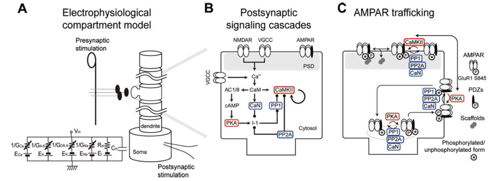

+++
Categories = ["Axon", "Learning"]
bibfile = "ccnlab.json"
+++

Synaptic plasticity is the well-established biological phenomenon that synaptic weights change in strength, which is known to be the primary basis for **learning** in the brain, consistent with the foundational hypothesis of [[abstact neural network]] models: _knowledge is encoded in synaptic weights_.

* **LTP = long-term potentiation** refers to _increases_ in synaptic strength, as initially established by [[@^BlissLomo73]].

* **LTD = long-term depression** refers to _decreases_ in synaptic strength, which took a while longer to establish ([[@BearMalenka94]]).

{id="figure_ltp-nmda" style="height:20em"}
![Critical steps in allowing calcium ions (Ca++) to enter postsynaptic cell via NMDA channels, inducing synaptic plasticity. 1. The postsynaptic membrane potential (Vm) must be elevated (from excitatory inputs to AMPA receptors across synapses of the postsynaptic neuron, and backpropagating action potential that comes back down the dendrite when the postsynaptic neuron fires). 2. Elevated Vm causes magnesium (Mg++) ions to be expelled from NMDA channel openings, thus unblocking them. 3. Presynaptic neuron fires an action potential, releasing glutamate. 4. Glutamate binds to NMDA receptors, causing them to open, allowing Ca++ to enter (only when also unblocked, per step 2). 5. The concentration of Ca++ in the postsynaptic spine drives second messenger systems (indicated by the X) that result in change in AMPA receptor efficacy, thereby changing the synaptic weight. Ca++ can also enter from voltage-gated calcium channels (VGCCs), which depend only on postsynaptic Vm levels, and not sending activity --- these are weaker contributors to Ca++ levels.](media/fig_ltpd_synapse.png)

The synapse has a lot of moving parts (introduced in [[neuron]]), any one of which could potentially be the critical factor in causing its overall efficacy to change. How many can you think of? The search for the critical factor(s) dominated the early phase of research on synaptic plasticity, and evidence for the involvement of a range of different factors has been found over the years, from the amount of presynaptic neurotransmitter released, to number and efficacy of postsynaptic AMPA receptors, and even more subtle things such as the alignment of pre and postsynaptic components, and more dramatic changes such as the cloning of multiple synapses. However, the dominant factor for long-lasting learning changes appears to be the number and efficacy of postsynaptic AMPA receptors.

[[#figure_ltp-nmda]] shows the five critical steps in the cascade of events that drives change in AMPA receptor efficacy. The [[neuron channels#NMDA|NMDA]] receptors and the calcium ion ($Ca^{++}$) play a central role. NMDA channels allow $Ca^{++}$ to enter the postsynaptic spine. Across all cells in the body, $Ca^{++}$ typically plays an important role in regulating cellular function, and in the neuron, it is capable of setting off a series of chemical reactions that ends up controlling how many AMPA receptors are functional in the synapse. For details on these reactions, see [[#Detailed biology of learning]]. Here's what it takes for the $Ca^{++}$ to get into the postsynaptic cell:

1. The postsynaptic membrane potential ($V_m$) must be elevated, as a result of all the excitatory synaptic inputs coming into the cell. The most important contributor to this $V_m$ level is actually the **backpropagating action potential** --- when a neuron fires an action potential, it not only goes forward out the axon, but also backward down the dendrites (via active voltage-sensitive $Na^+$ channels along the dendrites). Thus, the entire neuron gets to know when it fires --- we'll see that this is incredibly useful computationally.

2. The elevated $V_m$ causes magnesium ions ($Mg^{++}$) to be repelled (positive charges repel each other) out of the openings of NMDA channels, unblocking them.

3. The presynaptic neuron fires an action potential, releasing glutamate neurotransmitter into the synaptic cleft.

4. Glutamate binds to the NMDA receptor, opening it to allow $Ca^{++}$ ions to flow into the postsynaptic cell. This only occurs if the NMDA is also unblocked. This dependence of NMDA on both pre and postsynaptic activity was one of the early important clues to the nature of learning, as we see later.

5. The concentration of $Ca^{++}$ in the postsynaptic spine drives those complex chemical reactions that end up changing the number and efficacy of AMPA receptors. Because these AMPA receptors provide the primary excitatory input drive on the neuron, changing them changes the net excitatory effect of a presynaptic action potential on the postsynaptic neuron. This is what is meant by changing the synaptic efficacy, or *weight*.

$Ca^{++}$ can also enter the postsynaptic cell via **voltage gated calcium channels** [[#neuron channels#VGCC|VGCC]] which are calcium channels that only open when the membrane potential is elevated. Unlike NMDA, however, they are _not_ sensitive to presynaptic neural activity --- they only depend on postsynaptic activity. This has important computational implications, as we discuss later. VGCCs contribute less to $Ca^{++}$ levels than NMDA, so NMDA is still the dominant player.

**Metabotropic glutamate receptors (mGlu)** also play an important role in synaptic plasticity. These receptors do not allow ions to flow across the membrane (i.e., they are not _ionotropic_), and instead they directly trigger chemical reactions when neurotransmitter binds to them. These chemical reactions can then modulate the changes in AMPA receptors triggered by $Ca^{++}$.

{id="figure_ltpd-ca"}

For a long time, researchers focused mainly on LTP (which is generally easier to induce), but eventually they realized that both directions of synaptic plasticity are equally important for learning. [[#figure_ltpd-ca]] shows the standard model for how this direction of change depends on the overall level of $Ca^{++}$ in the postsynaptic spine, accumulated over a few hundreds of milliseconds at least. Low levels drive LTD, while high levels produce LTP. This strength-based model provides a compelling biological mechanism for the computational model of [[hebbian learning]].

However, this model does not take into account the time domain, which is critical for the [[temporal derivative]] framework underlying the [[kinase algorithm]] used in [[Axon]].

## Detailed biology of learning

{id="figure_urakubo-model"}

[[#figure_urakubo-model]] shows a full set of chemical processes that are triggered by $Ca^{++}$ influx, and result in changes in AMPA receptor expression in the synapse.  This figure is from the very detailed computational model by [[@UrakuboHondaFroemkeEtAl08]], which is highly recommended reading for those interested in the time course and dynamics of these chemical processes.

The Urakubo et al. (2008) model was constructed in a very "bottom up" fashion, by building in detailed chemical rate parameters and diffusion constants, etc, based on empirical measurements, for all of the major biological processes involved in synaptic plasticity.  Having built this model, they found that it did *not* capture the classic spike timing dependent plasticity (STDP) curve, when driven by the exact STDP pairwise induction protocol (see figure of this in the main chapter text).  However, by changing one aspect of the way the NMDA receptors function (adding what is known as an *allosteric* mechanism, where the NMDA receptor functions differently depending on binding by a substance called calmodulin), they were able to capture not only pairwise STDP, but also the weight changes that result from more complex patterns of spiking, in triplet and quadruplet experiments. 
Furthermore, they accurately capture the effects of changing the timing parameters on pairwise STDP experiments (e.g., interval between pairwise spikes, and number of repetitions thereof).

Thus, this model represents a remarkable bridge between detailed biological mechanisms, and the overall synaptic plasticity that results in actual experiments.  Either this is a fantastic coincidence, or this model has managed to capture a reasonable chunk of the critical mechanisms of synaptic plasticity.  We adopt the later view, and therefore leverage this model as a basis for our computational models described in the main chapter.

{id="figure_urakubo-fits" style="height:30em"}
![Fit of the Urakubo et al. (2008) model with a simple learning function driven by the product of the total sending and receiving neural activity (frequency of firing in Hertz (Hz) times duration of firing in milliseconds).  This simple linear function (called the ''XCAL dWt function'') can capture a considerable amount of the regularity present in the behavior of the Urakubo et al. (2008) model, with a correlation value of ''r=0.894''.  The top portion of the figure shows graphs of three different sending Hz, with the X (horizontal) axis being the receiving unit Hz, Z (depth) is the duration of activity in fractions of a second (.1 to 1), and Y (vertical) is net change in synaptic weight.  The black lines are the measured results from Urakubo et al. (2008), and the red are the values computed from the simple piecewise-linear function shown at the bottom of the figure.](media/fig_xcal_dwt_fun_urakubo_fit_full.png)

For the bottom-up derivation of XCAL, we systematically subjected the biologically detailed Urakubo et al. (2008) model to a range of different *pre* and *post* spike trains, with durations from 100 msec to a second, and spike rates from 10 to 100 Hz (Hertz or spikes per second).  We then tried to fit the pattern of weight changes that resulted using a  piecewise linear function of some form.  [[#figure_urakubo-fits]] shows the results. The resulting function is shown at the bottom of the figure --- if you compare with [@fig:fig-xcal-dwt-fun], you should see that this is essentially the qualitative shape of the function relating weight change to level of $Ca^{++}$.  The top part of the figure is probably too complex to parse very well, but you should get the general impression that the red lines (generated by the piecewise linear function) fit the black lines (data from the Urakubo et al. (2008) model) pretty well.  The correlation value of .894 represents a very good fit of the function to the data.

Thus, we are able to capture much of the incredible complexity of the Urakubo et al. (2008) model (and by extension, hopefully, the complexity of the actual synaptic plasticity mechanisms in the brain) using an extremely simple function.  This is a very powerful simplification.  But what does it mean?

First, the main input into this function is the *total synaptic activity* reflecting the firing rate and duration of activity of the sending and receiving neurons.  In mathematical terms for a rate-code model with sending activity rate x and receiving activity rate y, this would just be the "Hebbian" product we described above:

$$
\Delta w = f_{xcal} \left( x y, \theta_p\right)
$$

Where $f_{xcal}$ is the piecewise linear function shown in [[#figure_urakubo-fits]] or 4.4, which we can call the *XCAL dWt function*.  It also takes an additional dynamic parameter $\theta_p$, which determines the point at which it crosses over from negative to positive weight changes --- we'll discuss this at length in a moment.  Just for kicks, here is the mathematical expression of this function:

where $\theta_d = .1$ is a constant that determines the point where the function reverses back toward zero within the weight decrease regime --- this reversal point occurs at $\theta_p \theta_d$, so that it adapts according to the dynamic $\theta_p$ value.

As noted in the main chapter, the dependence of the NMDA channel on activity of both sending and receiving neurons can be summarized with this simple Hebbian product, and the level of $Ca^{++}$ is likely to reflect this value.  Thus, the XCAL dWt function makes very good sense in these terms: it reflects the qualitative nature of weight changes as a function of $Ca^{++}$ that has been established from empirical studies and postulated by other theoretical models for a long time.  When realistic spike trains with many spikes drive the complex synaptic plasticity mechanisms, this fundamental function emerges.

As a learning function, this basic XCAL dWt function has some advantages over a plain Hebbian function, while sharing its basic nature due to the "pre * post" term at its core.  For example, because of the shape of the dWt function, weights will go down as well as up, whereas the Hebbian function only causes weights to increase.  But it still has the problem that weights will increase without bound, and we'll see in the next section that some other top-down computationally-motivated modifications can result in a much more powerful form of learning.

