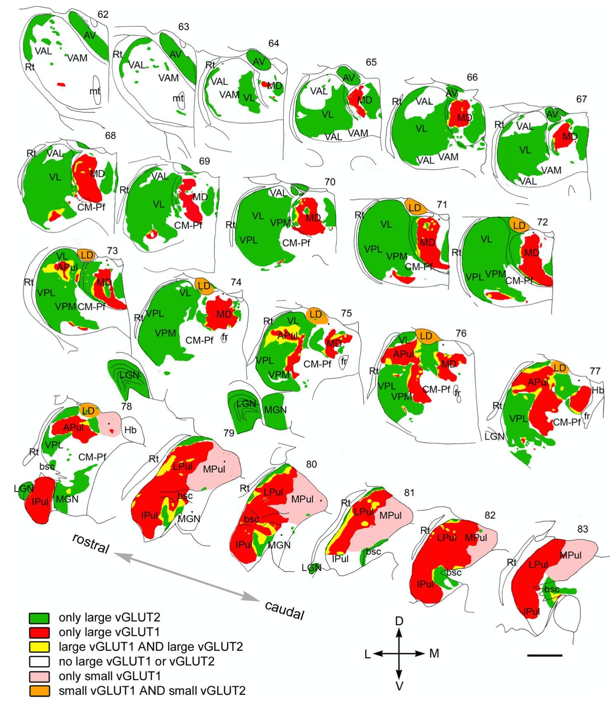

+++
Categories = ["Neuroscience"]
bibfile = "ccnlab.json"
+++

The **thalamus** plays essential roles in multiple different brain circuits, and is thus discussed in the context of those other circuits. Thus, this page is just a brief overview with pointers to those other pages.

From an evolutionary, comparative perspective, the thalamus consistently provides interconnectivity between primary sensory areas and the _pallium_, which is the outer-most region of the brain, i.e., the _telecephelon_. In mammals, the [[neocortex]] is a major component of the pallium, while other vertibrates have smaller, simpler cortex-like structures in their pallium that play the same functional role as the neocortex ([[Butler08]]). The functions highlighted below are specific to mammals.

* In posterior [[neocortex]], the _pulvinar_ nucleus of the thalamus supports [[predictive learning]] by alternatively representing a top-down prediction and a bottom-up outcome.

* There are multiple different thalamic nuclei interconnected with frontal [[neocortex]], particularly [[prefrontal cortex]] and the [[basal ganglia]], which play critical roles in goal-driven behavior as captured in the [[Rubicon]] model.

<!--- TODO: reunions and hippocampus, etc. -->

## Functional organization of the thalamus

Rovo et al. -- put this in pfc, not here.

connectivity of different thalmic areas.

broader connectivity of BG loops etc.

{id="figure_thal-rovo" style="height:40em"}

* [[@KuramotoPanFurutaEtAl17]] -- each MD neuron interconnects with multiple areas, and most terminate in central layers 3,4 not layer 1 -- thus core type.

[[@GiguereGoldman-Rakic88]] is primate study showing patchy organization in primates.

