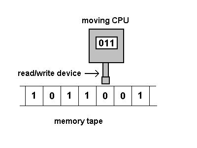

+++
Categories = ["Axon"]
bibfile = "ccnlab.json"
+++

{id="figure_turing-machine"}

To understand what kind of neural machinery it would take to support CPU-like functionality in the brain, we start with the surprisingly simple mechanisms needed to make a computer work. At the most abstract level, Alan Turing and John Von Neumann worked out the basic principles of a **universal computational device** (something that could in principle do _anything_) in the 1930's and 40's ([[@Turing36]], [[@vonNeumann45]]).  Amazingly, this device only requires three essential components ([[#figure_turing-machine]]):

1. A way of reading and writing information from a **memory system** (conceptualized as a *tape* by Turing).

2. A +program that determines how this information is transformed in between being read and written.

3. Some **active memory** where things can be temporarily cached, for the program to refer to.

These elements were elaborated by Von Neumann, in one of the most important unpublished papers of all time ([[@vonNeumann45]]), creating the foundation for modern digital computers. We now take it for granted that computers can do almost anything, but this was just theory not so long ago.

{id="figure_mental-mult"}

You can get a good feel for how a computer works, and why it can do anything, by considering the traditional strategies for performing multi-digit arithmetic ([[#figure_mental-mult]]).  Instead of just staring at those big numbers and hoping a number pops to mind, you break the problem down into a sequence of simple, discrete steps.  That sequence of steps is the _program_ or algorithm, and each individual _operation_ involves one of a small set of different processes, such as adding or multiplying single-digit numbers, writing down some numbers for later use (i.e., storing onto the tape in a Turing machine), and reading those numbers back in at the appropriate time (as you move to the next column of digits).

This kind of sequential, discrete, step-wise processing is entirely different from how our neurons work.  Neurons also break down a problem in to simpler components, but a critical difference is that they all work together in _parallel_ instead of the fundamentally sequential, _serial_ processing required for a universal computer. The major advantage of serial processing is that it is much more flexible --- any arbitrary collection of operations can be sequenced one after the other over time, but the same is _not_ true for parallel computation. Some operations are mutually incompatible with each other, or depend one on the other, and simply cannot be performed simultaneously in parallel.

Indeed, one of the great challenges of modern computer science is trying to come up with even moderately usable parallel computing frameworks, and it is clear that the universal flexibility of traditional serial computation does not extend into the parallel realm: parallel computation must generally be setup on a case-by-case basis. For example, in the case of multi-digit multiplication, you have to do the tens-place part of the problem first, before you know how much to carry over to the higher digits, etc --- you can't just do everything all in one step.

More generally, parallel systems are good at doing the same kind of thing over and over again really fast (e.g., detecting patterns via networks if interacting neurons in our brain), but they are not so good at doing random, arbitrary, _different_ things, which is precisely where serial computation excels. However, serial computation is inherently much slower (one step at a time). These fundamental tradeoffs between parallel and serial computation mean that a system that can do both will be able to achieve the best of both worlds --- that is the magic recipe that the human brain has achieved. Our brains are parallel at the level of individual neurons and networks of neurons, but at the larger _systems_ level of the brain, we can achieve a form of flexible, serial computation.

There is strong evidence for the presence of these two different forms of computation at the psychological level. For example, we would predict that you need to use your "mental CPU"-like capacity whenever you take on a novel task, such as when you first learned to drive a car. At that time, you relied on a sequential, deliberate process that consumed all of your attention --- at each point in time, you had to keep reminding yourself of what you were supposed to be doing. However, with sufficient practice over time, these slow, effortful processes gradually become **automated**, and you may now find yourself driving down the freeway with very little awareness of any of the underlying steps you're effortlessly performing.

This difference between the initial effortful **controlled processing** and the subsequent **automatic processing** was captured in a highly influential pair of papers by Walter Schneider and Richard Shiffrin ([[@SchneiderShiffrin77]]; [[@ShiffrinSchneider77]]). This same distinction was later described by [@Kahneman11] in terms of _System 1_ (automatic, fast) vs _System 2_ (controlled, slow), which are not perhaps not the most useful labels.

