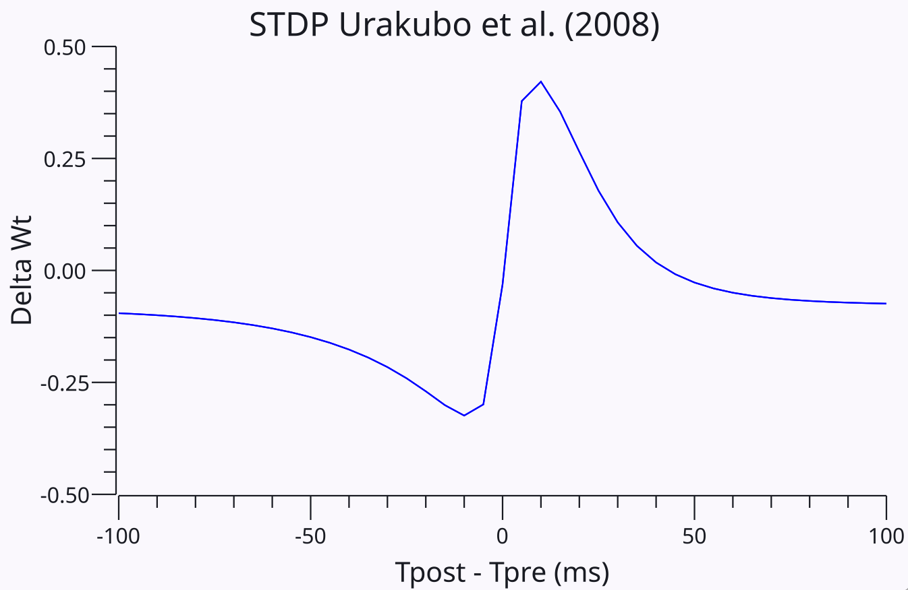

## Urakubo 

* Urakubo, H., Honda, M., Froemke, R. C., & Kuroda, S. (2008). Requirement of an allosteric kinetics of NMDA receptors for spike timing-dependent plasticity. The Journal of Neuroscience, 28(13), 3310–3323. http://www.ncbi.nlm.nih.gov/pubmed/18367598 | [Main PDF](https://github.com/emer/axon/blob/master/examples/urakubo/papers/UrakuboHondaFroemkeEtAl08.pdf) | [Supplemental PDF](https://github.com/emer/axon/blob/master/examples/urakubo/papers/UrakuboHondaFroemkeEtAl08_suppl.pdf) | [Model Details](https://github.com/emer/axon/blob/master/examples/urakubo/papers/UrakuboHondaFroemkeEtAl08_model_sup.pdf) (last one has all the key details but a few typos and the code is needed to get all the details right).

This model captures the complex postsynaptic chemical cascades that result in the changing levels of AMPA receptor numbers in the postsynaptic density (PSD) of a spine, as a function of the changing levels of calcium (Ca2+) entering the spine through NMDA and VGCC (voltage-gated calcium) channels. The model mechanisms are strongly constrained bottom-up by the known kinetics of these chemical processes, and amazingly it captures many experimental results in the LTP / LTD experimental literature. However, it does not capture all of the key benchmark results, and is missing some critical known mechanisms, in particular the DAPK1 pathway that plays a critical role in LTD, per Meyer et al's work.

Overall, this model provides an extremely valuable resource for understanding how plasticity works and how realistic but much simpler models can be constructed, which are actually usable in larger-scale simulations.

The complexity of this model of a single synaptic spine involves 116 different variables updated according to interacting differential equations requiring a time constant of 5e-5 (20 steps per the typical msec step used in axon). In previous work with the original Genesis implementation of this model (see [CCN textbook](https://CompCogNeuro.org)), we were able to capture the net effect of this model on synaptic changes, at a rate-code level using random poisson spike trains, using the simple "checkmark" linearized version of the BCM learning rule (called "XCAL" for historical reasons), with an `r` value of around .9 (81% of the variance). 

Software note: The original Genesis model is a good object lesson in how a generic modeling framework can obscure what is actually being computed. The model shows up as a complex soup of crossing lines in the Genesis GUI, and the code is a massive dump of inscrutable numbers, with key bits of actual computation carefully hidden across many different bits of code, with seemingly endless flags and conditions making it very difficult to determine what code path is actually in effect. In addition, Genesis is ancient software that requires an old gcc compiler to build it, and it only runs under X windows.

By contrast, the present model is purpose-built in compact, well-documented and readable Go code, using a few simple types in the [emergent chem](https://github.com/emer/emergent/tree/master/chem) package, providing the basic `React` and `Enz` mechanisms used for simulating the chemical reactions.

## Basic Usage

Toolbar at the top does actions (mouse over and hold to see tooltips), e.g.:
* `Init` re-initializes with any params updates
* `Run` runs current `Stim` program

Params in the `Urakubo` list at left side control lots of things (see tooltips), e.g.:
* `Stim` determines the stimulation program -- see `stims.go` for code -- figures below show some examples.
* `ISISec` = spacing between individual stimulation patterns
* `NReps` = number of repetitions of patterns -- more = bigger effects on weights
* `FinalSecs` = number of seconds to allow AMPAR trafficking to settle out -- has significant effects on final results, particularly on showing LTD effects which emerge over time. 50 secs is long enough to be close to asymptotic -- 20 vs. 50 still shows some diffs but 50 vs. 100 is pretty close.
* Other params used in different cases -- see examples below -- and below that are overall parameters of the neuron etc.

Tab bar selects different plots:
* `Stats DWt Plot` shows final delta-weights (change in synaptic weight), i.e., `Trp_AMPAR` = trapped AMPA receptors, as a proportion of `InitWt` which is baseline value -- only updated for the `Sweep` Stims.
* `Stats DWtPhase Plot` shows DWt for `ThetaErr` case, which manipulates minus and plus phase activity states according to the Contrastive Hebbian Learning (CHL) algorithm.
* `Msec*Plot` shows all the model state values evolving over time at different temporal scales (100 = 1 point for every 100 msec, etc)

## Classical STDP Replication

The classic Bi & Poo STDP curve emerges reliably with e.g., 100 reps with 50 secs final "burn in" of the weights -- maximum burn-in occurs after about 100 secs and after then things can start to decay. The curve gets stronger with more reps as well.  The X axis is Tpost - Tpre, so the "causal" pre-post ordering is positive numbers on the right.

* `Stim = STDPSweep`
* `NReps = 100`
* `FinalSecs = 50`

# STDP in Packets

What happens in a slightly more "realistic" scenario where pre-post spikes occur at more naturalistic overall frequencies? This was tested with the STDPPacketSweep inputs: 200 msec of 25 or 50 hz spiking, with fixed pre-post time offsets.  This case represents a kind of "best case" for whether there might be some kind of STDP-like signal left in more realistic spike trains -- it is still highly unlikely that in the noisy environment of the brain, you would ever see such reliable pre-post timing across a sequence of spikes like this.

Interestingly, with 25 hz spiking, it shows the same qualitative effects but in a weaker form, but that is not recognizably present in the 50 hz case. This means that there may be _some_ residual STDP effect but it is relatively fragile and these input trains are not plausible.

* `Stim = STDPPacketSweep`
* `NReps = 100`
* `FinalSecs = 50`
* `SendHz = 25 or 50`
* `DurMsec = 200`

## Technical details

Key big-picture points:

* The outer `Sim` object is designed to provide a simple end-user interface with minimal params.
* `Urakubo` object has all the detailed state and params.
* The axon Network simulates one axon neuron. The only inputs from Axon -> Urakubo in `NeuronUpdate` method are the `Vm`, computed from raw Ge excitation, and the VGCC conductance.
* Almost everything in the the Urakubo model derives from the Ca value computed from NMDA and VGCC, along the Vm. The `ClampCa` stim config drives the Ca directly to allow precise matching with the genesis model.

### Baseline

* Run the `Baseline` case with `InitBaseline` turned off, and ensure that the resulting printouts from InitCode methods match the InitBaseline code already in place. This ensures that the equations are all working as expected.

### 

